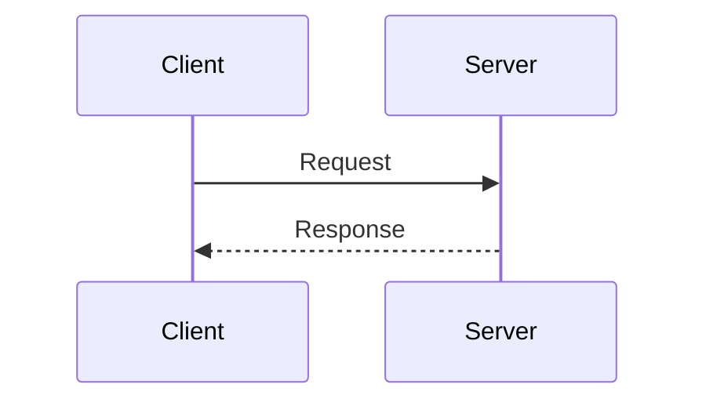

<div align="center">

# TheCoreDump

**Raw tech insights, unfiltered.**

[](https://mohitmishra786.github.io/TheCoreDump/)
[](https://jekyllrb.com/)
[](https://github.com/cotes2020/jekyll-theme-chirpy)
[](LICENSE)

A technical blog focused on deep-dive analysis of distributed systems, cloud infrastructure, database internals, operating systems, and incident post-mortems.

**[Visit the Blog →](https://mohitmishra786.github.io/TheCoreDump/)**

</div>

---

## Overview

TheCoreDump delivers comprehensive technical content for engineers, architects, and system designers. Each article provides granular technical insights backed by evidence, code examples, and architectural diagrams.

### Content Focus

| Category | Topics |
|----------|--------|
| **Cloud Infrastructure** | Azure Front Door, AWS Lambda, distributed systems architecture |
| **Database Systems** | PostgreSQL internals, MVCC, indexing strategies, performance optimization |
| **Operating Systems** | Linux kernel, memory management, system calls, concurrency |
| **Incident Analysis** | Post-mortems of major outages, root cause analysis, lessons learned |
| **System Design** | Architecture patterns, scalability, reliability engineering |

## Live Site

**[https://mohitmishra786.github.io/TheCoreDump/](https://mohitmishra786.github.io/TheCoreDump/)**

## Technical Stack

- **Static Site Generator**: Jekyll 4.x
- **Theme**: Chirpy (minimal, responsive, feature-rich)
- **Hosting**: GitHub Pages
- **Syntax Highlighting**: Rouge
- **Diagrams**: Mermaid.js
- **Analytics**: GoatCounter
- **PWA**: Progressive Web App support

## Features

- **Dark/Light Mode**: Automatic theme switching based on system preferences
- **Table of Contents**: Auto-generated TOC for all posts
- **Syntax Highlighting**: Code blocks with line numbers and language detection
- **Mermaid Diagrams**: Technical diagrams rendered client-side
- **Responsive Design**: Optimized for desktop, tablet, and mobile devices
- **Search Functionality**: Full-text search across all posts
- **Tag & Category System**: Organized content discovery
- **PWA Support**: Installable as a Progressive Web App with offline caching

## Project Structure

```
TheCoreDump/
├── _posts/              # Blog posts (Markdown format)
│   └── YYYY-MM-DD-*.md
├── _tabs/               # Navigation pages
│   ├── about.md
│   ├── archives.md
│   ├── categories.md
│   └── tags.md
├── _data/               # Site data files
│   ├── authors.yml
│   ├── contact.yml
│   └── dashboard.json
├── _plugins/            # Jekyll plugins
│   └── posts-lastmod-hook.rb
├── assets/              # Static assets
│   ├── images/          # Post images and diagrams
│   ├── code/            # Code examples
│   └── data/            # JSON data files
├── _config.yml          # Site configuration
└── index.html           # Homepage
```

## Getting Started

### Prerequisites

- Ruby 2.5 or higher
- Bundler gem
- Jekyll 4.x

### Installation

1. **Clone the repository**
   ```bash
   git clone https://github.com/mohitmishra786/TheCoreDump.git
   cd TheCoreDump
   ```

2. **Install dependencies**
   ```bash
   bundle install
   ```

3. **Run the development server**
   ```bash
   bundle exec jekyll serve
   ```

4. **Open your browser**
   Navigate to `http://localhost:4000/TheCoreDump/`

### Building for Production

```bash
bundle exec jekyll build
```

The generated site will be in the `_site` directory.

## Writing Posts

### Post Format

Posts are written in Markdown and stored in the `_posts/` directory following the naming convention:

```
YYYY-MM-DD-Post-Title.md
```

### Front Matter Template

```yaml
---
title: Your Post Title
date: 2025-01-01 00:00:00 +0000
categories: [Category Name]
tags: [tag1, tag2, tag3]
math: true          # Enable LaTeX math rendering
mermaid: true       # Enable Mermaid diagrams
---
```

### Mermaid Diagrams

The site supports Mermaid diagrams for technical illustrations:

````markdown

````

### Code Blocks

Syntax highlighting is automatic based on language tags:

````markdown
```python
def hello_world():
    print("Hello, World!")
```
````

## Recent Articles

- **Microsoft Azure Front Door Series**: Comprehensive 5-part series covering architecture, request flows, load balancing, security, and monitoring
- **The Cloudflare November 18, 2025 Outage**: Deep technical analysis of root causes and lessons learned
- **PostgreSQL 18**: Asynchronous I/O revolution and next-generation database performance
- **AWS Lambda Runtime**: Execution model and event loop behavior analysis
- **PostgreSQL MVCC**: Transaction visibility and garbage collection mechanisms

## Configuration

Key configuration options in `_config.yml`:

| Setting | Value | Description |
|---------|-------|-------------|
| `title` | `TheCoreDump` | Site title |
| `tagline` | `Raw tech insights, unfiltered.` | Site tagline |
| `baseurl` | `/TheCoreDump` | Base URL path |
| `timezone` | `Asia/Kolkata` | Site timezone |
| `paginate` | `10` | Posts per page |
| `toc` | `true` | Enable table of contents |

## Contributing

Contributions are welcome. For major changes, please open an issue first to discuss what you would like to change.

### Content Guidelines

- Technical accuracy is paramount
- Include code examples and diagrams where appropriate
- Cite sources and references
- Maintain a professional, objective tone
- Use Mermaid diagrams for complex technical concepts
- Follow existing post structure and formatting

## License

This work is published under the [MIT License](LICENSE).

## Author

**Mohit Mishra**

- **Blog**: [TheCoreDump](https://mohitmishra786.github.io/TheCoreDump/)
- **GitHub**: [@mohitmishra786](https://github.com/mohitmishra786)
- **Twitter**: [@chessMan786](https://x.com/chessMan786)
- **LinkedIn**: [mohitmishraml](https://www.linkedin.com/in/mohitmishraml/)
- **Email**: dukechessman@gmail.com

## Acknowledgments

- Built with [Jekyll](https://jekyllrb.com/) static site generator
- Theme: [Chirpy](https://github.com/cotes2020/jekyll-theme-chirpy)
- Diagram rendering: [Mermaid.js](https://mermaid.js.org/)
- Syntax highlighting: [Rouge](https://github.com/rouge-ruby/rouge)

---

<div align="center">

**For technical insights, architectural deep-dives, and system design analysis**

**[Visit TheCoreDump →](https://mohitmishra786.github.io/TheCoreDump/)**

</div>
