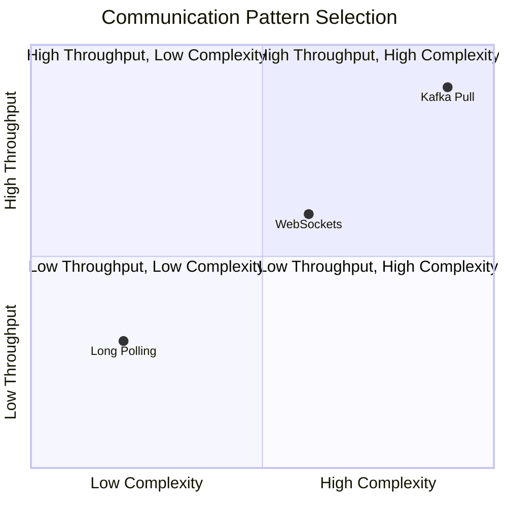

Real-time communication over the internet involves more than just sending data quickly. The choice between different communication patterns—long polling, WebSockets, or pull-based systems like Kafka—depends on specific requirements like scalability, latency, and state management. Let's examine why these patterns exist and when each makes sense.

## Long Polling vs. WebSockets: Understanding the Fundamentals

Both long polling and WebSockets enable real-time communication between clients and servers without constant polling. They're built on TCP, the reliable, connection-oriented protocol that ensures ordered packet delivery. However, they approach the challenge of real-time communication quite differently.

### Long Polling: The Patient Waiter

Long polling resembles a client sitting at a restaurant, asking the server, "Got any new food yet?" Instead of immediately saying "no" and walking away, the server holds the request open, waiting until something new becomes available.

Here's how long polling works:

[](https://mermaid.live/edit#pako:eNqNU0tvozAQ_iuj2UuiUkogLQmHXMhqe2lUiUiVVly8MEksgYfaJt1ulP--BpJuX9LWJ9vfYz5bMwcsuCRM0NBjS6qgpRRbLepcgVuN0FYWshHKQgrCQFpJUvYjmHVgRnpP-iO47MClsAIybnVBuRo46eVikSVwu17fw4_va7hquKpgpLskxsK3yXjgrdgSsLMGxx6KwI6r0kDBSlFhJSvghk622eXg-yCkhQ1rKF1p3_cHdDmAK3rq70FoLfdkztLFIj0lCoMALnrO-xSOca-5IGNewf97TPjZY1Z8CrEXshK_KvLgyaV-CfuGvJY1cWtBkyh2VMIoCsz489wjqhv77JimYWVo_LWI0fjNF92xpi__EXq41bLEZCMqQx7WpGvRnfHQyXK0O6opx8RtS9qItrI55urodK5HfjLXmFjdOqXmdrs7H9rGmZ978sVckypJp9wqi8m8d8DkgL8xCYPYn95MZ9M4DqPr2czDZ0ymoT-P4usgiOaTOI6jm6OHf_qKgT_r7v-tiYdUSsv6bpiKfjiOfwGxe_TT)

The long polling process:

1. **Client Request**: The client sends an HTTP request to the server (typically GET)
2. **Server Wait**: If no new data exists, the server keeps the TCP connection open instead of responding immediately
3. **Data Delivery**: When new data arrives, the server sends the response and closes the connection
4. **Cycle Restart**: The client immediately sends another request to continue the cycle
5. **Timeout Handling**: If no data appears after a set time (usually 30 seconds), the server sends an empty response

[](https://mermaid.live/edit#pako:eNp1Uk1vwjAM_SuRj1NBpS205DBpAqbtsAkB0qStO2StKZHapEsTPob470tbNgYaPtnOe8_Ji_eQyBSBQqWZxjFnmWJFZ-3Fgth4u3knnc4tGUkhMNFcZG3_VDfHL4zX-b1UY6YZJQ-LxZTM8NNgpckchW5Z57CGWSczTJCvMaXkGTdNh9ytGc_ZR45XiQteoDSaNokik23JFVYt_K9oA54qmWBVWYmz-1WlFNVxxFHvX_ikKPXuAn-OuTCJkseiwJRbRy0taftXedZkSkY5tz6R-croVG4EOJApngJdsrxCB-wbC1bXsK91YtArLDAGatMUl8zkOoZYHCyvZOJVygKoVsYylTTZ6qcwZXr65V9xhSJFNZJGaKA9v5EAuoctUM8Nu8EgiIIw9Px-FDmwAxp43aEf9l3XH_bCMPQHBwe-mpFuN6r7p-g5YH3QUj21W9Ys2-Eb9M_KvA)

**Advantages:**
- Works with existing HTTP infrastructure
- Simple implementation
- Universal support across browsers and servers
- No special server configuration required

**Disadvantages:**
- Each poll creates a new HTTP request with full headers
- Not truly bidirectional—client always initiates
- Potential delays if data arrives just after a timeout
- Higher protocol overhead

### WebSockets: The Two-Way Radio

WebSockets establish a persistent, bidirectional connection between client and server. They begin with HTTP but quickly transition to a more efficient protocol.

**WebSocket Connection Flow:**

[](https://mermaid.live/edit#pako:eNqFVE1v2zAM_SsEz26Qzzr1ocDmbstlQzCnKDDkotpMLEQWPUlutwX575O_smVNFp0s8fHxPdLSHlPOCCO09L0indKDFFsjirUGv0phnExlKbSDGISFWEnS7m0wqYMJmRcya92Gv7AjYH8AcZBEsFitlrAQOrO52BEsc2GpBcY39_c94NOHFbxKl8Nj6VVkFMErPVtOd9QVTTw47sCj4QgSj05zqbewNOw4ZWXPln-i56ShOeLgXerkS6fhbM57mUlDHsVaKIi5KCotU1HvT5T_4f7oO-c1r3FBSnHfEDyRfhHd9fYqelnZHDQ7uenF4DU5j9Z7Eo0TyIQTfcZZ2zFr3boGQ4WQ2gKX1FlWzCV8JaFunCzoXFPqJZTrzIOfc1vyGPyfu4cTJClLXVsu8Fyy_A-PztrN8eOa8RWZQuq3o44Ve0lNkZMx_XXu_6sdBrg1MsNoI7yFAAtPJ-o97uu0NbqcPAPWs8loIyrVzP3g8_x1-sZcYORM5TMNV9u831Sl70B_Q4_kxrsiE3OlHUajsKHAaI8_MBoPw8H0djqfhuF4MpvPA_yJ0XQ8uJuEs-FwcjcKw3ByewjwV1NyOJiHswApk47N5_ZdaJ6Hw288AkwC)

```javascript
// WebSocket client example
const ws = new WebSocket('ws://localhost:8080');

ws.onopen = function() {
    console.log('Connected');
    ws.send('Hello Server');
};

ws.onmessage = function(event) {
    console.log('Received:', event.data);
};
```

**Advantages:**
- True bidirectional communication
- Low latency
- Minimal overhead after handshake
- Single connection handles multiple messages

**Disadvantages:**
- Requires WebSocket protocol support
- Stateful connections complicate scaling
- More complex infrastructure requirements

## TCP Connection Management

Both approaches maintain long-lived TCP connections with kernels waiting for interrupts. The key difference lies in the protocol layer:

**Protocol Comparison:**
- **Long Polling**: Uses HTTP with full request/response overhead
- **WebSockets**: Uses lightweight framing protocol after initial handshake

In both cases, the kernel waits for events—data arrival, timeouts, or errors—but WebSockets prove more efficient for frequent, small updates due to reduced protocol overhead.

## Kafka's Pull-Based Architecture

Kafka takes a different approach entirely. Instead of pushing data to consumers, it implements a pull-based system where consumers actively request data using `consumer.poll()`. This design choice stems from Kafka's focus on scalability and flexibility in distributed messaging systems.

### Why Pull Instead of Push?

**Kafka Architecture Overview:**

[](https://mermaid.live/edit#pako:eNqFU9FugjAU_RVy94pGWhTlYclgyR4WEx72NNlDJxchAjUtTebUf19BEVC23afec3rPaTn0AGseIbiwEWyXGG9eWBi6pPo8AyG8snjLDD9TskQRwpmvyrNWnuBbFIb10UFJg5IuShuUXlAsovPizjAQPFJrFLJrFlirBu_ZBaTFyb_SPi-kyvXWF8HVrmfQ2VWTxlOXrcq3Vtf57hFqjrRc997XowxaeHcWtJWhtxZ2y9lDFjfXDixjNHo8BkomxhKlZBuURx3ahSWDLOkq-I1Clg0o-GSQvSj49M9Ze5ClvdjKfYZ6wojTLHMf0IqnMfYo8jtFexSY-vdOI3Bjlkk0QX_CnFU9HKqpEMoEcwzB1csIY6ayskrmpOd2rHjnPAe3FEpP6tg2SdOoXcRKfE6ZTjW_igudAwqfq6IEl0xrCXAP8KW7iTO2Z_bcdhxCp_O5CXtwbTJeUGc6mdCF5TgOnZ1M-K4tJ-N5hbdlmYBRWnKxPL_Z-umefgBfrBYu)

**Kafka Consumer Pull Flow:**

[](https://mermaid.live/edit#pako:eNqFU01v2zAM_SuETh2QFW6S1omBFVi87pQOwTpgwOCLatOOUEv09FEsC_LfR8dxnCHppoMgiY-PfBS5FTkVKBLh8GdAk-MnJSsrdWaAVyOtV7lqpPGQgnSQknFBoz03L1rzwtLLJeOyNS6pgidPVlaYmQ7zhTwCvaKFNDlyg_Ps6iA0HSh9f3-_SOCBn59r5dbwLV21YIO5V3Rg6vaaqGlNXplAwcGK6lqZqjOecDX8fuWVRgr-w00URdq9G0BDVgxN15i_QN7nRmXp0A_YBRMuE_iMPl-DRudYnYPSkj6DLrvYX9EHa3osPEv2HEDDSdYeHnvCj69S1SwfB3sfPf0f5VmhV5Zyhh7T_Rt6KFFKWit_EAFX0m1MflIjrB0y6zHDt8Ix03fJPKEBT3Ao-UURD7rxG7DoGq71iU40xaXy_FMRN0Iu63rzBrztEEs1lPtf46SOPcLBxEhUVhUiKSVrHAn-dS3bu9i2mEz4NWrMRMLHAksZap-JzOzYj3v9B5EWibeBPS2Fat1fQlNI30_XkdxyQLQpBeNFMp7vKUSyFb_4FsXX07vpbBrH48ntbDYSG5FMx9fzSXwbRZP5TRzHk7vdSPzeh4yuZ_F0frpGAgvF8_bYDfh-znd_ALZFMvo)

Kafka handles massive data streams—logs, events, metrics—flowing at extremely high rates. The pull-based model offers several advantages:

**Consumer Control**: Consumers decide when and how much data to fetch. One consumer might poll every second for small batches, while another waits daily to grab gigabytes for batch processing.

```java
// Kafka consumer example
ConsumerRecords<String, String> records = consumer.poll(Duration.ofMillis(1000));
for (ConsumerRecord<String, String> record : records) {
    // Process record
    System.out.println("Offset: " + record.offset() + ", Value: " + record.value());
}
```

**Stateless Brokers**: Push-based systems require brokers to track each consumer's state—current position, processing capacity, readiness for more data. With thousands or millions of consumers, this becomes a memory and coordination nightmare. Pull-based systems offload this responsibility to consumers, which track their own offsets.

**State Management Comparison:**

**Independent Scaling**: Brokers serve whoever requests data without managing individual consumer needs. Consumers can scale independently by adding instances to handle load, and brokers remain unaware of these changes.

### Long-Lived Connections in Kafka

Kafka clients maintain persistent TCP connections to brokers, similar to WebSockets or long polling. This avoids the overhead of repeatedly establishing connections, which would overwhelm brokers with handshakes and teardowns.

**Kafka Connection Lifecycle:**

[](https://mermaid.live/edit#pako:eNptU8tu2zAQ_BVij4XsupYdOTwUCJy0QAEDQdxTqx5ocS0SEEmDj_Rh-N9LkZEjNeWBIHdmdnb5OENjOAIF55nHe8lay9TseVlrEsf3dz_IbPaRbI3W2Hip2xx_3Sf4LniB2suG9SFKvm4fyUNMeOikE8izZkpKui9G6rj-bE040UQg-9A06FyWjPEkeDRdlxxyaGuM5VIzbyy5c062ejB7IWaRNX3KpNvFBWvRkSdsUD5f6VfK1Cb2GYsNOCK8zf-EB9Yx3YwK26E6oHVCxhoF0y1m1Yg59RkAjI7q1KHHtzb30jXXY6dkL4Ln5qcm-9g26_7bxz-SB2uNfT8Is2JCSaJ45xnKszYeiZWt8MQch4Iy1I8Z-YS-EUS9HOwYib0o2cuODv0E2aPmRCCz_oBsgPpY7wYFtFZyoEfWOSxAoVWs38O5J9YQ35HCGmhccjyy0Pkaan2JuhPT34xRQL0NURnvohXDJpz46wu_JrfRFe3WBO2BlmVKAfQMv4AuF9V8dbParKpqWa43mwJ-A10t57dltV4sytsPVVWVN5cC_iTLxXxTrQtALuNz3OVPlf7W5S9bkxqC)

When a consumer calls `poll()`, it sends a request over the existing TCP connection, asking for new messages since its last offset. The broker responds with available data (up to configured limits), and the connection remains open for subsequent polls.

```java
// Kafka consumer configuration for connection management
Properties props = new Properties();
props.put("connections.max.idle.ms", 540000); // Keep connections alive
props.put("session.timeout.ms", 30000);       // Session timeout
props.put("fetch.max.wait.ms", 500);          // Max wait for data
```

This differs from long polling in that `poll()` returns immediately (or after a short timeout) with whatever data is available. If nothing exists, the consumer simply polls again rather than waiting for new data to arrive.

### Why Not WebSockets for Kafka?

WebSockets could theoretically work for Kafka, but they'd be a poor fit. Let's compare the approaches:

**Push vs Pull Architecture Comparison:**

[](https://mermaid.live/edit#pako:eNqFk02PmzAQhv-KNb2SKNjJkuXQA1SrShGrSlkpUmEPXjAJirEjY9puk_z3Dh9pQlNaX7B5nxlmXjNHSHUmwIet4YcdeQkSRXBV9Vv3IoGNeFvrdC8s-VJXOxIhLhPosGZt1vEVWQvzTZjXW5VMJh9PTeiJbEI3DmUhlCXuOEMvDB1n2IV5vmPwEcVdHWRtuRUk4opvRYn4AI56OoxDrZRIbaEVeTE83Rdq-1cyiANUD0ZUVW0E-cxVJsfYp_hJ6u8EU1ujZY8IlXWbO5dXPN9zdFjKe4dXQdzJgdH7gburxlCtqrrEZt3X3iIpTxhzS9ErRccpdqWexym3bXC1dtFkmU_K1tyss3pQGu1B-j-Q9SAbB_80zr5L0ZqdF1L6H_I8xXWrYX29lqaNOtToPzQ20MDBySgy8HMuK-EAmlPy5gzHJiwBu8M_KwEft5nIeS1tc3VnjDtw9VXrEnxraow0ut7uLof6kGFznwqO91_-Tm6wTWFCXSsLPvPaFOAf4Qf4dOZN5w_z5dzzKFsslw68gz-n00fmLWYz9uh6nscezg78bD85my69hQMiK6w2UTfh7aCffwFA6S2C)

WebSockets excel at low-latency, bidirectional applications where both sides send small, frequent updates. Kafka deals with high-throughput, ordered message streams, often handling millions of messages per second.

A push-based WebSocket system would require brokers to:
- Manage active connections for every consumer
- Track individual consumer state
- Handle varying consumer processing speeds
- Manage failures and network issues
- Decide when to send data

Pull-based `poll()` keeps the system simple: consumers request data when ready, and brokers simply serve requests.

## Performance Comparison

Different communication patterns excel in different scenarios:

| Pattern | Use Case | Latency | Throughput | Complexity | Connection Overhead |
|---------|----------|---------|------------|------------|-------------------|
| Long Polling | Real-time web apps | Medium | Low-Medium | Low | High (HTTP headers) |
| WebSockets | Interactive applications | Low | Medium | Medium | Low (after handshake) |
| Kafka Pull | High-throughput streaming | Medium | Very High | High | Low (persistent TCP) |

### Long Polling Performance

```python
# Long polling client example
import requests
import time

def long_poll():
    while True:
        try:
            response = requests.get('http://api.example.com/poll', timeout=30)
            if response.status_code == 200:
                data = response.json()
                if data:
                    process_data(data)
        except requests.Timeout:
            # Timeout reached, poll again
            continue
        except Exception as e:
            time.sleep(5)  # Wait before retrying
```

### WebSocket Performance

```javascript
// WebSocket with message batching
const ws = new WebSocket('ws://localhost:8080');
const messageQueue = [];

ws.onmessage = function(event) {
    messageQueue.push(JSON.parse(event.data));
    
    // Process messages in batches
    if (messageQueue.length >= 100) {
        processBatch(messageQueue.splice(0, 100));
    }
};
```

### Kafka Performance Optimization

```java
// Optimized Kafka consumer
Properties props = new Properties();
props.put("fetch.min.bytes", 1024);        // Wait for minimum data
props.put("fetch.max.wait.ms", 500);       // Maximum wait time
props.put("max.poll.records", 1000);       // Records per poll
props.put("enable.auto.commit", false);    // Manual offset management

// Batch processing
while (true) {
    ConsumerRecords<String, String> records = consumer.poll(Duration.ofMillis(1000));
    
    for (TopicPartition partition : records.partitions()) {
        List<ConsumerRecord<String, String>> partitionRecords = records.records(partition);
        // Process entire partition batch
        processBatch(partitionRecords);
        
        // Commit offset after successful processing
        consumer.commitSync(Collections.singletonMap(partition, 
            new OffsetAndMetadata(partitionRecords.get(partitionRecords.size() - 1).offset() + 1)));
    }
}
```

## Use Case Analysis

### When to Use Long Polling

- **Web applications** requiring real-time updates
- **Simple notification systems**
- **Scenarios with existing HTTP infrastructure**
- **Applications with infrequent updates**

Example: A web dashboard displaying system status that updates every few seconds.

### When to Use WebSockets

- **Interactive applications** requiring low latency
- **Gaming platforms**
- **Live chat applications**
- **Real-time collaboration tools**

Example: A collaborative document editor where multiple users edit simultaneously.

### When to Use Kafka's Pull Model

- **High-throughput data streaming**
- **Event sourcing systems**
- **Log aggregation**
- **Systems requiring guaranteed message delivery and ordering**

Example: Processing millions of user activity events for analytics and recommendations.

## Implementation Considerations

### Connection Management

All three patterns require careful connection management:

```python
# Connection pooling for long polling
import requests
from requests.adapters import HTTPAdapter
from urllib3.util.retry import Retry

session = requests.Session()
retry_strategy = Retry(
    total=3,
    backoff_factor=1,
    status_forcelist=[429, 500, 502, 503, 504]
)
adapter = HTTPAdapter(max_retries=retry_strategy)
session.mount("http://", adapter)
session.mount("https://", adapter)
```

### Error Handling and Resilience

```java
// Kafka consumer with error handling
while (true) {
    try {
        ConsumerRecords<String, String> records = consumer.poll(Duration.ofMillis(1000));
        processRecords(records);
    } catch (WakeupException e) {
        // Shutdown signal
        break;
    } catch (Exception e) {
        logger.error("Error processing records", e);
        // Implement retry logic or dead letter queue
    }
}
```

## Conclusion

The choice between long polling, WebSockets, and pull-based systems like Kafka depends on specific requirements:

**Summary Comparison:**



- **Long polling** provides a simple way to add real-time features to existing HTTP-based systems
- **WebSockets** offer the best performance for truly interactive, bidirectional applications
- **Kafka's pull model** excels in high-throughput, distributed systems where scalability and fault tolerance matter most

Each approach represents a different trade-off between simplicity, performance, and scalability. Understanding these trade-offs helps architects choose the right pattern for their specific use case.

The common thread is that they all maintain long-lived TCP connections with kernels waiting for interrupts—the difference lies in how they manage those connections and handle the conversation between client and server.

## Additional Resources

- [Kafka Consumer API Documentation](https://kafka.apache.org/documentation/#consumerapi)
- [WebSocket RFC 6455](https://tools.ietf.org/html/rfc6455)
- [HTTP Long Polling vs WebSockets](https://ably.com/blog/websockets-vs-long-polling)
- [Kafka Architecture Deep Dive](https://kafka.apache.org/documentation/#design) 