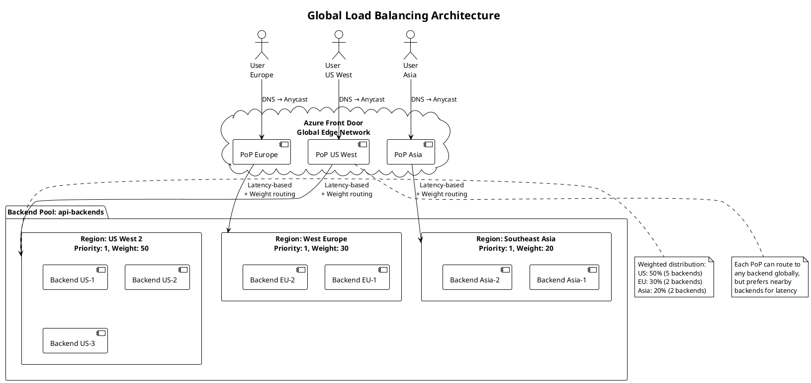
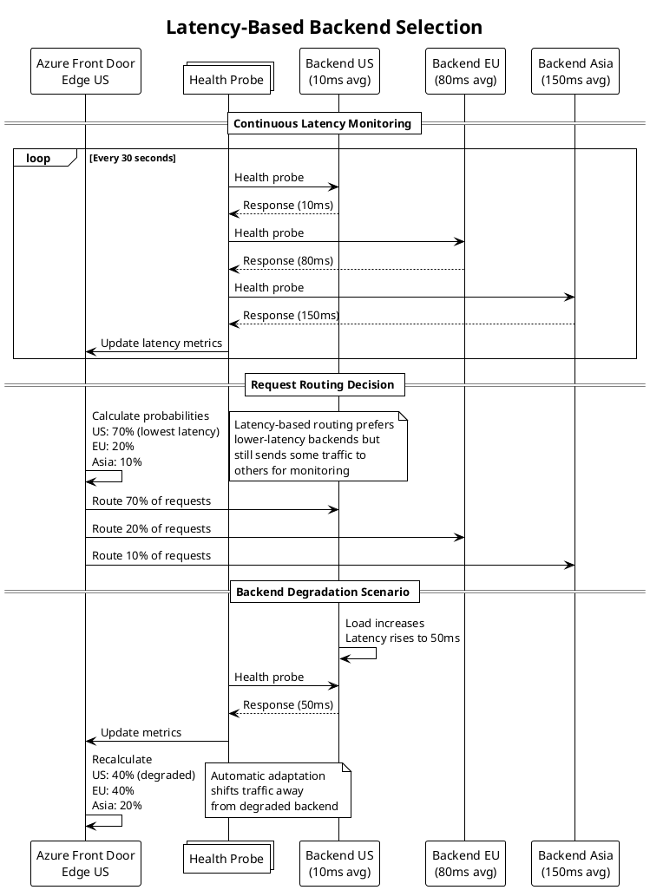
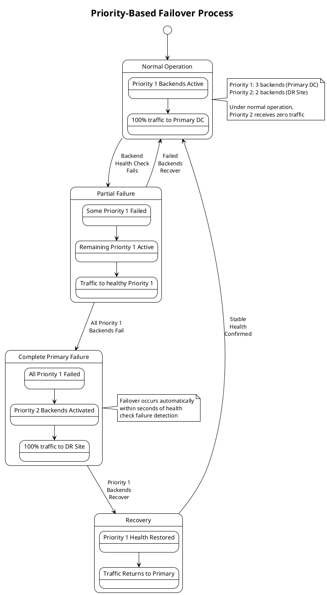
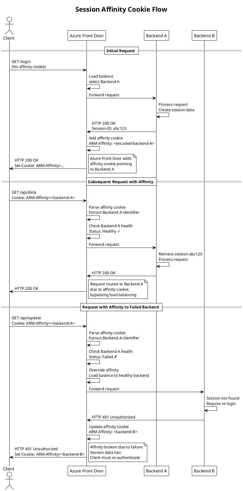
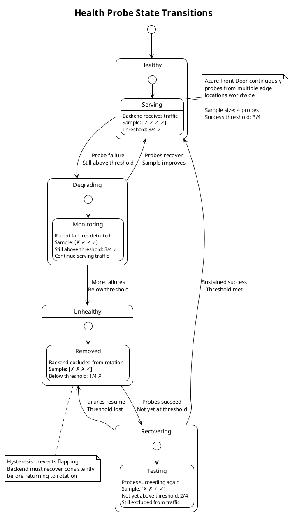

## Introduction

Building upon the OSI layer implementations and request flow mechanics established in Parts 1 and 2, this article examines Azure Front Door's load balancing capabilities in detail. Load balancing represents a core function that distributes traffic across multiple backends to achieve high availability, improved performance, and scalable capacity.

We explore the algorithms that determine backend selection, the health monitoring mechanisms that detect failures, the failover strategies that maintain service during outages, and the session affinity patterns that enable stateful applications. Understanding these mechanisms is essential for architecting resilient applications and diagnosing traffic distribution issues.

## Global Load Balancing Architecture

Azure Front Door implements global load balancing that distributes traffic across backends in multiple geographic regions, distinguishing it from regional load balancers that operate within single locations.

### Global vs Regional Distribution

The global scope of Azure Front Door's load balancing provides distinct advantages and introduces specific considerations that influence architectural decisions.

**Geographic Distribution Benefits:**

Global load balancing places backends near users worldwide, reducing latency through proximity. When users in Asia access applications, Azure Front Door can route requests to Asian backends rather than forcing round-trips to distant regions. This geographic awareness provides better user experience through lower response times.

Resilience improves as failures in one region do not affect others. Regional outages that would cause complete service disruption for single-region deployments become partial degradation with global distribution. Azure Front Door automatically routes traffic away from failed regions to healthy alternatives, maintaining service availability.

Capacity scales naturally across regions. Rather than predicting peak load in any single region, organizations can provision aggregate capacity globally, with Azure Front Door distributing load to available backends wherever they exist. This approach improves utilization and reduces over-provisioning costs.

Compliance requirements for data sovereignty are satisfied through geographic routing policies. Organizations operating in jurisdictions requiring local data processing can configure Azure Front Door to route users to backends in appropriate regions, maintaining regulatory compliance while benefiting from global infrastructure.

**Regional Considerations:**

Within global deployment, regional factors significantly influence traffic distribution. Latency-based routing considers network performance to each region, measured continuously through health probes and actual request timing. Backends responding faster receive more traffic, automatically adapting to performance changes.

Geographic preferences can explicitly route users to specific regions based on client location, supporting compliance or data sovereignty requirements. Organizations operating in regulated industries can ensure European users connect to European backends, Asian users to Asian backends, maintaining data locality.

Priority settings enable primary-secondary patterns where specific regions handle traffic until failures occur. Organizations might designate their primary data center as priority 1 and disaster recovery sites as priority 2, activating DR capacity only when primary capacity fails.

### Multi-Region Deployment Patterns

Azure Front Door supports several multi-region deployment patterns, each suited for different requirements and operational models.

**Active-Active Pattern:**

Active-active deployments provision backends in multiple regions with all regions serving traffic simultaneously. Traffic distributes proportionally based on configured weights, capacity, or latency measurements. This pattern maximizes resource utilization as all deployed capacity serves production traffic.

The active-active approach provides the highest availability. Regional failures reduce capacity but do not cause complete outages. Users experience degraded performance or longer wait times as remaining regions absorb additional load, but service continues. This graceful degradation is preferable to complete service loss.

However, active-active introduces complexity. Data synchronization between regions requires eventual consistency patterns or conflict resolution strategies. Database replication must handle updates in multiple regions, choosing between strong consistency with performance costs or eventual consistency with potential conflicts. Session state requires external storage accessible from all regions or session-less application design.

**Active-Passive Pattern:**

Active-passive deployments provision backends in multiple regions but route all traffic to the primary region under normal operation. Secondary regions remain idle, activating only when primary region failures occur. This pattern simplifies operational concerns by maintaining a single active data set.

Data consistency is simpler in active-passive as writes occur in only the primary region. Database replication can use asynchronous replication to secondary regions for disaster recovery without complex conflict resolution. Session state remains in the primary region without requiring distributed storage.

The tradeoff is resource underutilization. Secondary region capacity sits idle during normal operation, representing cost without value. Failover to secondary regions requires data synchronization to complete before activation, potentially delaying recovery. Organizations must balance cost efficiency against recovery time objectives when choosing between active-active and active-passive patterns.

**Geographic Segmentation:**

Geographic segmentation deploys backends in multiple regions with users routed to specific regions based on their location. European users always connect to European backends, Asian users to Asian backends, creating independent regional segments.

This pattern provides strong data sovereignty guarantees as user data remains within designated regions. Performance is consistent as users always connect to geographically nearby backends. Regional isolation contains failures, preventing issues in one region from affecting others.

However, capacity planning becomes regional rather than global. Organizations must predict peak load in each region independently and provision accordingly. Load imbalances between regions cannot leverage spare capacity in other regions, potentially requiring over-provisioning. The pattern works best for organizations with clear regional user populations and data sovereignty requirements.

## Load Balancing Algorithms

Azure Front Door supports multiple load balancing algorithms, each implementing different strategies for backend selection with distinct performance and distribution characteristics.

### Latency-Based Routing

Latency-based routing is Azure Front Door's default algorithm, automatically selecting backends based on observed response times rather than configured proportions.

**Measurement Mechanism:**

Azure Front Door measures latency to each backend through multiple mechanisms. Health probes include round-trip time measurements, capturing network latency plus backend processing time for probe endpoints. Actual request timing during production traffic provides authentic latency measurements under real load conditions.

The latency measurements use exponentially weighted moving averages, giving greater weight to recent measurements while smoothing transient variations. This approach balances responsiveness to changing conditions against stability, preventing rapid oscillation due to momentary latency spikes.

Measurement occurs independently from each edge location. A backend might exhibit low latency from US edge locations but higher latency from Asian locations due to network topology. Azure Front Door considers these geographic latency differences when routing, with each edge location selecting backends based on locally observed latency.

**Selection Algorithm:**

When routing requests, Azure Front Door selects backends probabilistically based on inverse latency. Lower latency backends receive higher probability of selection, but even high-latency backends receive some traffic for continuous monitoring.

The selection algorithm calculates selection probability for each backend as inversely proportional to observed latency. A backend with 10ms latency receives roughly 10x the traffic of a 100ms backend, all else being equal. This proportional distribution adapts automatically to performance changes without manual intervention.

However, the algorithm respects configured weight and priority values as constraints. If backends have different priorities, only the lowest priority tier participates in latency-based selection. Within a priority tier, weights scale selection probabilities, allowing operators to bias distribution beyond pure latency considerations.

**Advantages and Limitations:**

Latency-based routing provides automatic adaptation to performance changes. Backends experiencing degraded performance automatically receive less traffic as latency increases, protecting user experience without manual intervention. Recovery is similarly automatic as improved performance attracts more traffic.

This adaptation helps with gradual backend deployment. New backends with cold caches initially respond slower than warm backends. Latency-based routing naturally sends less traffic to cold backends, allowing cache warming without overwhelming them. As caches warm and performance improves, traffic naturally increases.

However, the algorithm may not distribute traffic evenly if backend capacities differ. Higher-capacity backends may observe higher latency due to increased load, paradoxically receiving less traffic than lower-capacity backends. This feedback can cause oscillation with traffic shifting between backends based on transient latency variations.

Organizations requiring specific traffic distribution regardless of performance should use weighted or priority-based routing instead of latency-based routing. The predictability of weighted routing is preferable when capacity planning requires known traffic proportions.

### Priority-Based Routing

Priority-based routing implements primary-secondary patterns where backends with lower priority numbers receive all traffic until failures occur.

**Priority Tier System:**

Backend priority is specified as integer values, with lower numbers indicating higher priority. Azure Front Door filters backends by health status, then selects only backends with the lowest priority value among healthy backends for traffic routing.

For example, a backend pool might include three priority 1 backends in the primary data center and two priority 2 backends in a disaster recovery site. Under normal operation, all traffic routes to the three priority 1 backends. If all priority 1 backends fail health checks, traffic shifts entirely to priority 2 backends, activating disaster recovery capacity.

Within a priority tier, traffic distributes according to weight values. If multiple backends share the same priority, their weights determine proportional traffic allocation. This allows capacity-aware distribution within each tier while maintaining tier-based failover.

**Failover Behavior:**

Priority-based failover occurs automatically based on health probe results. When all backends in the active priority tier fail health checks, Azure Front Door immediately routes traffic to the next priority tier. This failover completes within seconds after health probe detection, minimizing service disruption.

The failover is stateless and requires no human intervention. Users experiencing active connections may encounter disruption as backend failures occur, but new connections establish successfully to alternative backends. Applications should implement retry logic to handle transient failures during failover windows.

Recovery follows the inverse process. When priority 1 backends recover and begin passing health checks, traffic shifts back from priority 2 backends. The return process uses the same health check thresholds as initial failure detection, requiring multiple consecutive successful probes before considering backends healthy.

**Use Cases:**

Priority-based routing suits active-passive deployment patterns where organizations want clear primary and secondary roles. Financial systems might require all transactions to process in the primary data center for consistency, failing over to disaster recovery only when absolutely necessary.

The pattern also supports graduated capacity planning. Organizations might provision full capacity in the primary site and reduced capacity in disaster recovery sites, accepting degraded performance during DR scenarios rather than maintaining idle full capacity at all locations.

Maintenance operations benefit from priority-based routing. Operators can set backends to low priority before maintenance, causing traffic to shift to alternatives. After completing maintenance and validating health, priority values reset to normal, returning traffic to the maintained backends.

### Weighted Round-Robin

Weighted round-robin distributes traffic proportionally according to backend weight values, providing predictable distribution independent of performance variations.

**Weight Calculation:**

Backend weights represent relative capacity or desired traffic proportion. Weights are arbitrary positive integers, with the proportion of traffic calculated as backend_weight / sum_of_all_weights. Backends with weight 1, 1, and 2 receive 25%, 25%, and 50% of traffic respectively.

The implementation maintains request counts to each backend, selecting backends to match configured weight ratios over time. Short-term distribution may deviate from exact proportions due to sampling variance, but long-term averages converge to configured ratios.

Weight adjustments provide fine-grained traffic control. Operators can shift traffic gradually between old and new backend versions by adjusting weights incrementally, implementing canary deployments or blue-green transitions with precise control.

**Round-Robin Selection:**

The round-robin algorithm distributes requests sequentially across backends, cycling through the list repeatedly. Weights extend this by repeating backends in the selection sequence proportional to their weights. A backend with weight 2 appears twice as often in the sequence as weight 1 backends.

However, the actual implementation does not maintain a fixed sequence, as that would cause correlation between request timing and backend selection. Instead, Azure Front Door uses pseudorandom selection with probabilities matching weight ratios, ensuring proportional distribution without predictable patterns.

**Predictability vs Adaptiveness:**

Weighted round-robin provides predictable traffic distribution matching configured weights precisely. This predictability enables capacity planning based on known traffic proportions, with confidence that backends receive expected load.

However, this predictability comes at the cost of adaptiveness. Backends experiencing degraded performance continue receiving full weighted traffic allocation, potentially causing poor user experience. Latency-based routing would automatically reduce traffic to degraded backends, but weighted round-robin maintains configured proportions regardless of performance.

Organizations must choose between predictability and adaptiveness based on their operational priorities. Environments with stable backend performance and capacity planning requirements may prefer weighted routing. Environments with variable performance or preferring automatic adaptation to conditions may choose latency-based routing.

### Session Affinity Implementation

Session affinity routes subsequent requests from the same client to the same backend, enabling stateful applications that store session data in backend memory.

**Cookie-Based Affinity:**

Azure Front Door implements session affinity using cookies containing encoded backend identifiers. When session affinity is enabled for a backend pool, Azure Front Door adds cookies to responses indicating which backend served the request.

The cookie format is opaque and includes tamper detection to prevent clients from arbitrarily selecting backends. Encoded information includes backend identifier, encryption signature, and expiration timestamp. Clients cannot decode or modify these values without breaking the signature, preventing backend selection manipulation.

Subsequent requests from the same client include this cookie, directing Azure Front Door to route to the specified backend. The routing decision occurs before load balancing algorithm evaluation, overriding normal backend selection. Only when the specified backend is unhealthy does Azure Front Door select an alternative backend, prioritizing availability over strict affinity.

**Affinity Guarantees and Limitations:**

Session affinity provides best-effort guarantees rather than absolute guarantees. Backend health changes override affinity, routing to alternative backends when affinity targets become unhealthy. This behavior prioritizes availability over session preservation, accepting potential session loss during failures.

Configuration changes that add or remove backends can disrupt affinity mappings. If backends are renamed or reconfigured, affinity cookies referencing old identifiers may become invalid. Azure Front Door handles this gracefully by treating invalid affinity cookies as absent, performing normal load balancing.

Client cookie handling also affects reliability. Clients that block or clear cookies lose affinity, causing subsequent requests to route to different backends. Private browsing modes typically clear cookies on window close, causing affinity loss. Applications must handle these scenarios gracefully, potentially by using external session storage accessible from all backends.

**External Session Storage Alternative:**

While session affinity enables stateful applications with backend-local session storage, modern architectures increasingly use external session storage accessible from all backends. Redis, memcached, or database-backed sessions eliminate affinity requirements, providing better resilience and operational flexibility.

External session storage decouples session state from backend identity. Requests can route to any backend, which retrieves session data from shared storage. This approach eliminates session loss during failover and simplifies backend scaling and deployment. The tradeoff is additional latency for session storage access and increased architectural complexity.

Organizations designing new applications should strongly consider external session storage over session affinity. The operational benefits typically outweigh the latency costs, especially with modern in-memory caches like Redis providing sub-millisecond access times.

## Health Monitoring and Probes

Health monitoring provides the foundation for intelligent load balancing by continuously assessing backend availability and responsiveness.

### Health Probe Configuration

Health probes send periodic requests to backend endpoints, validating their ability to serve production traffic.

**Probe Parameters:**

Health probe configuration includes several critical parameters. Protocol specifies HTTP or HTTPS for probe requests, with HTTPS requiring valid certificates on backends. Path identifies the endpoint to probe, typically dedicated health check endpoints rather than production URLs. Interval determines frequency in seconds, with 30 seconds as default. Probe method specifies GET or HEAD requests, with HEAD reducing bandwidth by omitting response bodies.

Probe paths should be designed specifically for health checking. Simple application logic should verify critical dependencies including database connectivity, external service availability, cache server connectivity, and adequate system resources. However, probe endpoints must respond quickly, typically within 5 seconds, to avoid false positives from timeout-induced failures.

**Threshold Configuration:**

Azure Front Door evaluates probe responses against configured thresholds to determine health status. Sample size determines how many recent probe results to consider, typically between 2 and 10. Success threshold specifies how many successful probes within the sample size mark a backend healthy.

For example, sample size 4 with success threshold 3 requires 3 out of the last 4 probes to succeed. This configuration tolerates occasional failures without marking backends unhealthy, while detecting persistent issues relatively quickly. Conservative thresholds like 6 out of 10 reduce false positives from transient network issues but slow failure detection. Aggressive thresholds like 2 out of 2 detect failures immediately but may cause unnecessary failover due to momentary glitches.

### Probe Distribution and Timing

Health probes originate from multiple Azure Front Door edge locations, providing distributed perspective on backend health.

**Geographic Distribution:**

Probes from multiple locations detect regional network issues that might affect only certain geographic areas. A backend might be unreachable from Asian edge locations due to regional internet routing problems while remaining accessible from US and European locations. Per-location health status allows Azure Front Door to route traffic appropriately, sending Asian users to alternative backends while US and European users continue accessing the affected backend.

This geographic health awareness provides more sophisticated failure handling than simple binary healthy/unhealthy status. Partial reachability issues manifest as degraded health in some regions, triggering proportional traffic reduction rather than complete removal from all edge locations.

**Probe Traffic Volume:**

Health probes from multiple edge locations generate significant request volume to backends. With 100 edge locations probing every 30 seconds, backends receive 200 probes per minute per configured health probe endpoint. Organizations with multiple frontend configurations probing the same backends must consider cumulative probe traffic in capacity planning.

The probe traffic is generally insignificant compared to production traffic, but it may impact rate limiting configurations or request-based billing for certain backend types. Health probe requests should be exempted from rate limits to prevent false positives, and probe traffic should be considered in cost estimates for backends charged per request.

### Probe Response Evaluation

Azure Front Door evaluates probe responses to determine backend health, considering HTTP status codes, response timing, and content validation.

**Success Criteria:**

Successful probes require HTTP 200 OK responses within the timeout period, typically 5 seconds. Other 2xx status codes like 201 or 204 are also considered successful. 3xx redirect responses are treated as failures, as health endpoints should respond directly rather than redirecting.

Response timing contributes to latency measurements used by latency-based load balancing. Even when probes succeed, unusually high response times influence backend selection, directing traffic to faster-responding alternatives.

**Failure Conditions:**

Several conditions mark probes as failures. Connection failures where TCP connections cannot be established indicate backend unavailability. Timeout expirations where backends do not respond within configured timeouts suggest overload or processing issues. HTTP 4xx client error responses suggest configuration problems with probe paths or authentication. HTTP 5xx server error responses indicate backend application failures. TLS errors when using HTTPS probes suggest certificate or configuration issues.

Each failure type provides diagnostic information for troubleshooting. Connection failures typically indicate networking or firewall issues. Timeouts suggest backend overload requiring capacity increases. 5xx errors point to application bugs or dependency failures requiring development team attention.

## Failover Strategies and Patterns

Failover strategies determine how Azure Front Door responds to backend failures, balancing availability against consistency and operational complexity.

### Automatic Failover Mechanisms

Azure Front Door implements automatic failover without requiring human intervention, maintaining service availability during backend failures.

**Immediate Backend Removal:**

When backends fail health checks below configured thresholds, Azure Front Door immediately removes them from rotation. New requests route only to healthy backends, preventing users from experiencing failures. This removal occurs independently at each edge location based on locally observed health, with global consistency emerging from consistent probe results across locations.

The immediate removal provides fast failure detection, typically within 30 to 90 seconds depending on probe interval and sample size configuration. This speed minimizes user impact, with only requests in-flight during failure detection potentially experiencing errors.

**Traffic Redistribution:**

Removed backend capacity distributes to remaining healthy backends. If a backend pool contains three backends and one fails, the two remaining backends absorb its traffic share, each seeing roughly 50% load increase. Organizations must provision sufficient capacity headroom to handle failures without overloading remaining backends.

This redistribution occurs automatically through load balancing algorithm adjustments. Latency-based routing naturally shifts traffic as failed backends stop responding to probes. Weighted routing recalculates proportions among healthy backends. Priority-based routing activates lower priority tiers when higher priority backends are exhausted.

### Recovery and Return to Service

Backend recovery follows a similar automatic process, with health probe successes triggering return to rotation.

**Hysteresis Behavior:**

Returning backends to service requires sustained health probe success, creating hysteresis that prevents flapping. If the health threshold is 3 out of 4 probes, a backend must achieve 3 consecutive successful probes before returning to rotation.

This hysteresis prevents rapid oscillation where backends toggle between healthy and unhealthy due to transient issues. However, it also delays recovery, keeping backends out of rotation for additional probe intervals beyond actual recovery time. Organizations must balance flapping prevention against recovery speed when selecting threshold values.

**Gradual Traffic Increase:**

Some organizations desire gradual traffic ramping when returning backends to service rather than immediate full traffic restoration. While Azure Front Door does not implement automatic traffic ramping, operators can simulate this through manual weight adjustments, temporarily setting recovered backends to lower weights and increasing gradually over time.

This gradual approach allows cache warming and resource initialization before full load restoration. However, it requires operational overhead and coordination, trading automation for control.

## Conclusion

This third part of the Azure Front Door technical series explored load balancing mechanisms in detail, examining algorithms, health monitoring, and failover strategies. We analyzed latency-based, priority-based, and weighted round-robin algorithms, understanding their advantages and appropriate use cases.

Health probe configuration and evaluation determine backend health status, providing the foundation for intelligent traffic routing. Geographic probe distribution detects regional failures, enabling sophisticated failure handling. Session affinity enables stateful applications, though external session storage provides better resilience.

Failover strategies implement automatic backend removal and recovery, maintaining availability without human intervention. Understanding these mechanisms is essential for designing highly available applications and diagnosing traffic distribution issues.

The next article in this series will examine security and performance optimization, covering Web Application Firewall implementation, DDoS protection, caching mechanics, and compression algorithms that protect and accelerate application delivery.

## References

- Azure Front Door Load Balancing Documentation
- Azure Front Door Health Probes Configuration Guide
- TCP Load Balancing Algorithms: Theory and Practice
- Consistent Hashing and Load Distribution Patterns
- Session Persistence in Distributed Systems
- Health Check Best Practices for Microservices
- Traffic Management Strategies for Global Applications

