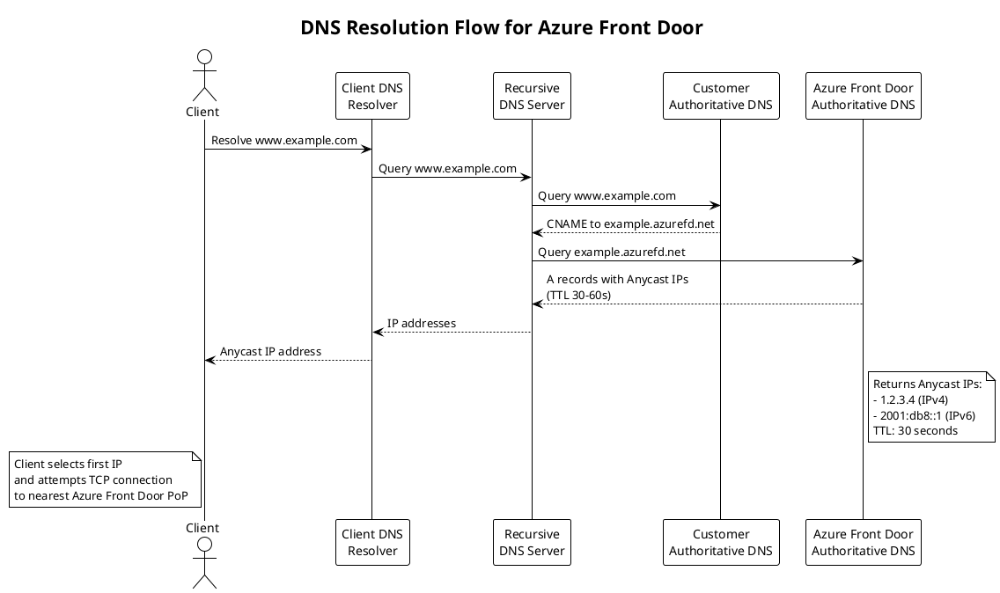
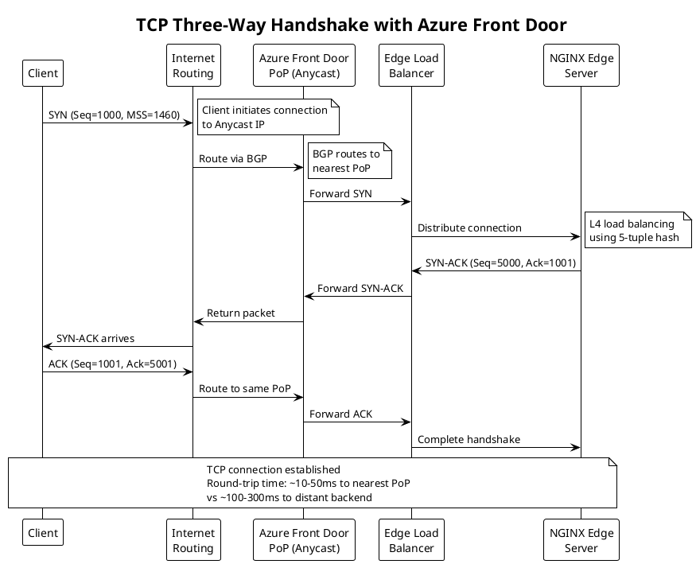
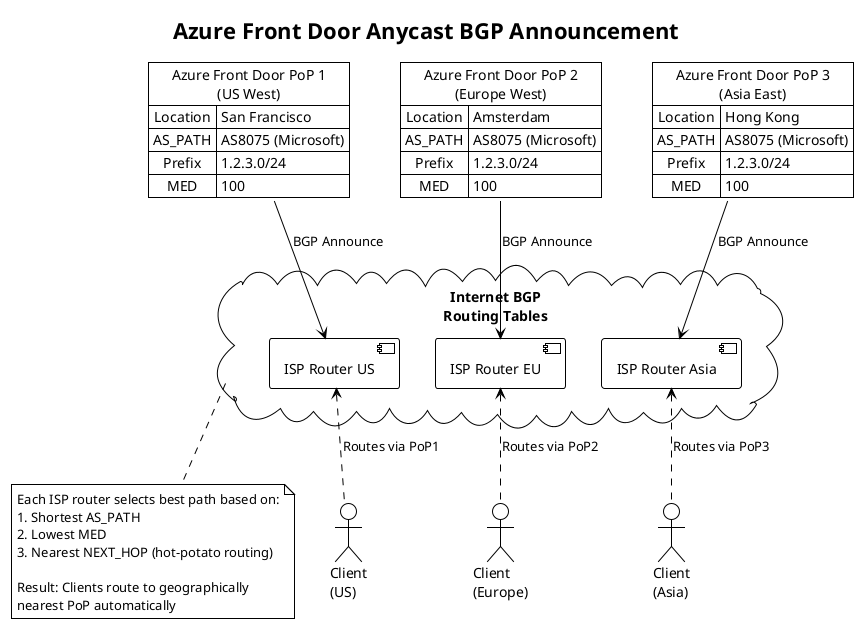
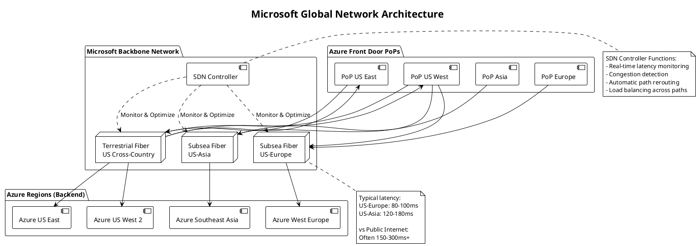
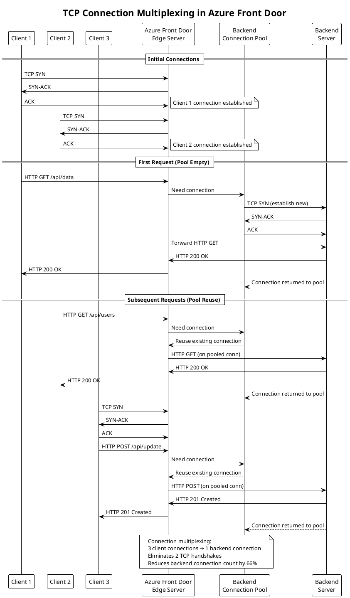
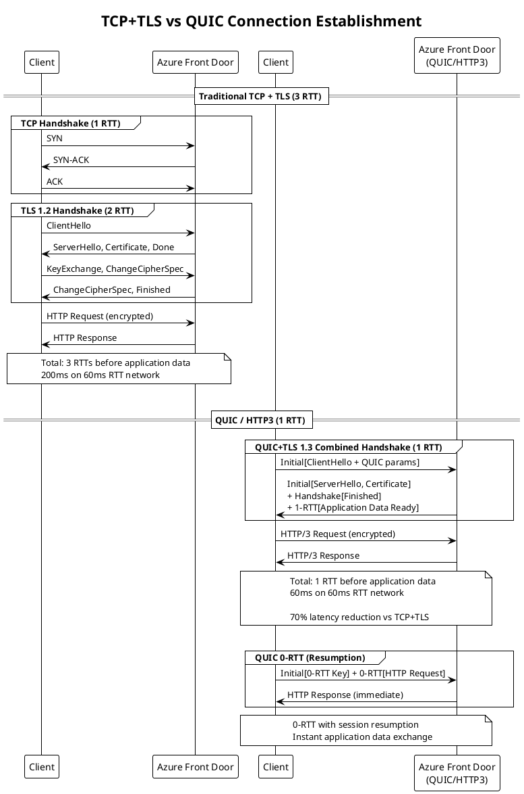
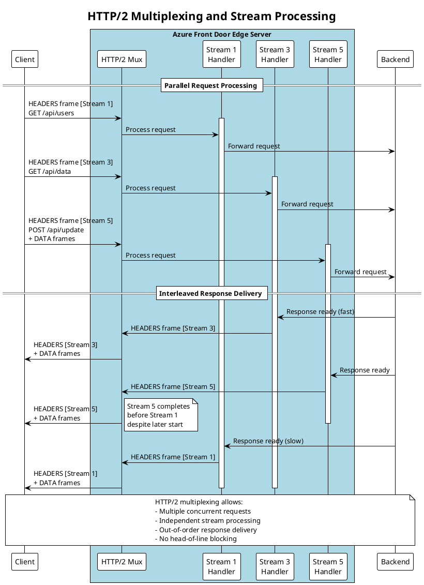

## Introduction

Building upon the architectural foundations established in Part 1, this article traces the complete lifecycle of requests through Azure Front Door from the perspective of network protocols and OSI model layers. We examine how packets flow from clients through global networks to edge locations, how connection state manages across protocol layers, and how Azure Front Door implements sophisticated routing and processing at each layer.

Understanding these low-level details is essential for diagnosing performance issues, optimizing configurations, and architecting applications that leverage Azure Front Door's capabilities effectively. We will progress systematically through the OSI layers, examining Layer 3 network routing, Layer 4 transport management, and Layer 7 application processing.

## Client Request Initiation and DNS Resolution

Every interaction with Azure Front Door begins before any packets reach Azure infrastructure, during DNS resolution when clients translate domain names into IP addresses that Anycast routing then directs to optimal edge locations.

### DNS Resolution Mechanics

When users access applications through Azure Front Door, their browsers or HTTP clients must first resolve domain names to IP addresses. This resolution process involves multiple steps and introduces the first opportunity for latency optimization through Azure's distributed DNS infrastructure.

**CNAME Chain Resolution:**

For custom domains, DNS configuration typically involves CNAME records pointing to Azure Front Door frontend hostnames. For example, `www.example.com` might have a CNAME to `example.azurefd.net`. Client DNS resolvers follow this CNAME chain, ultimately querying Azure Front Door's authoritative DNS servers for the final IP address.

The CNAME approach provides flexibility, allowing Azure to change backend IP addresses without requiring customer DNS updates. However, it introduces additional DNS queries in the resolution chain, potentially increasing latency. Each CNAME hop requires a separate DNS query, with round-trip times accumulating across hops.

**Authoritative DNS Response:**

Azure Front Door's authoritative DNS servers respond with A records (IPv4) and AAAA records (IPv6) containing Anycast IP addresses. These responses typically include low TTL values of 30 to 60 seconds, enabling Azure to influence traffic distribution through DNS changes when necessary.

The DNS response includes multiple IP addresses for redundancy. Clients typically attempt the first IP address, falling back to alternatives if connection attempts fail. This multi-address response provides resilience against individual edge location failures or routing issues affecting specific IP addresses.

**DNS Caching Implications:**

DNS caching at multiple layers affects how quickly routing changes propagate. Client operating systems cache DNS responses according to TTL values, recursive resolvers cache responses to serve multiple clients, and intermediate proxies or VPNs may implement additional caching. This multi-layer caching improves performance by reducing DNS queries but delays routing changes when Azure needs to redirect traffic.

Azure Front Door's relatively short TTL values balance these concerns, allowing routing changes within minutes while avoiding excessive DNS query load. However, some resolvers ignore TTL values or enforce minimum TTLs regardless of authoritative server specifications, potentially extending propagation delays beyond Azure's control.

### TCP Connection Establishment

After DNS resolution, clients initiate TCP connections to the resolved Anycast IP addresses. This connection establishment represents the first actual interaction with Azure Front Door infrastructure.

**Three-Way Handshake:**

TCP connection establishment follows the standard three-way handshake protocol. Clients send SYN (synchronize) packets to Azure Front Door Anycast addresses. These packets include initial sequence numbers, maximum segment size advertisements, window scaling options, and TCP timestamp options for round-trip time measurement.

Anycast routing directs these SYN packets to the nearest Azure Front Door Point of Presence based on BGP routing metrics. Edge routers at the PoP receive packets and forward them to load balancers, which select specific edge servers to handle connections. The selected edge server responds with SYN-ACK (synchronize-acknowledge) packets, confirming connection establishment and providing its own sequence number and TCP options.

Clients complete handshakes with ACK (acknowledge) packets, establishing connection state. This three-way handshake typically completes within one round-trip time to the nearest Azure Front Door PoP, significantly lower than round-trip times to distant backend servers would be if clients connected directly.

**TCP Fast Open Optimization:**

Azure Front Door supports TCP Fast Open (TFO), an optimization that allows data transmission in SYN packets, eliminating one round-trip from connection establishment. TFO requires clients and servers to support the feature, with cookies exchanged to prevent certain security attacks.

On first connection, clients send standard SYN packets without data. Azure Front Door responds with SYN-ACK packets including TFO cookies. On subsequent connections, clients include TFO cookies in SYN packets along with application data, typically HTTP GET requests. Azure Front Door validates cookies and immediately processes requests, returning responses before completing the three-way handshake.

TFO provides significant latency reduction for subsequent connections, particularly benefiting short-lived connections or mobile clients frequently establishing new connections. However, TFO requires careful security consideration to prevent SYN flood amplification attacks where attackers replay TFO cookies to amplify traffic.

## Layer 3: Network Layer Deep Dive

The network layer provides foundational routing and addressing that enables Azure Front Door's global distribution and low-latency client connectivity.

### IP Anycast Implementation

Azure Front Door's use of IP Anycast is fundamental to its architecture, enabling automatic client routing to optimal edge locations without complex DNS logic or geolocation databases.

**Anycast Address Assignment:**

Azure acquires IP address blocks from regional internet registries, registering them in WHOIS databases with appropriate organization information. These address blocks receive AS (Autonomous System) number assignments, identifying them in BGP routing tables globally.

Azure configures these IP blocks as Anycast addresses, announcing them from multiple Azure Front Door Points of Presence simultaneously. Unlike unicast addresses that identify single locations, Anycast addresses represent a service available at multiple locations, with routing protocols selecting which instance clients reach.

**BGP Announcement Mechanics:**

Border Gateway Protocol serves as the routing protocol enabling Anycast operation. Azure Front Door's edge routers establish BGP sessions with upstream provider routers and peering partner routers. These BGP sessions exchange routing information, including announcements for Azure Front Door Anycast prefixes.

Each BGP announcement includes several key attributes. The AS_PATH attribute lists the sequence of autonomous systems the route traversed, with shorter paths generally preferred. The ORIGIN attribute indicates how the route was learned (IGP, EGP, or INCOMPLETE). The NEXT_HOP attribute specifies the IP address of the next router toward the destination. Multi-Exit Discriminator (MED) values suggest preferred entry points when multiple connections exist between autonomous systems.

**Hot-Potato Routing:**

Internet service providers typically implement "hot-potato" routing, preferring to hand off traffic to destination networks as quickly as possible to minimize costs. This behavior complements Anycast, as ISPs naturally prefer closer Azure Front Door PoPs over distant ones, minimizing transit costs while improving latency for clients.

However, hot-potato routing can cause suboptimal paths in certain network topologies. Cold-potato routing, where providers carry traffic longer to reach better destination entry points, would sometimes provide better performance but increases provider costs. Azure Front Door's global PoP distribution minimizes these topology issues by ensuring nearby PoPs exist in most regions.

### Microsoft Global Network Backbone

Once client traffic reaches Azure Front Door PoPs, it traverses Microsoft's private global network to reach backend destinations. This network provides significant advantages over public internet transit.

**Fiber Infrastructure:**

Microsoft operates extensive private fiber connections between data centers, PoPs, and peering locations worldwide. This infrastructure includes subsea cables connecting continents, terrestrial fiber across countries and regions, and metropolitan fiber connecting facilities within cities. The private fiber network provides dedicated capacity without sharing bandwidth with other internet traffic, ensuring predictable performance.

The fiber infrastructure implements redundancy at multiple levels. Diverse physical paths prevent single cable cuts from disrupting connectivity. Multiple fiber strands within cables provide capacity headroom and fault tolerance. DWDM (Dense Wavelength Division Multiplexing) technology multiplexes many signals over single fibers, increasing capacity without additional cable installations.

**Traffic Engineering:**

Microsoft implements sophisticated traffic engineering to optimize path selection across its global network. Software-defined networking controllers monitor link utilization, latency, and failure conditions continuously. When congestion or failures occur, controllers adjust routing protocols to redirect traffic to alternative paths automatically.

The traffic engineering system considers multiple factors when selecting paths. Link utilization avoids overloaded connections, maintaining performance even during traffic spikes. Latency measurements prefer lower-latency paths for interactive traffic. Failure avoidance routes around known problems detected through monitoring. Cost considerations balance performance against operational expenses for provider transit where Microsoft's private network has gaps.

### Packet-Level Routing

Understanding packet-level routing reveals how data traverses networks from clients through Azure Front Door to backends.

**Client to Edge PoP:**

Client packets contain source IP addresses identifying client locations and destination IP addresses targeting Azure Front Door Anycast addresses. Internet routers examine destination addresses, consult BGP routing tables, and forward packets toward Azure Front Door PoPs advertising those addresses.

Each router along the path decrements the Time-To-Live (TTL) field in IP headers, preventing packets from circulating indefinitely if routing loops occur. Routers also implement ICMP protocol for error reporting, sending "Time Exceeded" messages when TTL reaches zero or "Destination Unreachable" messages when routing fails.

Fragmentation may occur if packet sizes exceed MTU (Maximum Transmission Unit) along paths. IPv4 allows intermediate routers to fragment packets, while IPv6 requires source fragmentation, implementing Path MTU Discovery to detect suitable packet sizes. Azure Front Door supports both models, handling fragmented packets and implementing PMTUD correctly.

**Edge PoP Processing:**

Packets arriving at edge PoPs undergo several processing stages. Edge routers validate packet integrity, checking checksums and header formats. L4 load balancers examine five-tuple information (source IP, source port, destination IP, destination port, protocol), selecting edge servers to handle connections. Selected servers accept packets, terminating TCP connections and processing application data.

**Return Path (PoP to Client):**

Response packets from Azure Front Door follow reverse paths back to clients. However, routing asymmetry is common in internet routing, where forward and return paths differ. Azure Front Door implements source NAT (Network Address Translation) when necessary, ensuring return packets appear to originate from Anycast addresses clients contacted, maintaining connection state despite routing asymmetry.

## Layer 4: Transport Layer Implementation

The transport layer manages connection state, reliable delivery, and flow control between clients, Azure Front Door, and backends.

### TCP Connection Management

Azure Front Door terminates TCP connections from clients at edge locations, establishing separate TCP connections to backends. This connection split provides numerous benefits while introducing specific behaviors that applications must handle correctly.

**Client-Edge Connection:**

Connections between clients and Azure Front Door edge locations complete TCP handshakes quickly due to geographic proximity. Once established, these connections remain open for extended periods when using HTTP keep-alive or HTTP/2 multiplexing, avoiding repeated handshake overhead.

Azure Front Door implements TCP keepalive, sending periodic probe packets on idle connections to detect connection failures. The keepalive mechanism helps detect half-open connections where one endpoint failed without proper connection teardown, preventing resource leaks and improving reliability.

**Edge-Backend Connection Pooling:**

Azure Front Door maintains connection pools to backends, reusing TCP connections across multiple client requests. This connection pooling provides significant performance benefits. Connection establishment overhead is eliminated for subsequent requests after the first. TLS handshake overhead is avoided when using HTTPS to backends. Round-trip latency is reduced by eliminating handshake delays.

The connection pool implementation includes sophisticated management logic. Pool size limits per backend prevent resource exhaustion if backends become slow or unresponsive. Idle timeout closes connections unused beyond configured durations, freeing resources. Health monitoring detects broken connections, removing them from pools before attempting use. Connection lifetime limits force periodic connection refresh, preventing issues from accumulating over long-lived connections.

### TCP Performance Optimizations

Azure Front Door implements various TCP optimizations to improve throughput and reduce latency under diverse network conditions.

**Window Scaling:**

TCP's original 16-bit window size field limits windows to 65,535 bytes, constraining throughput on high-bandwidth-delay-product networks. For example, on a 100Mbps link with 100ms latency, the bandwidth-delay product is 1.25MB, but the maximum unscaled TCP window allows only 65KB in flight, limiting throughput to ~5Mbps.

Window scaling extends TCP windows to gigabyte ranges, negotiated during connection establishment through TCP options. Azure Front Door negotiates aggressive window scaling with clients, allowing full utilization of high-bandwidth connections. Similarly, edge-to-backend connections use appropriate window scaling for Microsoft's backbone network characteristics.

**Congestion Control Algorithms:**

TCP congestion control prevents network overload while maximizing throughput. Azure Front Door implements modern congestion control algorithms like CUBIC (for client connections) and BBR (Bottleneck Bandwidth and RTT) where appropriate. These algorithms outperform classic TCP Reno/Tahoe, particularly on high-bandwidth or high-latency networks.

CUBIC uses a cubic function to probe for available bandwidth after congestion events, growing windows more aggressively than linear algorithms. This aggressive growth improves throughput recovery after packet loss. BBR explicitly models network bandwidth and round-trip time, adjusting sending rates to target optimal operating points without inducing congestion.

**Selective Acknowledgment (SACK):**

Standard TCP acknowledges data cumulatively, indicating the highest sequence number received in order. If packets are lost or reordered, TCP must retransmit all data from the first missing segment, even if subsequent segments arrived successfully.

Selective Acknowledgment extends TCP to acknowledge non-contiguous data blocks, informing senders which segments arrived successfully. This allows retransmission of only actually lost segments, improving performance on lossy networks. Azure Front Door enables SACK on both client and backend connections, optimizing recovery from packet loss.

### QUIC Protocol and HTTP/3 Support

Azure Front Door Premium tier supports QUIC protocol, representing a fundamental reimagining of transport-layer design for modern networks.

**QUIC Architecture:**

QUIC runs over UDP rather than TCP, avoiding TCP's rigid connection state machine and enabling faster connection establishment. QUIC integrates transport and security (TLS) handshakes, completing both in a single round-trip instead of TCP's three-way handshake followed by TLS negotiation.

QUIC implements connection multiplexing natively, supporting multiple independent streams over single connections without head-of-line blocking. If packets are lost affecting one stream, other streams continue processing, unlike TCP where packet loss blocks all streams on the connection.

Connection migration allows clients to change IP addresses without breaking connections, beneficial for mobile clients moving between networks. QUIC identifies connections with connection IDs rather than five-tuples, enabling transparent migration as client addresses change.

**HTTP/3 Over QUIC:**

HTTP/3 uses QUIC as its transport protocol, replacing HTTP/2's TCP foundation. HTTP/3 maintains HTTP/2's semantics including request/response model, header compression, and server push, but gains QUIC's performance benefits.

The stream multiplexing in HTTP/3 avoids TCP head-of-line blocking. When loading web pages with many resources, HTTP/3 can deliver small resources immediately even if large resources experience packet loss, improving perceived performance. This contrasts with HTTP/2 over TCP, where packet loss affecting one resource delays all resources on the connection.

**Implementation Challenges:**

Despite performance benefits, QUIC faces deployment challenges. Many corporate firewalls block UDP traffic on port 443, preventing QUIC connections. NAT devices and middleboxes may not correctly handle QUIC, causing connection failures. Azure Front Door implements robust fallback, advertising QUIC support but gracefully reverting to TCP when QUIC fails.

The fallback mechanism uses Alt-Svc HTTP headers to advertise QUIC availability. Clients supporting HTTP/3 attempt UDP connections on subsequent requests. If QUIC connections fail, clients retry with TCP, maintaining connectivity. This approach enables gradual QUIC adoption without breaking compatibility.

## Layer 7: Application Layer Processing

The application layer provides Azure Front Door's most sophisticated capabilities, implementing HTTP/HTTPS protocol processing, content-based routing, and security functions.

### HTTP Protocol Implementation

Azure Front Door implements comprehensive HTTP protocol support, handling HTTP/1.1, HTTP/2, and HTTP/3 on client connections while flexibly connecting to backends using appropriate versions.

**HTTP/1.1 Processing:**

HTTP/1.1 remains widely deployed despite newer protocol versions. Azure Front Door's HTTP/1.1 implementation handles persistent connections with keep-alive, chunked transfer encoding for streaming responses, pipelined requests (though discouraged), and byte-range requests for partial content retrieval.

The HTTP/1.1 parser tolerates common protocol deviations for compatibility while rejecting clearly malformed requests that might exploit vulnerabilities. This balance maintains security without breaking legitimate clients with slightly non-conformant implementations.

**HTTP/2 Advanced Features:**

HTTP/2 provides significant improvements over HTTP/1.1 through binary framing, header compression, multiplexing, server push, and stream prioritization. Azure Front Door implements full HTTP/2 support, transparently converting between HTTP versions as needed.

Binary framing replaces HTTP/1.1's text-based protocol with efficient binary frames. Frame types include HEADERS for request/response headers, DATA for payload content, SETTINGS for connection parameters, PRIORITY for stream prioritization, RST_STREAM for stream cancellation, and GOAWAY for connection shutdown. This binary protocol enables efficient parsing and processing compared to HTTP/1.1's text scanning.

Header compression using HPACK significantly reduces overhead. HTTP headers are verbose and repetitive, with common headers like Cookie, User-Agent, and Accept appearing in every request. HPACK maintains compression contexts tracking previously sent headers, referencing them by index in subsequent requests. For typical web traffic, HPACK reduces header sizes by 70-90%, improving performance especially on mobile networks.

### Request and Response Processing Pipeline

Azure Front Door's request processing pipeline orchestrates multiple stages of analysis and transformation between receiving client requests and delivering responses.

**Request Pipeline Stages:**

The pipeline begins with protocol processing where raw packets are parsed into HTTP requests. Header inspection extracts and validates HTTP headers, checking for required fields and format compliance. URL parsing separates components including scheme, host, path, query string, and fragment identifier.

WAF evaluation occurs early, inspecting requests against security rules before expensive backend processing. Routing rule evaluation matches requests against configured patterns, selecting appropriate backend pools. Backend selection within pools applies load balancing algorithms and health checks. Request transformation applies configured modifications like header addition or URL rewriting. Finally, backend forwarding sends requests to selected origins.

**Response Pipeline Stages:**

Response processing begins when backends complete request handling. Protocol processing parses backend responses into structured formats. Cacheability evaluation determines whether responses should be cached based on headers and configuration. Cache storage saves cacheable responses for subsequent requests. Response transformation applies configured modifications like header manipulation or compression. Finally, protocol encoding converts responses to appropriate client protocol versions before delivery.

## Conclusion

This second part of the Azure Front Door technical series examined the complete request lifecycle from the network protocol perspective, progressing through OSI layers from DNS resolution through TCP connection management to HTTP protocol processing.

We traced how Anycast routing directs clients to optimal edge locations using BGP mechanics, how Microsoft's global backbone network transports traffic efficiently between edge locations and backends, and how TCP connection multiplexing and QUIC protocol improvements reduce latency and improve throughput. We explored HTTP/2 multiplexing and how Azure Front Door bridges protocol versions, providing modern capabilities to clients while supporting diverse backend implementations.

Understanding these low-level protocols and their interactions is essential for diagnosing performance issues, optimizing configurations, and making informed architectural decisions. The next article in this series will examine load balancing mechanisms in detail, covering algorithms, health monitoring, and failover behaviors that ensure high availability and optimal performance.

## References

- RFC 7540: Hypertext Transfer Protocol Version 2 (HTTP/2)
- RFC 9000: QUIC: A UDP-Based Multiplexed and Secure Transport
- RFC 9114: HTTP/3
- RFC 4271: Border Gateway Protocol 4 (BGP-4)
- RFC 7413: TCP Fast Open
- RFC 1323: TCP Extensions for High Performance
- RFC 2018: TCP Selective Acknowledgment Options
- Microsoft Global Network Documentation
- Azure Front Door Technical Documentation
- NGINX HTTP/2 Implementation Guide

