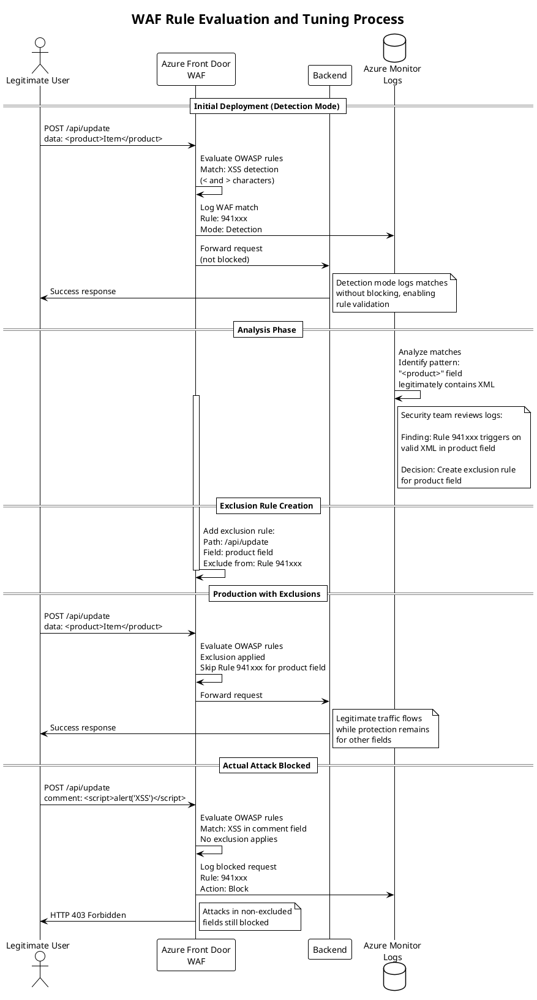
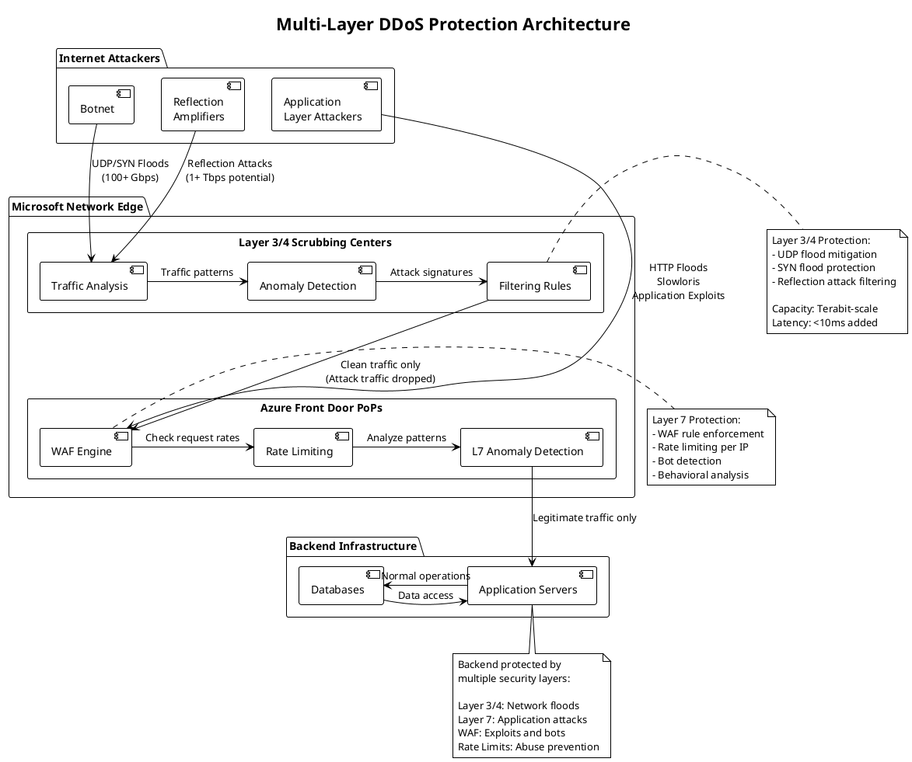
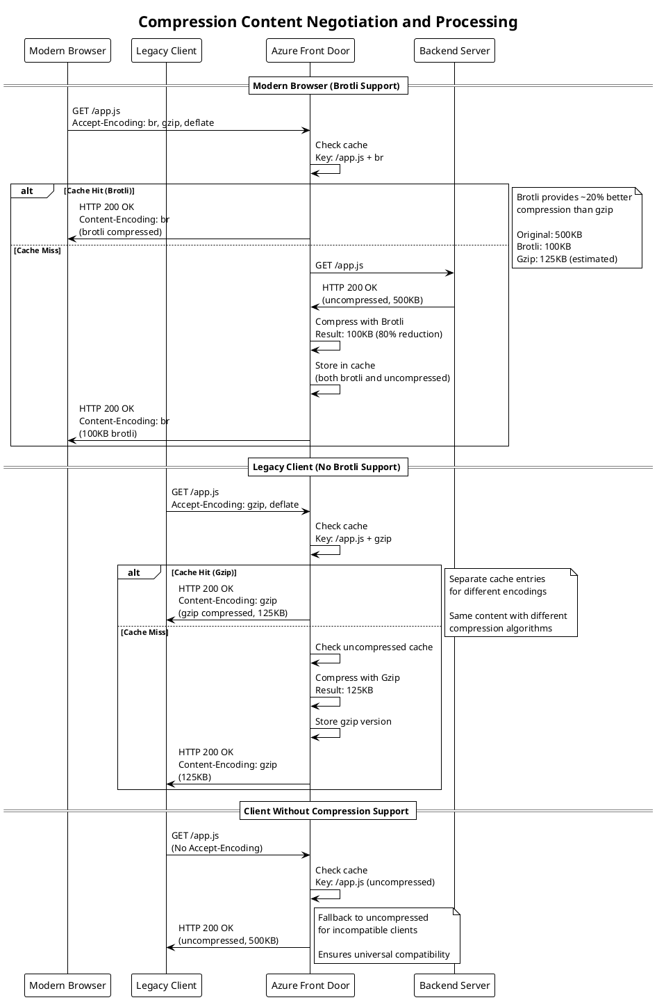

## Introduction

Building upon load balancing and traffic management covered in Part 3, this article explores the security and performance optimization capabilities that make Azure Front Door a robust application delivery platform. Security features protect applications from attacks while performance optimizations reduce latency and improve user experience.

We examine Web Application Firewall rule processing, DDoS protection across multiple network layers, edge caching mechanics with cache key optimization, and compression algorithms that reduce bandwidth consumption. Understanding these capabilities is essential for securing applications and achieving optimal performance.

## Web Application Firewall Implementation

Web Application Firewall provides security protection at the Azure Front Door edge, inspecting requests before they reach backend services and blocking malicious traffic based on configured rules.

### WAF Architecture and Processing Pipeline

WAF evaluation occurs early in the request processing pipeline, immediately after protocol parsing but before routing decisions or backend selection.

**Request Inspection Flow:**

When requests arrive at Azure Front Door edge locations, they undergo protocol processing to extract HTTP methods, URLs, headers, and bodies. The parsed request data flows into the WAF engine, which evaluates configured rule sets sequentially.

The WAF engine operates in phases. Custom rules evaluate first, enabling organization-specific security logic to execute before managed rules. This ordering allows administrators to create exceptions or additional protections tailored to their applications. Managed rule sets follow, applying OWASP Core Rule Set protections against common vulnerabilities. Bot protection rules execute for Premium tier customers, identifying and mitigating automated traffic. Rate limiting rules apply last, enforcing request volume controls based on accumulated state.

Each rule phase can take different actions based on match results. Allow actions permit requests to continue processing through subsequent phases and routing logic. Block actions immediately terminate processing, returning HTTP 403 Forbidden responses without backend involvement. Log actions record matches without blocking, useful for monitoring and rule tuning before enforcement. Redirect actions return HTTP 302 responses directing clients to alternative URLs.

```plantuml
@startuml
!theme plain

title WAF Request Processing Pipeline

start

:Client Request Arrives;
:Protocol Parsing\n(HTTP headers/body);

partition "WAF Evaluation" {
    
    :Evaluate Custom Rules;
    if (Custom Rule Match?) then (block)
        :Return HTTP 403;
        stop
    else (allow/log)
        :Continue;
    endif
    
    :Evaluate Managed Rules\n(OWASP CRS);
    if (OWASP Rule Match?) then (block)
        :Log to Azure Monitor;
        :Return HTTP 403\nWith Rule ID;
        stop
    else (allow/log)
        :Continue;
    endif
    
    if (Premium Tier?) then (yes)
        :Evaluate Bot Protection;
        if (Bot Detected?) then (challenge)
            :Return CAPTCHA\nor JS Challenge;
            stop
        else (legitimate)
            :Continue;
        endif
    endif
    
    :Check Rate Limiting;
    if (Rate Exceeded?) then (yes)
        :Return HTTP 429;
        stop
    else (within limits)
        :Continue;
    endif
}

:Routing Rule Evaluation;
:Backend Selection;
:Forward to Backend;

stop

note right of "WAF Evaluation"
  WAF processing occurs at edge
  before backend routing
  
  Blocked requests never reach
  backends, reducing attack surface
  
  Rule evaluation is sequential:
  1. Custom rules
  2. Managed rules (OWASP)
  3. Bot protection
  4. Rate limiting
end note

@enduml
```

**Request Components Inspected:**

WAF rules examine multiple request components to detect attack patterns. URL path and query string analysis identifies path traversal attempts, injection patterns, and malformed encoding. HTTP header inspection detects headers commonly used in attacks like X-Forwarded-For manipulation or Host header injection. Request body analysis for POST requests examines form data, JSON payloads, and XML documents for injection attacks. Cookie value inspection identifies authentication bypass attempts or session manipulation.

The multi-component inspection detects sophisticated attacks that split malicious payloads across multiple fields to evade simple filters. OWASP rules implement correlation logic that combines signals from URL, headers, and body to identify attack patterns that would escape single-field inspection.

### Managed Rule Sets and OWASP Protection

Azure Front Door WAF provides managed rule sets based on OWASP Core Rule Set, offering protection against common web vulnerabilities without requiring security expertise to configure.

**OWASP Core Rule Set Coverage:**

The managed rules protect against threats enumerated in the OWASP Top 10 and beyond. SQL injection protection detects SQL syntax patterns in parameters, including union-based injection, blind SQL injection, and stored procedure abuse. Cross-site scripting defenses identify JavaScript injection in various contexts including HTML content, attributes, event handlers, and URL parameters. Remote code execution rules block attempts to execute shell commands, PHP code, or other server-side script injection.

Path traversal protection prevents directory listing and file access outside web roots using patterns like ../../etc/passwd. Local file inclusion and remote file inclusion defenses stop attempts to include arbitrary files in application execution. Protocol enforcement ensures HTTP protocol compliance, rejecting malformed requests that might exploit parsing vulnerabilities.

**Rule Tuning and False Positives:**

Managed rules use broad pattern matching to detect potential attacks, occasionally triggering on legitimate application traffic. Organizations must tune rules to balance security and functionality, addressing false positives while maintaining protection.

False positive handling typically involves several strategies. Rule exclusions disable specific rules for particular URLs or parameters known to trigger false matches. Field-level exclusions allow specific request components to bypass inspection when legitimate application behavior mimics attack patterns. Detection-only mode logs matches without blocking, enabling rule validation before enforcement. Threshold adjustments change sensitivity for rules that support configurable thresholds.

Azure Front Door provides detailed logging of WAF matches including matched rule identifiers, request details, and match locations within requests. This logging enables systematic false positive investigation, identifying patterns in blocked legitimate traffic for targeted exclusion rules.



### Custom Rules and Application-Specific Protection

While managed rules provide broad protection, custom rules enable application-specific security logic tailored to organizational requirements.

**Custom Rule Capabilities:**

Custom rules support sophisticated matching conditions and combinations. Geographic location matching restricts access based on client country or region, implementing geo-blocking or geo-fencing. IP address matching allows allowlists or blocklists for specific address ranges, useful for restricting administrative interfaces or blocking known attackers. Header matching inspects specific HTTP headers, implementing security policies like requiring internal routing headers or blocking certain user agents.

Cookie matching evaluates cookie values, enabling authentication-aware security policies. Request body matching inspects POST payload content using string matching or regular expressions. Query string parameter matching evaluates URL parameters, blocking specific values or patterns. Match conditions combine using AND/OR logic, creating complex rules that trigger only when multiple conditions satisfy simultaneously.

**Rate Limiting Rules:**

Rate limiting custom rules control request volume from individual IP addresses, preventing application-layer DDoS attacks and abuse. Rate limits specify maximum requests per minute, with actions taken when thresholds exceed.

The rate limiting implementation maintains per-IP request counters across edge locations, aggregating global request rates. When clients exceed limits, configured actions apply. Block actions return HTTP 429 Too Many Requests for the duration of the rate limit window. Challenge actions return CAPTCHA or JavaScript challenge responses, requiring human or browser interaction before allowing requests. Log actions record rate limit violations without blocking, useful for monitoring and threshold tuning.

Rate limiting granularity extends beyond simple per-IP limits. Rules can limit specific URL paths, protecting expensive API endpoints while allowing unlimited access to static content. Geographic rate limiting applies different limits based on client location, accommodating regional traffic patterns. User-agent-based limiting applies different thresholds to browsers versus API clients, recognizing their different usage patterns.

### Bot Protection and Threat Intelligence

Azure Front Door Premium tier integrates bot protection using machine learning models trained on billions of requests across Microsoft's global network.

**Bot Detection Mechanisms:**

Bot detection analyzes multiple behavioral signals to distinguish automated traffic from human users. Request pattern analysis identifies regular request intervals characteristic of automated tools. Browser fingerprinting examines JavaScript execution capabilities, DOM access patterns, and rendering behavior. TLS fingerprint matching compares connection characteristics against known bot tool signatures. HTTP header analysis detects anomalies in header ordering, values, or combinations indicating automation.

The machine learning models continuously evolve as new bot tools emerge and existing tools adapt to detection. Microsoft's threat intelligence feeds provide real-time updates on active botnet IP addresses, attacker infrastructure, and emerging attack patterns. This continuous learning maintains effective protection against evolving threats without requiring manual rule updates.

**Challenge Mechanisms:**

When bot detection triggers, Azure Front Door can respond with various challenge types. JavaScript challenge returns HTML pages with JavaScript that must execute correctly, proving browser capabilities. CAPTCHA challenge requires solving visual puzzles, confirming human interaction. Silent challenge performs background verification using browser APIs without user interaction. These challenges balance security against user experience, with silent challenges preferred when confidence is moderate and CAPTCHA reserved for high-risk scenarios.

## DDoS Protection Mechanisms

Distributed Denial of Service attacks attempt to overwhelm applications with traffic volume, consuming resources until legitimate users cannot access services. Azure Front Door implements multi-layer DDoS protection, defending against both network-layer and application-layer attacks.

### Layer 3/4 Volumetric Attack Protection

Network-layer DDoS attacks flood targets with massive packet volumes, saturating network links or exhausting connection state tables.

**Always-On Protection:**

Azure Front Door includes always-on DDoS protection at Layer 3 and Layer 4 without requiring activation or configuration. Microsoft's network infrastructure includes scrubbing centers distributed globally that detect and mitigate volumetric attacks automatically.

The protection operates through traffic analysis at Azure's network edge. All traffic destined for Azure Front Door Anycast addresses flows through scrubbing centers, where detection systems analyze traffic patterns continuously. Machine learning models identify anomalous traffic volumes, suspicious packet characteristics, and attack signatures in real time.

**Attack Types Mitigated:**

Common network-layer attacks mitigated include UDP flood attacks overwhelming targets with UDP packets, SYN flood attacks exhausting TCP connection tables with incomplete handshakes, reflection and amplification attacks using DNS, NTP, or other protocols to amplify attacker traffic, and protocol exploits targeting network stack vulnerabilities.

When attacks are detected, scrubbing centers apply filtering rules that drop attack traffic while allowing legitimate traffic through. The filtering updates propagate globally within seconds, protecting all Azure Front Door edge locations simultaneously. Attack traffic is absorbed at scrubbing centers, never reaching application infrastructure or consuming backend capacity.



### Layer 7 Application Layer Attack Protection

Application-layer DDoS attacks use legitimate HTTP requests to exhaust application resources, requiring different mitigation strategies than network-layer attacks.

**HTTP Flood Protection:**

HTTP flood attacks send massive numbers of HTTP requests to overwhelm application servers. Unlike network floods that use raw packet volumes, HTTP floods generate requests that appear legitimate to network-layer protections, requiring application-aware defenses.

Azure Front Door protects against HTTP floods through multiple mechanisms. Rate limiting enforces per-IP request thresholds, blocking clients exceeding limits. Edge caching serves cacheable content without backend involvement, absorbing attack traffic at the edge. Connection limits restrict concurrent connections per IP, preventing resource exhaustion. Challenge mechanisms distinguish humans from bots, blocking automated attack tools.

**Slowloris Attack Mitigation:**

Slowloris attacks hold many connections open with incomplete requests, exhausting server connection limits without generating high traffic volumes. Traditional rate limiting may not detect slowloris as request rates appear normal while connection counts are extremely high.

Azure Front Door mitigates slowloris through connection timeout enforcement, closing connections that do not complete requests within reasonable timeframes. Connection limits per IP prevent single sources from holding excessive connections. Request header timeout limits force clients to send complete headers promptly, preventing slow-header attacks.

### Adaptive Real-Time Tuning

DDoS protection continuously adapts to traffic patterns, distinguishing legitimate traffic increases from attacks.

**Baseline Learning:**

Azure Front Door learns normal traffic patterns for each application, establishing baselines for request rates, connection counts, geographic distribution, and protocol characteristics. These baselines account for daily and weekly patterns, recognizing that weekend traffic differs from weekday traffic or that certain hours see higher legitimate usage.

When traffic deviates significantly from learned baselines, protection systems analyze the deviation to determine whether it represents legitimate growth, marketing campaigns, or attacks. Machine learning models consider multiple factors including suddenness of increase, geographic distribution, client behavior patterns, and attack signatures in traffic.

**Automated Response:**

Detected attacks trigger automated mitigation responses without requiring human intervention. The response escalates through multiple tiers based on attack severity. Initial response increases monitoring sensitivity, collecting detailed telemetry. Rate limiting tightens when traffic exceeds baseline thresholds. Geo-blocking temporarily restricts traffic from attack source regions. Finally, challenge mechanisms activate CAPTCHA or JavaScript challenges widely.

The automated response aims to minimize impact on legitimate users while effectively blocking attacks. Proportional response applies only protections necessary for current attack characteristics, avoiding overly aggressive measures that might block legitimate traffic.

## Edge Caching Mechanics

Caching at Azure Front Door edge locations significantly improves performance by serving content without backend round-trips while reducing origin load.

### Cache Architecture and Storage

Azure Front Door maintains cache storage at each edge location, using memory and SSD storage to hold frequently accessed content.

**Cache Storage Tiers:**

Cache architecture uses multiple storage tiers optimized for different access patterns. Memory cache stores hot content accessed very frequently, providing microsecond access times. SSD cache stores warm content accessed regularly but not frequently enough to warrant memory storage, providing millisecond access times. The tiered approach maximizes performance while managing storage costs, with more expensive memory reserved for highest-value content.

Eviction policies manage limited cache capacity. LRU (Least Recently Used) eviction removes content not accessed recently when capacity limits are reached. Size-aware eviction considers object sizes, preferring to cache many small objects over few large objects. Importance scoring factors access frequency and backend generation cost, retaining hard-to-generate content longer.

**Cache Key Calculation:**

Cache keys uniquely identify cached content, determining whether subsequent requests match existing cache entries. The cache key calculation includes several request components.

URL path distinguishes different resources, making /index.html and /about.html separate cache entries. Query string inclusion depends on configuration, with options to include all parameters, ignore all parameters, or include only specified parameters. Host header differentiates content for different domains served through the same Azure Front Door profile. Accept-Encoding header separates compressed and uncompressed versions, serving appropriate versions based on client capabilities.

This multi-component key ensures correct responses while maximizing cache hit rates. Including unnecessary components reduces hit rates by creating separate entries for functionally identical content. Excluding necessary components causes incorrect responses when content varies based on excluded components.

```plantuml
@startuml
!theme plain

title Cache Key Calculation and Lookup Process

start

:Incoming Request;
:Parse Request\nComponents;

partition "Cache Key Calculation" {
    :Extract URL Path\n(/api/products);
    
    :Check Query String Config;
    if (Query String Mode?) then (include all)
        :Add full query string\n(?category=electronics&sort=price);
    else if (include specified) then
        :Add specified params\n(?category=electronics);
    else (ignore)
        :Omit query string;
    endif
    
    :Add Host Header\n(www.example.com);
    
    :Check Accept-Encoding\n(gzip, br);
    :Add encoding to key;
    
    :Compute Cache Key Hash\nSHA256(all components);
}

:Lookup in Cache;

if (Cache Hit?) then (yes)
    :Check Freshness\n(TTL expired?);
    
    if (Still Fresh?) then (yes)
        :Serve from Cache;
        :Update LRU position;
        stop
    else (expired)
        :Conditional Request\nto Backend\nIf-Modified-Since;
        
        if (Backend: 304\nNot Modified?) then (yes)
            :Refresh TTL;
            :Serve from Cache;
            stop
        else (200 new content)
            :Update Cache Entry;
            :Serve New Content;
            stop
        endif
    endif
    
else (miss)
    :Request from Backend;
    :Evaluate Cacheability;
    
    if (Cacheable?) then (yes)
        :Store in Cache;
        :Set TTL from headers;
    endif
    
    :Serve to Client;
    stop
endif

note right of "Cache Key Calculation"
  Cache key components:
  
  1. URL path (always)
  2. Query string (configurable)
  3. Host header
  4. Accept-Encoding
  5. Custom vary headers
  
  Different combinations create
  separate cache entries
end note

@enduml
```

### Caching Rules and Policies

Caching behavior is controlled through configuration rules that determine which content is cacheable and for how long.

**HTTP Header-Based Caching:**

Azure Front Door respects standard HTTP caching headers by default. Cache-Control headers specify cacheability and TTL, with directives like public, private, no-cache, no-store, and max-age controlling behavior. Expires headers provide absolute expiration timestamps as an alternative to relative TTLs. Pragma headers provide HTTP/1.0 compatibility with no-cache semantics. Vary headers indicate which request headers affect responses, influencing cache key calculation.

Private responses marked with Cache-Control: private are never cached at Azure Front Door, as they contain user-specific content unsuitable for shared caches. Public responses with appropriate max-age values cache according to specified TTLs. No-cache and no-store directives prevent caching entirely, requiring backend requests for every client request.

**Caching Rule Override:**

While HTTP header-based caching works well for content with proper headers, many applications lack correct caching headers. Azure Front Door provides caching rules that override backend headers, enabling caching despite missing or incorrect header values.

Override rules specify cache durations for URL patterns, setting TTLs independently of backend headers. Query string handling rules determine whether query parameters affect cache keys. Header bypass rules ignore specific backend headers, caching content despite private or no-cache directives. These overrides enable caching for applications that cannot easily be modified to emit correct headers.

### Cache Invalidation and Purge

While caching improves performance, applications require mechanisms to invalidate cached content when updates occur.

**Purge API Operations:**

Azure Front Door provides purge APIs that remove specific content from caches globally. Purge operations specify content to invalidate through URL patterns, with single URL purge removing specific resources, prefix purge removing all URLs matching a prefix, and wildcard purge removing content matching patterns.

Purge propagation occurs within minutes across all edge locations globally. The control plane distributes purge commands to edge locations, which remove matching entries from cache storage. Subsequent requests result in cache misses, fetching fresh content from backends.

**Purge Strategies:**

Effective cache purging requires careful strategy selection. Immediate purge after content updates ensures users see current content but generates backend load spikes as many edges simultaneously request fresh content. Scheduled purge during low-traffic periods reduces load impact but delays content freshness. Partial purge invalidates only changed resources rather than entire site caches, minimizing backend load while ensuring freshness.

Many organizations implement versioned URLs or cache-busting query parameters as alternatives to purging. URLs like /script.js?v=1.2.3 change with content updates, naturally creating cache misses without explicit purge operations. This approach provides reliable cache invalidation without operational overhead but requires URL management in applications.

## Response Compression

Compression reduces response sizes, improving performance for clients on bandwidth-constrained networks while reducing data transfer costs.

### Compression Algorithms

Azure Front Door supports multiple compression algorithms with different characteristics and tradeoffs.

**Gzip Compression:**

Gzip provides widely supported compression using the DEFLATE algorithm. Virtually all modern browsers and HTTP clients support gzip, making it the safe default choice. Compression ratios typically achieve 70-90% size reduction for text-based content, with exact ratios depending on content characteristics.

Gzip operates at multiple compression levels from 1 (fastest) to 9 (best compression). Azure Front Door uses moderate compression levels that balance compression ratio against CPU consumption. Higher levels provide marginally better compression at significantly higher CPU cost, making them inefficient for real-time response compression.

**Brotli Compression:**

Brotli is a newer compression algorithm providing better compression ratios than gzip with similar speed. Brotli achieves 10-20% better compression than gzip on average, significantly reducing transfer sizes especially for text-heavy content like HTML and JavaScript.

Browser support for brotli is widespread in modern browsers but incomplete in older versions. Azure Front Door negotiates compression based on client Accept-Encoding headers, using brotli when supported and falling back to gzip otherwise. This content negotiation ensures optimal compression without compatibility issues.

**Compression Selection:**

Azure Front Door selects compression algorithms through content negotiation. Clients send Accept-Encoding headers listing supported algorithms. Azure Front Door examines the header and selects the best mutually supported algorithm, preferring brotli over gzip when both are available.

If clients do not support compression, Azure Front Door serves uncompressed content. This fallback ensures compatibility with legacy clients while providing compression benefits to capable clients.



### Compression Configuration and Content Types

Compression applies selectively based on content types, as only certain content benefits from compression.

**Compressible Content Types:**

Text-based content types benefit significantly from compression and are enabled by default. These include HTML (text/html), CSS (text/css), JavaScript (application/javascript, text/javascript), JSON (application/json), XML (application/xml, text/xml), and text files (text/plain). These content types typically achieve 70-90% size reduction through compression.

Binary formats are excluded from compression as they use format-specific compression. Images (JPEG, PNG, GIF, WebP) include internal compression and gain nothing from additional gzip/brotli compression. Video files (MP4, WebM) are already heavily compressed. Compressed archives (ZIP, GZIP) obviously cannot compress further. Applying compression to these formats wastes CPU without reducing sizes.

**Compression Thresholds:**

Compression applies only to responses above minimum size thresholds, typically 1KB or 2KB. Very small responses do not benefit from compression, as the compression overhead exceeds size reduction. Additionally, HTTP compression headers add bytes that can exceed compression savings for tiny responses.

The threshold prevents wasting CPU on responses that will not benefit. Organizations can adjust thresholds based on their content characteristics and performance priorities, but default values work well for most applications.

## Conclusion

This fourth part of the Azure Front Door technical series examined security and performance optimization capabilities. We explored Web Application Firewall implementation with OWASP rule sets, custom rules, and bot protection providing defense against attacks. DDoS protection across network and application layers defends against volumetric floods and application-layer attacks.

Edge caching mechanics with sophisticated cache key calculation improve performance by serving content without backend round-trips. Response compression using gzip and brotli algorithms reduces bandwidth consumption and improves performance for users on slower connections.

Understanding these security and performance features is essential for protecting applications and achieving optimal user experience. The final article in this series will examine integration patterns, monitoring capabilities, and operational best practices for managing Azure Front Door in production environments.

## References

- OWASP Core Rule Set Documentation
- Azure Front Door WAF Configuration Guide
- Azure DDoS Protection Architecture
- HTTP Caching Specifications (RFC 7234)
- Gzip Compression Algorithm (RFC 1952)
- Brotli Compression Format (RFC 7932)
- Web Application Security Best Practices
- Content Delivery Network Performance Optimization

