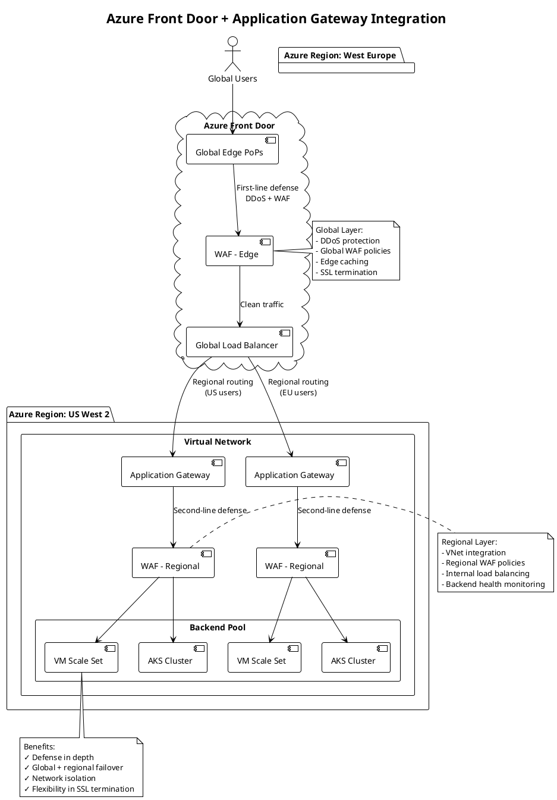
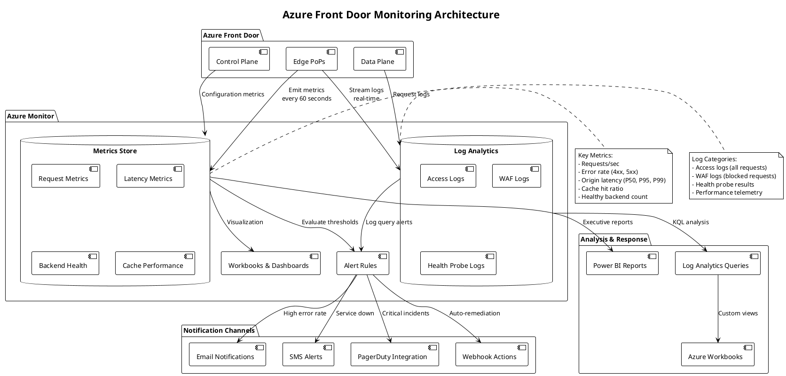

## Introduction

This final article in the Azure Front Door technical series examines practical integration patterns, monitoring strategies, and operational best practices. Building upon the architectural foundations, request flows, load balancing mechanisms, and security features covered in previous parts, we now explore how to successfully deploy, monitor, and operate Azure Front Door in production environments.

We examine integration with Azure services and external systems, infrastructure as code approaches using Terraform and Bicep, monitoring with Azure Monitor and Log Analytics, troubleshooting methodologies for common issues, and operational best practices drawn from real-world deployments.

## Integration with Azure Services

Azure Front Door integrates deeply with other Azure services, creating powerful application delivery architectures when combined appropriately.

### Azure Application Gateway Integration

Combining Azure Front Door with Application Gateway provides layered global and regional traffic management with enhanced security.

**Architectural Pattern:**

The typical integration pattern uses Azure Front Door as the global entry point routing traffic to regional Application Gateway instances. Azure Front Door handles global load balancing, DDoS protection at the edge, and initial WAF filtering. Application Gateway provides regional Layer 7 load balancing within Azure Virtual Networks, additional WAF policies for defense in depth, and SSL termination for backend pool members.

This layered approach provides multiple advantages. Global failover occurs at Azure Front Door level while regional distribution happens at Application Gateway level. Security defense in depth applies WAF policies at both global edge and regional network boundaries. Network segmentation places Application Gateway within Virtual Networks, isolating backends from public internet while Azure Front Door faces external traffic.

**Configuration Considerations:**

When integrating these services, several configuration details require attention. Backend connectivity from Azure Front Door to Application Gateway can use public IP addresses for simplicity or Private Link (Premium tier) for security. Header preservation requires careful configuration as both services add X-Forwarded-* headers, potentially creating duplicate headers. Health probes must work through both layers, with Application Gateway probing backends and Azure Front Door probing Application Gateway instances.

SSL certificate management becomes more complex with two termination points. Organizations can terminate SSL at Azure Front Door and use HTTP to Application Gateway over Azure's private network, or terminate SSL at both layers for end-to-end encryption. The security benefits of dual termination must be weighed against operational complexity and performance overhead.



### Azure Private Link Integration

Azure Private Link enables secure connectivity between Azure Front Door and backend services without exposing backends to the public internet.

**Private Link Architecture:**

Private Link creates private endpoints within Azure Virtual Networks that Azure Front Door Premium tier can connect to securely. Backend services receive private IP addresses within Virtual Networks, eliminating public internet exposure. Azure Front Door connects through Microsoft's backbone network to these private endpoints, maintaining end-to-end security without public routing.

This architecture provides significant security benefits. Backend services never receive public IP addresses, eliminating attack surface from public internet scanning. Network Security Groups control access at Virtual Network boundaries, implementing micro-segmentation. Compliance requirements for private connectivity satisfy regulated industry mandates. Data exfiltration prevention ensures traffic stays within Microsoft's network.

**Implementation Patterns:**

Implementing Private Link requires specific configuration steps. Backend services must support Private Link, including Azure App Service, Azure Kubernetes Service with Private Link Service, Azure Functions Premium plan, and Azure Storage with private endpoints. Private Link Service configuration involves creating private link services associated with internal load balancers, configuring auto-approval or manual approval for endpoint creation, and managing private endpoint connections from Azure Front Door.

Azure Front Door configuration requires Premium tier subscription, backend hostnames pointing to Private Link Service alias or resource ID, and private endpoint approval completion before traffic flows. The implementation provides zero-trust network architecture where all connections traverse private infrastructure without public internet exposure.

### Azure Key Vault Integration

Azure Key Vault integration provides secure certificate management for SSL/TLS termination at Azure Front Door edge locations.

**Certificate Management Workflow:**

The integration enables automated certificate provisioning and renewal. Certificates are stored in Azure Key Vault with appropriate access policies restricting retrieval to authorized services and users. Azure Front Door uses managed identity authentication to access Key Vault, eliminating credential storage in configuration. Automatic certificate rotation occurs when Key Vault certificates update, with Azure Front Door detecting changes and updating edge locations.

Certificate monitoring includes expiration tracking through Azure Monitor alerts and renewal coordination between Key Vault and certificate authorities. This automation reduces operational burden and prevents certificate expiration outages that plague manually managed certificates.

**Security Considerations:**

Key Vault access control uses Azure RBAC or vault access policies to authorize Azure Front Door managed identity. Certificate permissions should follow least privilege, granting only Get and List permissions without allowing certificate management operations. Soft delete and purge protection prevent accidental certificate deletion that would cause immediate outages. Private endpoints for Key Vault restrict network access to Azure Virtual Networks, though Azure Front Door requires public Key Vault endpoints or service endpoint configuration.

## Infrastructure as Code

Modern cloud operations require infrastructure as code approaches that enable version control, automated deployment, and consistent environments.

### Terraform Configuration

Terraform provides vendor-neutral infrastructure provisioning with Azure Front Door support through the AzureRM provider.

**Resource Definitions:**

Terraform configuration defines Azure Front Door components as resources with dependencies. The azurerm_cdn_frontdoor_profile resource creates the base profile specifying SKU (Standard or Premium) and resource group placement. The azurerm_cdn_frontdoor_endpoint defines frontend endpoints with custom domain configuration. The azurerm_cdn_frontdoor_origin_group configures backend pool with health probe settings and load balancing configuration. The azurerm_cdn_frontdoor_origin specifies individual backend servers with priorities and weights.

Configuration example structure demonstrates the declarative approach:

```hcl
resource "azurerm_cdn_frontdoor_profile" "example" {
  name                = "example-frontdoor"
  resource_group_name = azurerm_resource_group.example.name
  sku_name            = "Premium_AzureFrontDoor"
  
  tags = {
    Environment = "Production"
    ManagedBy   = "Terraform"
  }
}

resource "azurerm_cdn_frontdoor_endpoint" "example" {
  name                     = "example-endpoint"
  cdn_frontdoor_profile_id = azurerm_cdn_frontdoor_profile.example.id
}

resource "azurerm_cdn_frontdoor_origin_group" "example" {
  name                     = "api-backend-pool"
  cdn_frontdoor_profile_id = azurerm_cdn_frontdoor_profile.example.id
  
  load_balancing {
    sample_size                 = 4
    successful_samples_required = 3
    additional_latency_in_milliseconds = 50
  }
  
  health_probe {
    interval_in_seconds = 30
    path                = "/health"
    protocol            = "Https"
    request_type        = "GET"
  }
}

resource "azurerm_cdn_frontdoor_origin" "example" {
  name                           = "backend-server-1"
  cdn_frontdoor_origin_group_id  = azurerm_cdn_frontdoor_origin_group.example.id
  
  enabled                        = true
  host_name                      = "backend1.example.com"
  http_port                      = 80
  https_port                     = 443
  origin_host_header             = "backend1.example.com"
  priority                       = 1
  weight                         = 1000
  
  certificate_name_check_enabled = true
}

resource "azurerm_cdn_frontdoor_route" "example" {
  name                          = "api-route"
  cdn_frontdoor_endpoint_id     = azurerm_cdn_frontdoor_endpoint.example.id
  cdn_frontdoor_origin_group_id = azurerm_cdn_frontdoor_origin_group.example.id
  cdn_frontdoor_origin_ids      = [azurerm_cdn_frontdoor_origin.example.id]
  
  patterns_to_match            = ["/api/*"]
  supported_protocols          = ["Http", "Https"]
  https_redirect_enabled       = true
  forwarding_protocol          = "HttpsOnly"
  
  cache {
    query_string_caching_behavior = "IgnoreQueryString"
    compression_enabled           = true
    content_types_to_compress = [
      "application/json",
      "text/html",
      "text/css",
      "application/javascript"
    ]
  }
}
```

**State Management:**

Terraform state tracking requires careful management for production deployments. Remote state storage in Azure Storage Account with blob container provides centralized state accessible to multiple operators and CI/CD pipelines. State locking using blob leases prevents concurrent modifications that could corrupt state. Backend encryption using Azure Storage encryption protects sensitive data in state files.

State file contains sensitive information including certificate data and backend connection strings, requiring strict access control through Azure RBAC and storage account network rules. Regular state backups protect against accidental deletion or corruption.

### Bicep Configuration

Bicep provides native Azure infrastructure as code with improved syntax over ARM templates.

**Declarative Resource Definitions:**

Bicep's cleaner syntax improves readability while compiling to ARM templates. Parameter definitions enable configuration reuse across environments. Module composition enables reusable components for common patterns. Resource dependencies express explicitly or implicitly through property references.

Example Bicep configuration:

```bicep
param location string = resourceGroup().location
param frontDoorName string
param backendHostname string

resource frontDoorProfile 'Microsoft.Cdn/profiles@2023-05-01' = {
  name: frontDoorName
  location: 'global'
  sku: {
    name: 'Premium_AzureFrontDoor'
  }
  properties: {
    originResponseTimeoutSeconds: 60
  }
}

resource endpoint 'Microsoft.Cdn/profiles/afdEndpoints@2023-05-01' = {
  parent: frontDoorProfile
  name: 'endpoint-${uniqueString(resourceGroup().id)}'
  location: 'global'
  properties: {
    enabledState: 'Enabled'
  }
}

resource originGroup 'Microsoft.Cdn/profiles/originGroups@2023-05-01' = {
  parent: frontDoorProfile
  name: 'backend-pool'
  properties: {
    loadBalancingSettings: {
      sampleSize: 4
      successfulSamplesRequired: 3
      additionalLatencyInMilliseconds: 50
    }
    healthProbeSettings: {
      probePath: '/health'
      probeRequestType: 'GET'
      probeProtocol: 'Https'
      probeIntervalInSeconds: 30
    }
  }
}

resource origin 'Microsoft.Cdn/profiles/originGroups/origins@2023-05-01' = {
  parent: originGroup
  name: 'backend-1'
  properties: {
    hostName: backendHostname
    httpPort: 80
    httpsPort: 443
    originHostHeader: backendHostname
    priority: 1
    weight: 1000
    enabledState: 'Enabled'
  }
}

output frontDoorEndpointHostname string = endpoint.properties.hostName
output frontDoorId string = frontDoorProfile.id
```

**Deployment Automation:**

Bicep deployment integrates with Azure DevOps Pipelines or GitHub Actions for continuous deployment. The pipeline stages include validation using `az bicep build` and `az deployment group validate`, what-if analysis showing planned changes before application, deployment execution with parameter files for environment-specific configuration, and verification through health checks and smoke tests.

## Monitoring and Observability

Effective monitoring provides visibility into Azure Front Door performance, health, and security, enabling proactive issue detection and resolution.

### Azure Monitor Integration

Azure Monitor collects metrics and logs from Azure Front Door, providing centralized observability.

**Metrics Collection:**

Azure Front Door emits metrics across multiple dimensions. Request metrics include total request count, requests per second, and HTTP status code distribution. Latency metrics track origin latency, total latency, and percentile distributions (P50, P90, P95, P99). Backend health metrics monitor healthy backend count, unhealthy backend count, and health probe results. Cache metrics measure cache hit ratio, cache hit count, and cache miss count. Bandwidth metrics track total egress bytes and bytes served from cache versus origin.

These metrics aggregate across multiple dimensions including endpoint, origin group, origin, and geographic region, enabling detailed analysis of performance patterns and issues.



**Log Collection:**

Diagnostic logs provide detailed request-level information. Access logs record every request including timestamp, client IP, requested URL, HTTP method and status code, bytes transferred, and user agent. WAF logs capture blocked requests with matched rule ID, action taken, request details, and client information. Health probe logs document backend health checks with probe results, response times, and status transitions.

Logs route to Log Analytics workspaces for querying and analysis using Kusto Query Language. Alternative destinations include Azure Storage for long-term retention and Azure Event Hubs for streaming to external systems.

### Alert Configuration

Proactive alerting detects issues before users report them, enabling rapid response and minimizing impact.

**Metric-Based Alerts:**

Metric alerts evaluate conditions against collected metrics, triggering notifications when thresholds breach. Common alert scenarios include high error rates when 5xx responses exceed defined thresholds, degraded backend health when healthy backend count drops below minimum required capacity, elevated latency when P95 latency exceeds acceptable limits, and reduced cache effectiveness when cache hit ratio falls significantly.

Alert rules specify evaluation frequency, aggregation period, threshold values, and severity levels (Critical, Error, Warning, Informational). Multi-dimensional alerts can evaluate conditions separately for different dimensions like endpoint or region, providing granular notifications.

**Log Query Alerts:**

Log query alerts evaluate Kusto queries against Log Analytics workspaces, enabling complex condition detection. Example queries include detecting WAF attack patterns through anomalous blocked request rates, identifying backend connection failures through specific error patterns in logs, monitoring authentication failures indicating potential attacks, and detecting traffic anomalies suggesting DDoS or abuse.

Log query alerts provide flexibility to detect patterns difficult to express through simple metric thresholds, enabling sophisticated alerting logic tailored to application-specific characteristics.

### Performance Monitoring and Analysis

Beyond alerting, ongoing performance analysis identifies trends and optimization opportunities.

**Latency Analysis:**

Latency breakdown separates total request latency into components: DNS resolution time, TCP connection establishment, TLS handshake duration, Azure Front Door processing time, origin request time, and response transfer duration. This breakdown identifies bottlenecks, determining whether issues originate from network conditions, Azure Front Door processing, or backend performance.

Percentile analysis (P50, P90, P95, P99) reveals performance distribution, identifying whether issues affect all users or only a small percentage. High P99 latency with good P50 indicates sporadic issues affecting few requests, while elevated P50 suggests systemic problems affecting most requests.

**Cache Performance Analysis:**

Cache hit ratio analysis reveals caching effectiveness, with low ratios suggesting configuration issues or uncacheable content. Cache key inspection identifies whether cache keys fragment storage inefficiently, creating separate entries for functionally identical content. TTL analysis determines whether expiration times balance freshness against backend load, optimizing the tradeoff between content currency and origin protection.

## Troubleshooting Methodologies

Systematic troubleshooting approaches resolve issues efficiently, minimizing mean time to resolution.

### Common Issue Patterns

Understanding common failure modes accelerates diagnosis and resolution.

**Backend Connectivity Issues:**

Backend connectivity problems manifest as elevated 502 Bad Gateway or 504 Gateway Timeout responses. Diagnostic steps include verifying backend health probe status in Azure Portal, testing direct backend connectivity bypassing Azure Front Door, examining NSG rules and firewall configurations, and validating DNS resolution for backend hostnames. Backend SSL certificate issues commonly cause failures when certificates are expired, hostname mismatches occur, or certificate chains are incomplete.

**Cache Behavior Issues:**

Unexpected cache behavior often relates to configuration misunderstandings. Issues include cache miss rates higher than expected, content serving stale after updates, and different responses for identical requests. Diagnosis involves examining request Cache-Control headers, verifying Azure Front Door caching rule configuration, and analyzing cache keys to ensure appropriate request components are included. Query string handling commonly causes confusion when application behavior depends on parameters not included in cache keys.

**Routing Problems:**

Requests routing to incorrect backends suggest routing rule misconfiguration. Troubleshooting examines route pattern ordering (most specific should precede general patterns), header inspection to verify matching conditions, and path matching with encoded characters. Azure Front Door performs pattern matching on decoded URLs, so patterns must account for URL encoding in request paths.

### Diagnostic Tools and Techniques

Azure provides multiple tools for investigating Azure Front Door issues.

**Azure Front Door Diagnostics:**

Built-in diagnostics in Azure Portal provide insights including current configuration state, health probe results per backend, recent deployments and configuration changes, and common configuration issues detected automatically. The diagnostics blade offers quick health overview without requiring log analysis or metric queries.

**Network Watcher Integration:**

Azure Network Watcher provides network-level diagnostics including IP flow verify testing NSG rule impact on traffic, next hop showing routing decisions for traffic, and connection troubleshoot validating end-to-end connectivity. These tools help diagnose network-layer issues affecting Azure Front Door to backend connectivity.

**Log Analytics Queries:**

Custom Kusto queries provide powerful analysis capabilities. Example queries for troubleshooting:

```kql
// Find requests with high latency
AzureDiagnostics
| where Category == "FrontdoorAccessLog"
| where TimeGenerated > ago(1h)
| where toint(timeTaken_s) > 5000  // >5 second latency
| project TimeGenerated, requestUri_s, httpStatusCode_s, timeTaken_s, originName_s
| order by timeTaken_s desc

// Analyze error rate by backend
AzureDiagnostics
| where Category == "FrontdoorAccessLog"
| where TimeGenerated > ago(1h)
| summarize 
    TotalRequests = count(),
    ErrorCount = countif(toint(httpStatusCode_s) >= 500)
    by originName_s
| extend ErrorRate = (ErrorCount * 100.0) / TotalRequests
| order by ErrorRate desc

// WAF blocked requests analysis
AzureDiagnostics
| where Category == "FrontdoorWebApplicationFirewallLog"
| where action_s == "Block"
| summarize BlockCount = count() by ruleName_s, clientIP_s
| order by BlockCount desc
| take 20
```

These queries enable rapid identification of patterns and anomalies that point to root causes.

## Operational Best Practices

Production operations require adherence to best practices that ensure reliability, security, and maintainability.

### Configuration Management

Disciplined configuration management prevents issues and enables rapid recovery.

**Version Control:**

All Azure Front Door configuration should exist in version control systems like Git. Infrastructure as code definitions (Terraform/Bicep), WAF policy rules, custom routing rules, and SSL certificate references should be committed with meaningful commit messages. This version control enables audit trails showing who changed what configuration and when, rollback capabilities to previous known-good configurations, and peer review through pull requests before production changes.

**Environment Separation:**

Production and non-production environments require separation to prevent accidental production changes and enable safe testing. Azure Front Door profiles should be separate for production and dev/test environments, using naming conventions clearly identifying environments (e.g., prod-frontdoor, test-frontdoor). Subscription separation provides billing isolation and access control boundaries. Resource group organization enables bulk operations and RBAC assignment at appropriate scopes.

**Change Management:**

Production changes should follow formal change management processes. Changes undergo testing in non-production environments first, require peer review and approval before production deployment, are scheduled during maintenance windows for high-risk changes, and include rollback plans documented before execution. Post-deployment verification confirms changes achieved intended effects without negative side effects.

### Security Hardening

Security best practices protect applications from attacks and data breaches.

**Principle of Least Privilege:**

Access control should follow least privilege, granting only permissions required for specific roles. Azure RBAC roles should be scoped narrowly with built-in roles like CDN Endpoint Reader for monitoring, CDN Profile Contributor for management, and custom roles for fine-grained control. Service principals for automation should have minimal permissions, avoiding Owner or Contributor roles. Managed identities should be preferred over service principals with secrets for Azure service authentication.

**WAF Policy Tuning:**

WAF policies require ongoing tuning to balance security and functionality. Start in detection mode logging but not blocking to identify false positives. Analyze blocked legitimate traffic to create exclusion rules targeting specific request components. Review WAF logs regularly to identify attack patterns and rule effectiveness. Update policies as applications change, adding new protections or adjusting exclusions.

### Capacity Planning

Proper capacity planning ensures performance during traffic growth and prevents resource exhaustion.

**Traffic Pattern Analysis:**

Understanding traffic patterns informs capacity decisions. Analyze historical traffic using Azure Monitor metrics, identifying daily and weekly patterns, seasonal variations, and traffic growth trends. Peak traffic periods require special consideration, ensuring sufficient backend capacity handles maximum expected load. Traffic sources by geography inform regional backend placement decisions, locating capacity near user concentrations.

**Scalability Testing:**

Load testing validates capacity before production deployment. Tests should simulate realistic traffic patterns including normal load levels, peak load scenarios, and sustained high load over extended periods. Backend autoscaling configurations should be validated to ensure triggers activate appropriately and scale actions complete quickly enough. Degradation testing determines behavior when backends become unhealthy, validating failover reduces capacity gracefully rather than causing cascading failures.

## Conclusion

This final article in the Azure Front Door technical series explored practical integration patterns, monitoring strategies, and operational best practices essential for production deployments. We examined integration with Azure services like Application Gateway and Private Link, infrastructure as code approaches using Terraform and Bicep, monitoring with Azure Monitor and Log Analytics, and systematic troubleshooting methodologies.

The complete five-part series provided deep technical exploration of Azure Front Door from architectural foundations through OSI layer implementations, load balancing mechanisms, security and performance optimization, and finally operational practices. This knowledge enables cloud architects and network engineers to design, deploy, and operate Azure Front Door effectively, leveraging its capabilities for secure, high-performance global application delivery.

Azure Front Door represents a sophisticated platform that balances complexity and usability, providing powerful capabilities while maintaining operational simplicity. Success requires understanding both its technical implementation details and operational best practices, combining them to build resilient, performant, and secure applications serving global user bases.

## Series Summary

**Part 1: Architecture and Core Concepts** established foundational understanding of Azure Front Door evolution, control plane and data plane separation, and core components including frontends, backends, routing rules, and health probes.

**Part 2: Request Flow and OSI Layer Implementation** traced complete request lifecycles from DNS resolution through TCP connection management to HTTP protocol processing, examining Anycast routing, BGP mechanics, and cross-layer optimizations.

**Part 3: Load Balancing and Traffic Management** explored load balancing algorithms including latency-based, priority-based, and weighted round-robin routing, health monitoring mechanisms, failover strategies, and session affinity patterns.

**Part 4: Security and Performance Optimization** examined Web Application Firewall implementation, DDoS protection across network layers, edge caching mechanics, and compression algorithms that protect and accelerate applications.

**Part 5: Integration, Monitoring, and Best Practices** covered integration with Azure services, infrastructure as code, monitoring with Azure Monitor, troubleshooting approaches, and operational best practices for production environments.

## References

- Azure Front Door Official Documentation
- Azure Monitor Documentation and Best Practices
- Terraform AzureRM Provider Documentation
- Azure Bicep Language Specification
- Azure Architecture Center: Application Delivery Patterns
- Azure Well-Architected Framework: Performance Efficiency
- Azure Well-Architected Framework: Security
- Kusto Query Language Reference
- Infrastructure as Code Best Practices
- Site Reliability Engineering Principles

