The database landscape shifted significantly in 2025. From PostgreSQL's revolutionary I/O subsystem to Oracle's complete AI integration, from Redis hitting 16x query performance to SQL Server's native vector search, from CockroachDB's 41% performance gains to Couchbase's billion-scale vector capabilities, this year brought fundamental changes to how we build data systems. Here's everything that happened, explained at the level you'd expect from an engineer who lives in these systems daily.

## Relational Databases: Core Evolution

### PostgreSQL 18: The I/O Revolution

PostgreSQL 18 dropped in September 2025, and the headline feature is a complete reimagining of how the database handles I/O operations. The new asynchronous I/O (AIO) subsystem represents years of work to break free from PostgreSQL's traditional synchronous model.

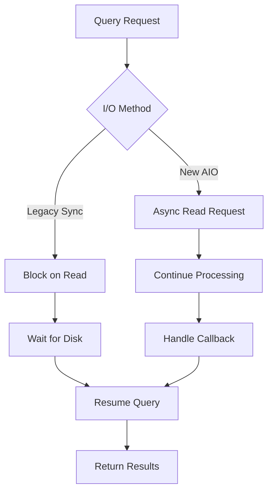
```mermaid
flowchart TD
    A[Query Request] --> B{I/O Method}
    B -->|Legacy Sync| C[Block on Read]
    B -->|New AIO| D[Async Read Request]
    C --> E[Wait for Disk]
    D --> F[Continue Processing]
    E --> G[Resume Query]
    F --> H[Handle Callback]
    H --> G
    G --> I[Return Results]
```

The diagram shows how AIO changes query execution. Instead of blocking every time you need data from disk, the database can issue the read request and move on to other work. When the data arrives, a callback handles it. This matters tremendously for read-heavy workloads, where benchmarks show 2-3x performance improvements, with some workloads hitting 3x faster execution.

On Linux, this leverages io_uring, which is the modern kernel interface for async operations. For other platforms, PostgreSQL implements a worker-based system that achieves similar results. The initial release focuses on file system reads: sequential scans, bitmap heap scans, and vacuum operations. These are the operations that touch the most data, so optimizing them has broad impact.

The skip scan feature solves a long-standing problem with B-tree indexes. Suppose you have an index on (country, city, customer_id). Traditional B-trees require an equality condition on country to use the index efficiently. If you query WHERE city = 'Boston' without specifying country, PostgreSQL would skip the index and do a full table scan. Skip scan changes this by intelligently jumping through the index structure, skipping irrelevant entries while still using the index. Run this query:

```sql
SELECT * FROM customers WHERE city = 'Boston' AND purchase_amount > 1000;
```

If your index is on (country, city, purchase_amount), skip scan will traverse the index, hopping from one country to the next while looking for 'Boston', avoiding the need to scan the entire table. This dramatically improves performance on large datasets where you can't always provide conditions on every prefix column.

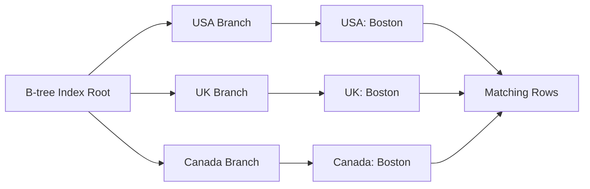
```mermaid
graph LR
    A[B-tree Index Root] --> B[USA Branch]
    A --> C[UK Branch]
    A --> D[Canada Branch]
    B --> E[USA: Boston]
    C --> F[UK: Boston]
    D --> G[Canada: Boston]
    E --> H[Matching Rows]
    F --> H
    G --> H
```

The diagram illustrates how skip scan navigates multiple branches of a B-tree to find all instances of 'Boston' across different countries, without scanning every entry.

PostgreSQL 18 also introduces native UUIDv7 support via the `uuidv7()` function. UUIDv7 combines global uniqueness with time-ordering, which means they play nicely with B-tree indexes. Traditional UUID v4 values are random, causing index fragmentation and poor locality. UUIDv7 values sort by timestamp, leading to better index performance and reduced page splits.

Virtual generated columns are now the default. When you create a generated column without specifying STORED, it computes values on read rather than on write. This saves disk space and eliminates the overhead of updating computed values every time you modify the underlying columns.

The upgrade story improved significantly. PostgreSQL 18 preserves planner statistics across major version upgrades. Previously, after upgrading, the query planner had no statistics until ANALYZE ran on all your tables. For large databases, this could mean hours or days of degraded performance. Now the statistics carry over, and your upgraded cluster starts with expected performance immediately.

The new RETURNING clause supports OLD and NEW references in INSERT, UPDATE, DELETE, and MERGE. This lets you see both the before and after values in a single operation:

```sql
UPDATE products 
SET price = price * 1.10 
WHERE category = 'electronics'
RETURNING 
    product_name, 
    old.price AS original_price, 
    new.price AS updated_price,
    new.price - old.price AS increase;
```

This eliminates the need for separate queries to track changes, which is valuable for audit logs and change tracking systems.

OAuth 2.0 authentication arrived, allowing integration with modern identity providers. Configure it in pg_hba.conf and load token validators using the oauth_validator_libraries setting. MD5 password authentication is now deprecated in favor of SCRAM-SHA-256.

PostgreSQL 13 reached end of life in November 2025, pushing users to upgrade for security patches. Amazon Aurora added PostgreSQL 18.1 support by December 2025, bringing these improvements to managed cloud deployments.

### MySQL 9.5: Security and AI Integration

MySQL 9.5 shipped in October 2025 with a focus on replication security and AI capabilities. The biggest change is default encryption on all replication connections. Enable it with:

```sql
SET GLOBAL replicate_encrypt=ON;
```

This encrypts replication traffic automatically, addressing a security gap where sensitive data could travel unencrypted between primary and replica servers.

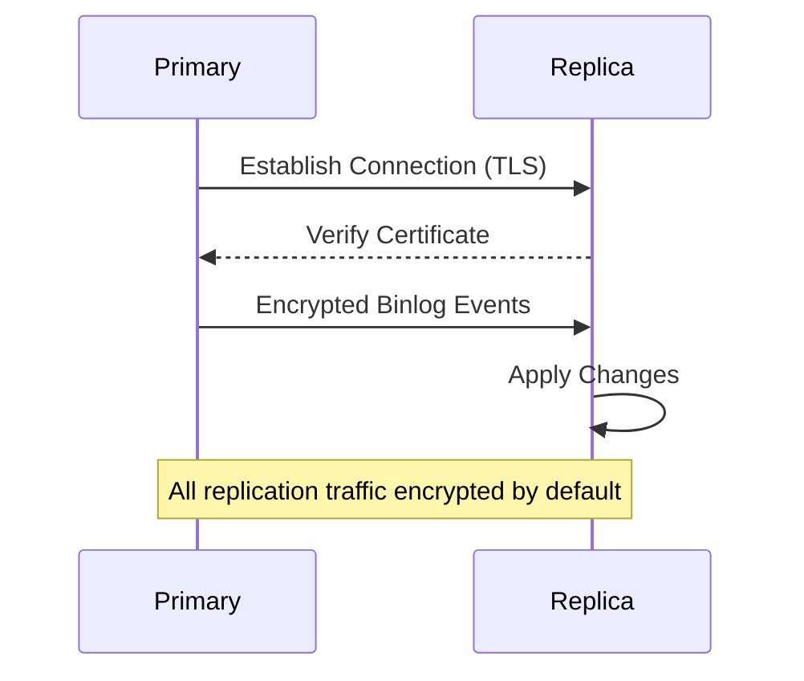
```mermaid
sequenceDiagram
    participant Primary
    participant Replica
    Primary->>Replica: Establish Connection (TLS)
    Replica-->>Primary: Verify Certificate
    Primary->>Replica: Encrypted Binlog Events
    Replica->>Replica: Apply Changes
    Note over Primary,Replica: All replication traffic encrypted by default
```

MySQL 9.4 in July required GCC 11 or newer for compilation, dropping support for ARM RHEL7 platforms. This signals a move toward modern compiler features and abandoning older platform support.

MySQL Studio, the new GUI tool, provides a query editor with visualizations. It's MySQL's answer to tools like pgAdmin and offers a more integrated experience than third-party options.

The MySQL AI add-on in version 9.5 introduces semantic embeddings for log anomaly detection. The system extracts semantic features from logs using embedding models, combining them with statistical TF-IDF features to improve anomaly detection accuracy. This builds on MySQL's AutoML capabilities, now expanded with deep recommendation models using PyTorch.

The NL_SQL routine lets you generate SQL queries from natural language statements:

```sql
SELECT NL_SQL('show me all customers who made purchases over $1000 last month');
```

The function collects schema information, sends it to an LLM, and generates SQL. It's useful for business users who need data but don't write SQL regularly.

Vector storage capabilities expanded with the VECTOR_STORE_LOAD routine supporting asynchronous operation. You can now load tables without blocking, perfect for automated deployments and containerized environments.

MySQL 9.5 brings materialized views to HeatWave, the in-memory analytics engine. Create them with CREATE MATERIALIZED VIEW, and they populate lazily during query execution. This improves query performance by pre-computing complex joins and aggregations.

### Oracle AI Database 26ai: Complete AI Integration

Oracle made a significant branding shift in October 2025, releasing Oracle AI Database 26ai. This replaces Oracle Database 23ai and represents Oracle's vision of an AI-native database. The "26" refers to the year (2026) when the next LTS version will arrive, with "ai" emphasizing AI capabilities.

The versioning system changed to year.quarter format. Version 23.26.0 was released in October 2025 (the "0" quarter is a special case to launch the new numbering scheme). Future releases will be 23.26.1 (Q1 2026), 23.26.2 (Q2 2026), and so on.

Upgrading from 23ai to 26ai is straightforward: apply the October 2025 release update. No database upgrade or application recertification needed. The architecture remains identical; Oracle simply added AI functionality on top of the existing 23ai codebase.

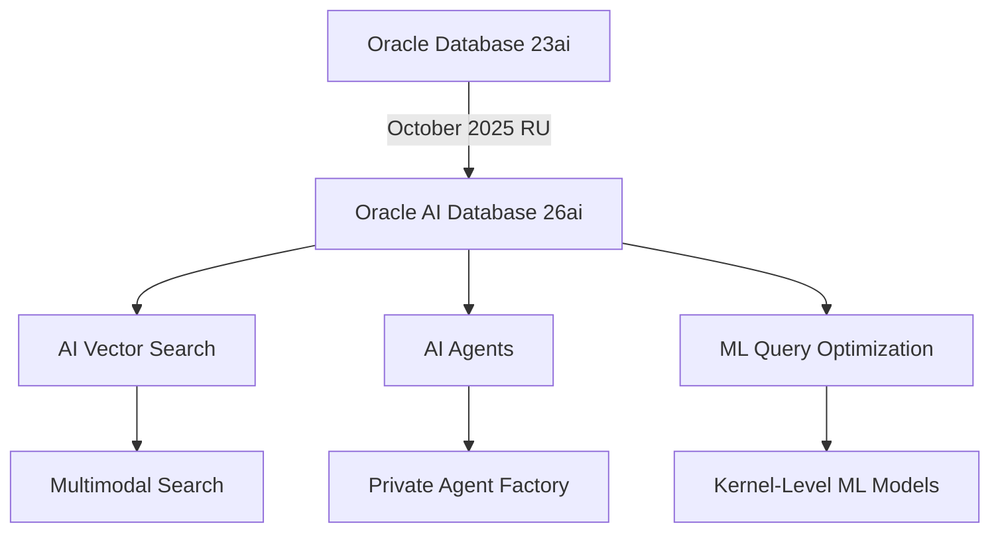
```mermaid
graph TD
    A[Oracle Database 23ai] -->|October 2025 RU| B[Oracle AI Database 26ai]
    B --> C[AI Vector Search]
    B --> D[AI Agents]
    B --> E[ML Query Optimization]
    C --> F[Multimodal Search]
    D --> G[Private Agent Factory]
    E --> H[Kernel-Level ML Models]
```

AI Vector Search is now deeply integrated at the kernel level. You can perform unified hybrid vector search combining vector similarity with relational, JSON, graph, and spatial queries. This matters for RAG systems where you need to search across different data types simultaneously.

Oracle's AI Private Agent Factory provides a no-code builder for creating and deploying AI agents. It runs as a container in your environment, not in Oracle's cloud, which addresses data sovereignty requirements. These agents can combine private database data with public information to answer complex business questions.

The SQL Firewall feature blocks SQL injection and credential misuse. It learns normal SQL patterns and blocks anomalous queries, adding a security layer beyond application-level protections.

True Cache received significant enhancements. It's a read-only cache that sits in front of the database, providing faster query responses and better scalability. The JDBC driver can automatically route read-only workloads to True Cache instances. New capabilities include pinning hot objects in cache, spill to disk, and cache warmup.

Automatic Transaction Rollback allows administrators to set priorities for transactions. If a low-priority transaction holds row locks and blocks a high-priority transaction beyond a set timeout, the database automatically rolls back the lower-priority transaction and releases the locks.

Oracle AI Database 26ai is available on all major cloud platforms: OCI, Azure, Google Cloud, and AWS. The on-premises version for Linux x86-64 will arrive in January 2026 with version 23.26.1.

### SQL Server 2025: AI-Ready Enterprise Database

SQL Server 2025 released to general availability in November 2025, bringing Microsoft's AI-first strategy to on-premises deployments. The tagline is "AI-ready enterprise database," and the focus shows in every major feature.

Native vector support arrived with a VECTOR data type and built-in vector search capabilities using DiskANN indexing. Create a vector index:

```sql
CREATE VECTOR INDEX idx_embeddings 
ON documents(embedding);
```

Then search for similar vectors:

```sql
SELECT TOP 10 doc_id, title
FROM documents
ORDER BY VECTOR_SIMILARITY(embedding, @query_vector);
```

This brings vector search directly into T-SQL, eliminating the need for separate vector databases in many scenarios.

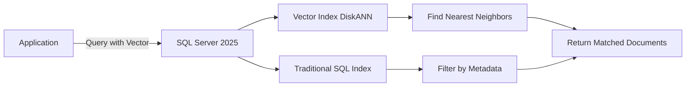
```mermaid
graph LR
    A[Application] -->|Query with Vector| B[SQL Server 2025]
    B --> C[Vector Index DiskANN]
    C --> D[Find Nearest Neighbors]
    D --> E[Return Matched Documents]
    B --> F[Traditional SQL Index]
    F --> G[Filter by Metadata]
    G --> E
```

The sp_invoke_external_rest_endpoint stored procedure lets you call external REST APIs directly from T-SQL. This enables calling AI services like ChatGPT without leaving the database:

```sql
DECLARE @response NVARCHAR(MAX);
EXEC sp_invoke_external_rest_endpoint
    @url = 'https://api.openai.com/v1/chat/completions',
    @method = 'POST',
    @headers = '{"Authorization": "Bearer YOUR_API_KEY"}',
    @payload = '{"model": "gpt-4", "messages": [{"role": "user", "content": "Summarize this data"}]}',
    @response = @response OUTPUT;
```

Fabric Mirroring provides near-real-time data replication to Microsoft Fabric. This uses a change feed capability to read committed transaction log changes and push them automatically to OneLake in Delta Parquet format. The result is that your OLTP data becomes immediately available for analytics without complex ETL pipelines.

Regular expression support finally arrived in T-SQL. Use REGEXP_LIKE, REGEXP_SUBSTR, and REGEXP_REPLACE for pattern matching directly in queries:

```sql
SELECT customer_name
FROM customers
WHERE REGEXP_LIKE(email, '^[a-zA-Z0-9._%+-]+@[a-zA-Z0-9.-]+\.[a-zA-Z]{2,}$');
```

Optimized locking uses Transaction ID locking (TID) and lock-after-qualification (LAQ) to improve concurrency by reducing or eliminating row and page locks. Enable it per database with no code changes:

```sql
ALTER DATABASE MyDatabase 
SET OPTIMIZED_LOCKING = ON;
```

This dramatically improves performance in high-concurrency environments by allowing more transactions to execute simultaneously.

Standard Edition capacity increased to 32 cores and 256GB RAM, up from previous limits. This makes Standard Edition viable for larger workloads that previously required Enterprise Edition.

The Intelligent Query Processing suite added cardinality estimation feedback for expressions, optional parameter plan optimization (OPPO), query store for readable secondaries, and DOP feedback enabled by default. These features automatically improve query performance without manual tuning.

Enhanced security includes integration with Microsoft Entra for multi-factor authentication, role-based access control, and conditional access policies. Managed identities allow secure authentication for both inbound and outbound connections without exposing credentials.

ZSTD backup compression provides better compression ratios than the default MS_XPRESS algorithm, reducing backup storage requirements significantly.

## Cloud Data Warehouses: Snowflake's AI-Powered Platform

### Snowflake: The AI Data Cloud Summit

Snowflake Summit 2025, held in June in San Francisco, marked a transformation in how the company positions itself for the AI era. With over 2,000 in-person attendees and 10,000+ online, the event unveiled a cohesive AI strategy anchored by performance improvements, cost optimization, and agentic AI capabilities.

The Standard Warehouse Gen2 became generally available, delivering 2.1x faster analytics performance compared to the previous generation. Benchmarks showed 1.9x faster performance compared to Managed Spark on equivalent workloads. This came from next-generation hardware and query engine optimizations, including improved join algorithms and predicate pushdown.

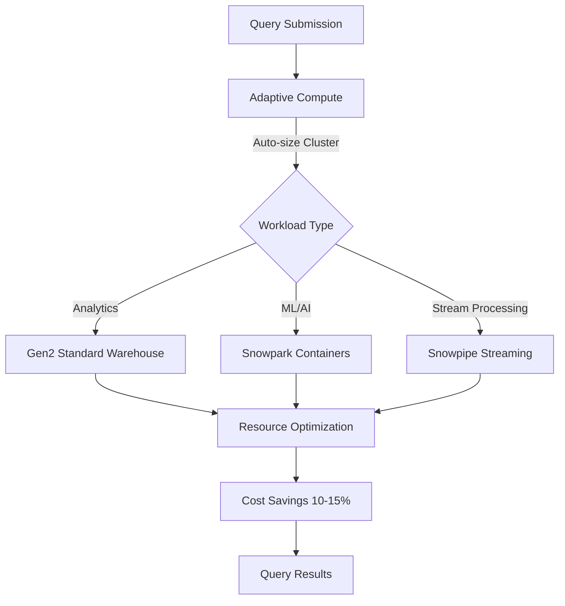
```mermaid
flowchart TD
    A[Query Submission] --> B[Adaptive Compute]
    B -->|Auto-size Cluster| C{Workload Type}
    C -->|Analytics| D[Gen2 Standard Warehouse]
    C -->|ML/AI| E[Snowpark Containers]
    C -->|Stream Processing| F[Snowpipe Streaming]
    D --> G[Resource Optimization]
    E --> G
    F --> G
    G --> H[Cost Savings 10-15%]
    H --> I[Query Results]
```

Adaptive Compute entered private preview, introducing automatic resource sizing and sharing. Instead of manually configuring warehouse sizes, Adaptive Compute analyzes query patterns and adjusts compute resources dynamically. It suspends idle nodes automatically and scales up during peak loads. Teams using Adaptive Compute in early testing reported 10% immediate cost reductions, with further optimizations pushing savings toward 15% or more.

State-aware orchestration works hand-in-hand with Adaptive Compute. The system tracks which models and tables have changed upstream. If no new data arrived, it skips unnecessary transformations. This eliminates wasted compute on unchanged pipelines. You enable it with a simple toggle, and Snowflake handles the rest. The intelligence operates at the metadata layer, checking freshness before executing jobs.

Snowflake Intelligence is the company's entry into agentic AI. It's a conversational interface where users ask natural language questions like "Show me ticket sales for this month's festival." Behind the scenes, Snowflake Intelligence queries Semantic Views, which are metadata structures defining business logic, metrics, and relationships. The system respects user permissions and generates SQL automatically.

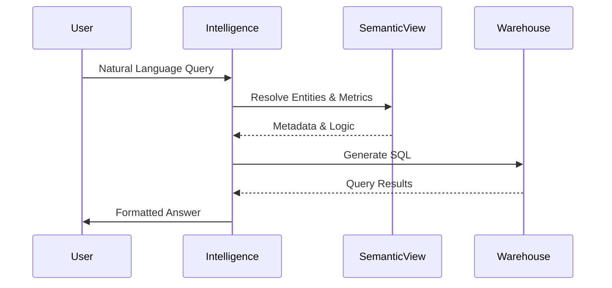
```mermaid
sequenceDiagram
    participant User
    participant Intelligence
    participant SemanticView
    participant Warehouse
    User->>Intelligence: Natural Language Query
    Intelligence->>SemanticView: Resolve Entities & Metrics
    SemanticView-->>Intelligence: Metadata & Logic
    Intelligence->>Warehouse: Generate SQL
    Warehouse-->>Intelligence: Query Results
    Intelligence->>User: Formatted Answer
```

Cortex AI SQL operators for multimodal analysis arrived in public preview. You can now analyze text, images, and audio directly in SQL queries without moving data out of Snowflake:

```sql
SELECT 
    image_id,
    CORTEX_VISION('describe', image_blob) AS description
FROM product_images
WHERE category = 'electronics';
```

This uses foundation models hosted within Snowflake's secure perimeter. No data leaves your environment. Cortex also added built-in LLM observability, tracking token usage, latency, and accuracy metrics for AI queries.

The Cortex Analyst Routing Mode entered preview in November 2025. This feature intelligently routes AI queries to the appropriate model based on query complexity and data requirements. Simple analytical questions go to smaller, faster models. Complex reasoning tasks route to more capable models. The system optimizes both cost and performance automatically.

Snowflake Postgres, the result of acquiring Crunchy Data for approximately $250 million, brings a managed PostgreSQL service to the platform. This addresses customer requests for transactional workloads alongside analytics. Snowflake Postgres integrates with the broader AI Data Cloud, allowing seamless joins between operational PostgreSQL data and Snowflake analytical tables.

Horizon Catalog gained an AI Copilot for natural language discovery. Data stewards can search for tables, columns, and lineage using conversational queries. The system surfaces trust signals like data quality scores, ownership, and usage patterns. Iceberg catalog-linked databases became available, letting teams govern external Iceberg tables from Snowflake without moving data.

Immutable Snapshots entered public preview as a ransomware defense. These point-in-time copies cannot be altered or deleted, even by administrators. They provide recovery guarantees when backups might be compromised.

Security enhancements included passkey support, authenticator apps, and programmatic tokens. Snowflake is moving toward mandatory multi-factor authentication by November 2025. The Trust Center improvements address compliance requirements for regulated industries.

Snowflake Openflow (generally available on AWS) is a multimodal ingestion service powered by Apache NiFi. It connects any data source to Snowflake, processing events inside your VPC before loading. This eliminates external ETL tools and simplifies architecture. Openflow can expose data directly to Cortex for AI search, or write to Snowflake or Iceberg tables.

dbt Projects now run natively on Snowflake, bringing transformation logic into the same platform as your data. This unifies governance, monitoring, and permissions. You no longer need separate dbt Cloud infrastructure; everything runs inside Snowflake with the same security controls.

The Snowflake Marketplace added Agentic Native Apps and Cortex Knowledge Extensions. Third-party AI assistants can now run inside your Snowflake environment, accessing your data with governed permissions. This enables building composite AI applications that combine your proprietary data with external intelligence.

## NewSQL Databases: CockroachDB's Distributed SQL Evolution

### CockroachDB 25.2 and 25.3: Performance and AI at Scale

CockroachDB marked its 10th anniversary in 2025 with version 25.2, released in June. This milestone release delivered 41% performance gains over version 24.3, measured across nine standard workloads. The improvements came from over 100 optimizations, both large and small.

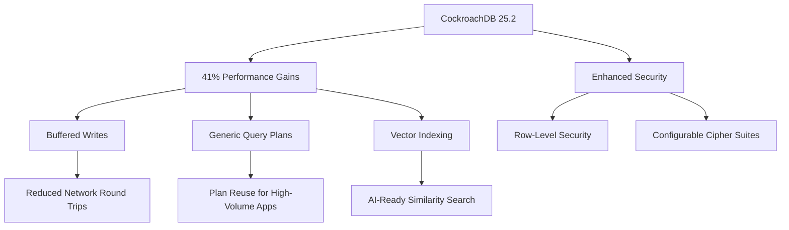
```mermaid
graph TD
    A[CockroachDB 25.2] --> B[41% Performance Gains]
    B --> C[Buffered Writes]
    B --> D[Generic Query Plans]
    B --> E[Vector Indexing]
    C --> F[Reduced Network Round Trips]
    D --> G[Plan Reuse for High-Volume Apps]
    E --> H[AI-Ready Similarity Search]
    A --> I[Enhanced Security]
    I --> J[Row-Level Security]
    I --> K[Configurable Cipher Suites]
```

Buffered writes, now in preview, address a problem with ORM-generated queries that tend to be "chatty." These read and write data across distributed nodes inefficiently. Buffered writes keep all writes in the local SQL coordinator until transaction commit. If you read from something you just wrote, it doesn't go back out to the network. This dramatically reduces latency for write-heavy workloads, with some benchmarks showing 50% throughput improvements.

Generic query plans solve inefficiency in high-volume applications. Most enterprise apps use a limited set of transaction types executed millions of times with different parameters. Previously, CockroachDB regenerated the plan for each execution. Generic plans are computed once and reused for subsequent executions with different parameter values. This eliminates redundant planning overhead.

Vector indexing arrived using the C-SPANNS algorithm (Clustering-based Space Partitioning and Nearest Neighbor Search). This enables fast similarity searches across large datasets. Create a vector index:

```sql
CREATE INDEX idx_embeddings 
ON documents(embedding) 
USING IVFFLAT;
```

Then query for similar vectors:

```sql
SELECT doc_id, title, content
FROM documents
ORDER BY embedding <-> query_vector
LIMIT 10;
```

The `<->` operator computes cosine distance. CockroachDB distributes the vector index across nodes, maintaining consistency while scaling horizontally. This matters for AI applications that need low-latency vector search alongside transactional guarantees.

CockroachDB 25.2 introduced row-level security, allowing fine-grained access control based on user attributes. Define policies directly on tables:

```sql
ALTER TABLE financial_records 
ENABLE ROW LEVEL SECURITY;

CREATE POLICY user_data_policy ON financial_records
FOR SELECT
USING (user_id = current_user());
```

Users automatically see only rows they own. This simplifies application logic by moving access control to the database layer.

Configurable cipher suites improve FIPS compliance. Organizations can restrict TLS cipher suites to approved algorithms, meeting stringent security requirements in regulated industries.

Physical Cluster Replication (PCR) became generally available, delivering low RPO/RTO for two-datacenter disaster recovery setups. PCR replicates physical bytes rather than logical transactions, enabling fast failover with minimal data loss (approximately 30 seconds RPO, minutes of downtime for failover).

Fast Restore improved backup recovery speeds by 4x in certain use cases. This comes from parallelizing restore operations across multiple nodes and optimizing data distribution during recovery.

Version 25.3, released later in 2025, focused on scalability and operational improvements. The new Kubernetes Operator simplifies deployment, scaling, and management of CockroachDB in cloud-native environments. It automates high availability, resilience, and seamless upgrades with minimal manual intervention.

MOLT Fetch added support for Oracle migrations. This tool is more fault-tolerant, faster, and easier to use than third-party migration tools. It handles schema conversion, data movement, and validation automatically.

LDAP authentication and authorization integration allows centralized user management. CockroachDB now leverages LDAP/AD as the source of truth for authentication and authorization, reducing administrative overhead and aligning with existing security infrastructure.

Distributed transactions got optimizations reducing quorum overhead by 30% in geo-distributed setups. Transaction priority controls let you mark critical transactions:

```sql
SET TRANSACTION PRIORITY HIGH;
```

High-priority transactions preempt lower-priority ones when resource contention occurs. This ensures critical business operations complete quickly even during peak load.

Value separation entered public preview, dramatically improving throughput for write-heavy workloads. Large values are stored separately from the main key-value store, reducing write amplification and improving compaction efficiency.

Egress Private Endpoints (limited access) let CockroachDB Cloud customers securely connect to external services like Kafka or webhooks without using the public internet. This uses AWS PrivateLink or GCP Private Service Connect for private outbound connections.

The Restore API (limited access) enables automated restore flows. Applications can trigger restores programmatically, simplifying disaster recovery automation.

CockroachDB's Performance Under Adversity benchmark simulates real-world failure scenarios: disk stalls, node crashes, regional outages. Unlike traditional benchmarks conducted in ideal conditions, this demonstrates CockroachDB's ability to deliver consistent throughput and sub-second latency under adverse conditions. The goal is to prove resilience, not just raw performance.

## NoSQL Databases: Document and Key-Value Evolution

### MongoDB: Voyage AI Acquisition and Application Modernization

MongoDB's biggest move in 2025 was acquiring Voyage AI in February. Voyage AI pioneered state-of-the-art embedding and reranking models, and integrating this technology directly into MongoDB Atlas addresses a critical AI challenge: retrieval accuracy.

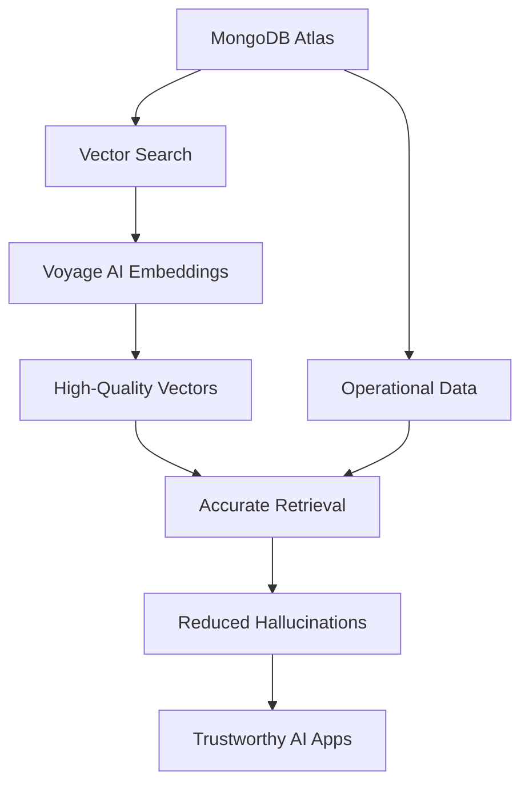
```mermaid
graph TD
    A[MongoDB Atlas] --> B[Vector Search]
    B --> C[Voyage AI Embeddings]
    C --> D[High-Quality Vectors]
    D --> E[Accurate Retrieval]
    E --> F[Reduced Hallucinations]
    A --> G[Operational Data]
    G --> E
    F --> H[Trustworthy AI Apps]
```

The integration brings auto-embedding services to Atlas Vector Search. Instead of generating embeddings externally and storing them in MongoDB, the database handles embedding generation automatically. Native reranking follows, allowing developers to boost retrieval accuracy with minimal code changes.

Voyage AI's models are designed for domain-specific retrieval in areas like financial services and legal documents. They ranked highest among zero-shot models on Hugging Face benchmarks. The voyage-3.5 and voyage-3.5-lite models released in 2025 improved retrieval quality by 2.66% and 4.28% respectively over their predecessors, while maintaining the same pricing.

MongoDB AMP (Application Modernization Platform) launched in September 2025. It combines AI-powered tools, a proven delivery framework, and expert guidance to help organizations transform legacy applications. The promise is 10x faster modernization compared to traditional methods.

AMP refactors monolithic architectures into scalable microservices, modernizes data infrastructure with MongoDB's document model, and revitalizes outdated user interfaces. The focus is on full-stack modernization, not just database migration.

MongoDB 8.2, released earlier in 2025, brought the most feature-rich and performant release yet. Full-text search and vector search capabilities arrived in Community Edition via a separate mongot binary that stays in sync through Change Streams. This lets developers build advanced search and AI features in self-managed environments without needing Atlas.

The SQL Interface for Enterprise Advanced became generally available, allowing standard SQL tools to query MongoDB data. This bridges the gap for teams with SQL expertise who want MongoDB's flexibility.

MongoDB Multimodal Search Python Library simplifies building applications that search across text, images, charts, and documents. It provides a single interface integrating Atlas Vector Search, AWS S3, and Voyage AI's multimodal embedding model voyage-multimodal-3.

### Redis 8 and Fall 2025 Release: Speed Everywhere

Redis 8 became generally available in May 2025, delivering over 30 performance improvements. Commands run up to 87% faster, operations per second throughput increased by up to 2x, and replication is 18% faster. The memory footprint improved with JSON using up to 67% less memory.

The Redis Query Engine gained horizontal and vertical scaling capabilities that were previously exclusive to Redis Cloud. Horizontal scaling enables querying in clustered databases, handling very large datasets with higher read and write throughput. Vertical scaling adds more processing power through the Query Performance Factor (QPF), unlocking up to 16x more throughput.

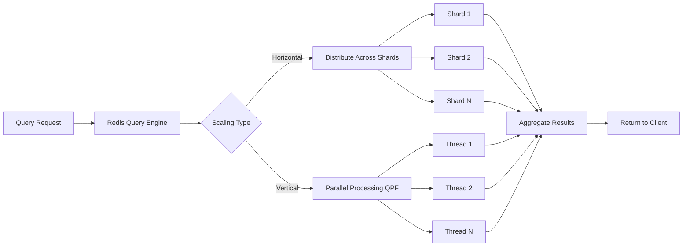
```mermaid
flowchart LR
    A[Query Request] --> B[Redis Query Engine]
    B --> C{Scaling Type}
    C -->|Horizontal| D[Distribute Across Shards]
    C -->|Vertical| E[Parallel Processing QPF]
    D --> F[Shard 1]
    D --> G[Shard 2]
    D --> H[Shard N]
    E --> I[Thread 1]
    E --> J[Thread 2]
    E --> K[Thread N]
    F --> L[Aggregate Results]
    G --> L
    H --> L
    I --> L
    J --> L
    K --> L
    L --> M[Return to Client]
```

The diagram shows how Redis scales queries both horizontally across shards and vertically using multiple threads. This is how Redis achieved 16x query performance improvements.

Redis 8 benchmarks demonstrated real-time vector search on 1 billion 768-dimensional vectors. For high-precision queries requiring 95% recall, Redis sustained 66K vector insertions per second with median latency of 1.3 seconds for the top 100 nearest neighbors. Lower precision configurations reached 160K insertions per second.

The September 2025 Fall Release brought LangCache, a fully managed semantic caching service. It stores and retrieves semantically similar LLM calls, reducing latency and token costs. Instead of sending every query to the LLM, LangCache checks if a similar query was answered recently and returns the cached response.

Hybrid search improvements include Reciprocal Rank Fusion (RRF) for combining text and semantic search results. This fuses results on the server side, eliminating client-side merging complexity and improving accuracy.

Vector compression through quantization and dimensionality reduction arrived using Intel SVS algorithms. Standard scalar quantization and advanced techniques reduce memory usage by 26-37% while maintaining search performance:

```redis
FT.CREATE idx ON HASH PREFIX 1 doc: 
  SCHEMA embedding VECTOR HNSW 6 
  TYPE FLOAT32 DIM 768 
  DISTANCE_METRIC COSINE
  QUANTIZATION INT8
```

The vector set data type (in beta) is a new native structure that stores vector embeddings with string elements. Like sorted sets, but instead of scores, each element has an associated vector. This makes semantic search operations more composable:

```redis
VADD myset "doc1" [0.1, 0.2, 0.3, ...]
VADD myset "doc2" [0.4, 0.5, 0.6, ...]
VSIM myset [0.15, 0.25, 0.35, ...] K 10
```

Redis 8.2 came to Redis Cloud in September, bringing the Query Engine, 18 data structures including vector sets, and 480+ commands. Hash field expiration allows setting TTLs on individual hash fields rather than entire keys, useful for session management.

Redis Data Integration (RDI) entered public preview on Redis Cloud, providing easy no-code data pipelines to keep Redis in sync with source databases. This eliminates stale data and cache misses.

### Couchbase 8.0: Billion-Scale Vector Search

Couchbase 8.0, released in October 2025, transformed the database into a comprehensive AI data platform. With over 400 features and changes, the release focuses on vector indexing, security, and developer productivity.

The headline is Hyperscale Vector Indexing (HVI), which supports billion-scale vector search with millisecond latency. Built on the DiskANN nearest-neighbor search algorithm using the Vamana directed graph construction algorithm, HVI provides flexibility to operate across partitioned disks for distributed processing and run in-memory for smaller datasets.

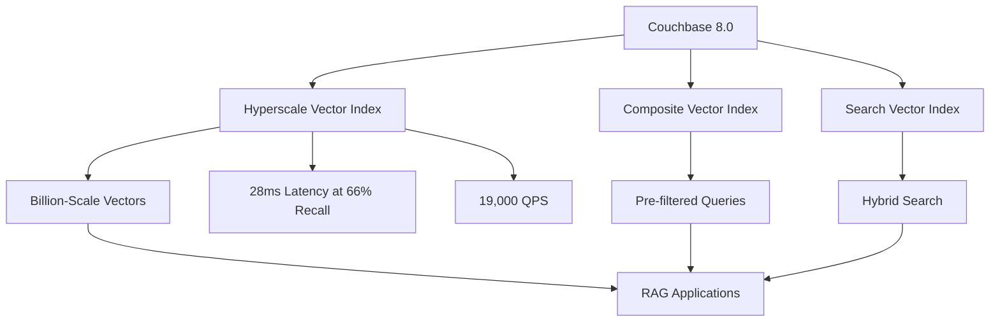
```mermaid
graph TD
    A[Couchbase 8.0] --> B[Hyperscale Vector Index]
    A --> C[Composite Vector Index]
    A --> D[Search Vector Index]
    B --> E[Billion-Scale Vectors]
    B --> F[28ms Latency at 66% Recall]
    B --> G[19,000 QPS]
    C --> H[Pre-filtered Queries]
    D --> I[Hybrid Search]
    E --> J[RAG Applications]
    H --> J
    I --> J
```

Independent benchmarks showed HVI delivering up to 19,000 queries per second with 28ms latency when adjusted for 66% recall accuracy. Compared to a leading cloud database, Couchbase ran over 3,000 times faster. When tuned for high recall accuracy (93% on modest hardware), Couchbase handled 350 times more queries per second.

Create a hyperscale vector index:

```sql
CREATE VECTOR INDEX vidx ON bucket(embedding) USING HNSW;
```

The index scales beyond a billion vector records without compromising responsiveness. The Vamana graph construction maintains connectivity while pruning unnecessary edges, resulting in fast searches with low memory overhead.

Composite vector index supports pre-filtered queries, scoping the specific vectors to search. These indexes can be stored and partitioned similarly to other global secondary indexes in Couchbase:

```sql
CREATE INDEX composite_idx ON bucket(category, embedding VECTOR);
```

This enables queries like "find similar products in the electronics category," where you pre-filter by category before performing vector search. The performance improvement is substantial when you can narrow the search space.

Search vector index enables hybrid searches that contain vectors, lexical search, and structured query criteria within a single SQL++ request:

```sql
SELECT id, title, score
FROM products
WHERE SEARCH(products, {
  "query": {"match": "laptop"},
  "knn": [{
    "field": "embedding",
    "vector": [0.1, 0.2, ...],
    "k": 10
  }]
});
```

This combines keyword matching with semantic search in a single operation, delivering more relevant results than either technique alone.

Native data at rest encryption (DARE) provides built-in security that automatically encrypts data stored on disk and decrypts it when accessed. This protects sensitive data from unauthorized users without application changes.

Natural language query support lets users unfamiliar with SQL++ query data using natural language. The system translates to SQL++, executes the query, and returns results. This lowers the barrier to data access for non-technical users.

The query workload repository tracks query statistics over time, helping with troubleshooting and optimization. You can analyze query patterns, identify slow queries, and optimize indexes based on actual usage.

User-defined synonyms for search make results more relevant. Define synonyms for domain-specific terminology:

```sql
ALTER INDEX search_idx 
ADD SYNONYM laptop -> ["notebook", "portable computer"];
```

Auto-failover improvements include automatic failover of non-responsive data nodes to improve application uptime. The system detects node failures and redistributes workloads automatically.

Dynamic rebalancing allows adjusting non-KV services without adding or removing nodes, eliminating rebalance delays. This makes scaling more flexible and responsive to changing workload patterns.

### ScyllaDB 2025.1: Tablets Enabled by Default

ScyllaDB 2025.1, released in April 2025, is the first source-available release combining both Enterprise and Open Source features under a single license. The major change is enabling Tablets by default for all new keyspaces.

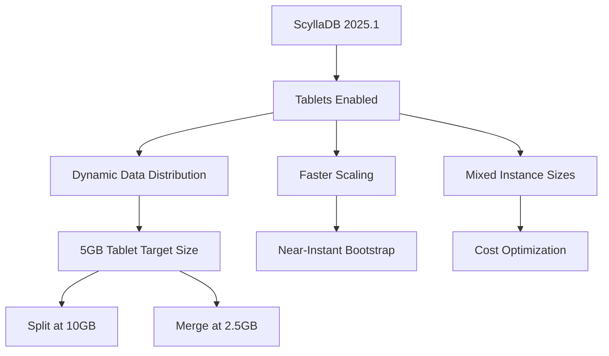
```mermaid
graph TD
    A[ScyllaDB 2025.1] --> B[Tablets Enabled]
    B --> C[Dynamic Data Distribution]
    B --> D[Faster Scaling]
    B --> E[Mixed Instance Sizes]
    C --> F[5GB Tablet Target Size]
    D --> G[Near-Instant Bootstrap]
    E --> H[Cost Optimization]
    F --> I[Split at 10GB]
    F --> J[Merge at 2.5GB]
```

Tablets replace the legacy vNodes approach, which statically distributed tables across nodes based on the token ring. Tablets dynamically assign tables to a subset of nodes based on size, enabling much faster scaling and topology changes.

When you add new nodes to a cluster with Tablets, they start serving reads and writes as soon as the first tablet migrates. This is dramatically faster than vNodes, which required streaming all data before the node became active. Together with Raft-based strongly consistent topology updates, Tablets enable adding multiple nodes simultaneously, even doubling a cluster at once.

Automatic support for mixed clusters with varying core counts means you can use different instance types in the same cluster. Previously, ScyllaDB required uniform instance sizes. Now you can add smaller instances for cost savings or larger ones for compute-intensive workloads, and Tablets balance the load appropriately.

Tablet Merge reduces tablet count for shrinking tables. As data is deleted, the load balancer detects shrunk tables and merges adjacent tablets to meet the average tablet replica size goal (default 5GB geometric average).

File-based streaming eliminates the need to process mutation fragments. ScyllaDB now directly streams entire SSTables, reducing network data transfer and CPU usage, particularly for small-cell data models. This method is used for tablet migration in all keyspaces with tablets enabled.

Zero-token nodes are nodes that don't replicate data but can assist in query coordination and Raft quorum voting. This allows creating an Arbiter: a tiebreaker node that helps maintain quorum in a symmetrical two-datacenter cluster. If one datacenter fails, the Arbiter (placed in a third datacenter) keeps quorum alive without replicating user data or incurring network and storage costs.

Raft-based consensus in v6 provides reliability for topology changes and schema updates. This ensures strong consistency during cluster modifications, eliminating race conditions and split-brain scenarios.

ScyllaDB X Cloud, launched in June 2025, leverages Tablets to deliver true elasticity. You can scale from 100K OPS to 2M OPS in minutes with consistent single-digit millisecond P99 latency. Automatic scaling triggers based on storage capacity or usage patterns, eliminating the need for manual capacity planning.

With Tablets, ScyllaDB X Cloud safely targets 90% storage utilization compared to 70% with vNodes. This is particularly helpful for storage-bound workloads, reducing costs significantly.

Dictionary-trained Zstandard (Zstd) compression was introduced, which is pipeline-aware. ScyllaDB built a custom RPC compressor with external dictionary support and a mechanism that trains new dictionaries on RPC traffic, distributes them over the cluster, and performs live switch of connections to the new dictionaries.

Rust-based shards in ScyllaDB reduce latency by 50% in write operations. The move to Rust for core components improves memory safety and performance, leveraging Rust's zero-cost abstractions and ownership model.

### Apache Cassandra: Community-Driven Enhancements

Cassandra focused on community enhancement proposals in 2025 rather than major version releases. Key proposals included support for constraints and Zstd compression for storage efficiency.

Zstd compression provides better compression ratios and faster compression speeds compared to existing algorithms. This reduces storage costs and improves I/O performance by reading less data from disk.

The Cassandra Summit in 2025 highlighted open-source innovations and integrations with NoSQL analytics tools like Knowi. These integrations make it easier to perform analytics on Cassandra data without moving it to separate systems.

## Graph Databases: Neo4j 2025 Series

Neo4j transitioned to calendar versioning in January 2025, with versions following a YYYY.MM format. The 2025.01 release in January required Java 21, dropping support for Java 17. This aligns with Java's LTS release cycle and brings access to modern language features.

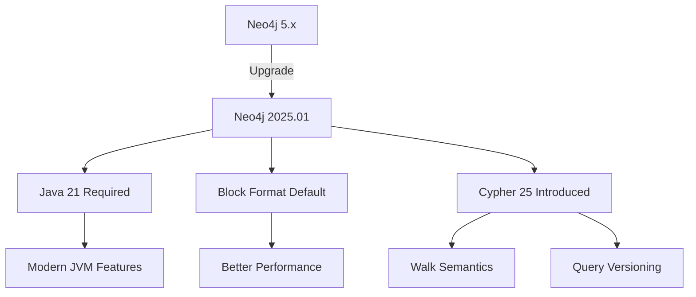
```mermaid
graph TD
    A[Neo4j 5.x] -->|Upgrade| B[Neo4j 2025.01]
    B --> C[Java 21 Required]
    B --> D[Block Format Default]
    B --> E[Cypher 25 Introduced]
    E --> F[Walk Semantics]
    E --> G[Query Versioning]
    C --> H[Modern JVM Features]
    D --> I[Better Performance]
```

Neo4j 2025.06 introduced Cypher 25, a new version of the Cypher query language. Cypher versions are now decoupled from Neo4j server versions. Databases created or migrated to 2025.06+ continue using Cypher 5 by default unless explicitly configured otherwise.

Cypher 25 includes walk semantics with the REPEATABLE ELEMENTS match mode, where relationships can be repeated in path traversal. Trail semantics (relationships not repeated) remains the default but can now be explicitly specified:

```cypher
MATCH DIFFERENT RELATIONSHIPS (start)-[r*1..5]->(end)
RETURN start, end, length(r)
```

Online upgrades from Neo4j 5 to 2025.x became supported without downtime in clustered deployments. This is a significant operational improvement, allowing upgrades during business hours without service interruption.

Block format became the default storage format for Enterprise Edition in 2025.01. This format provides better performance and compression compared to the previous record-standard format.

The discovery service v1 was removed in 2025.01, requiring migration to v2 before upgrading. Discovery service v2 provides better support for modern deployment patterns and cloud environments.

VECTOR support arrived as a new type in Cypher, the block storage format, and v6 drivers. This enables native vector storage and querying in graph databases:

```cypher
CREATE (n:Document {
  title: 'Product Manual',
  embedding: [0.1, 0.2, 0.3, ...] :: VECTOR
})
```

TLS CBC ciphers (cipher block chaining) are no longer available by default due to security vulnerabilities. The Internet Engineering Task Force doesn't recommend CBC-based ciphers, and they were removed from the TLS 1.3 standard.

## Time-Series Databases: InfluxDB 3 and Beyond

### InfluxDB 3: Core and Enterprise GA

InfluxDB 3 Core and Enterprise reached general availability in April 2025, marking a complete rewrite of the InfluxDB engine. Built in Rust using Apache Arrow, DataFusion, Parquet, and Flight, the new architecture delivers significant performance and flexibility improvements.

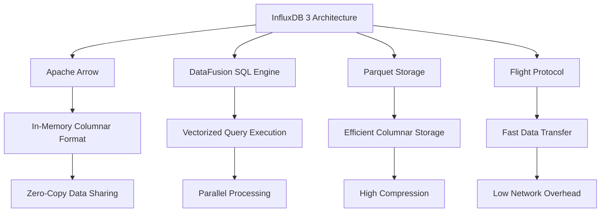
```mermaid
graph TD
    A[InfluxDB 3 Architecture] --> B[Apache Arrow]
    A --> C[DataFusion SQL Engine]
    A --> D[Parquet Storage]
    A --> E[Flight Protocol]
    B --> F[In-Memory Columnar Format]
    C --> G[Vectorized Query Execution]
    D --> H[Efficient Columnar Storage]
    E --> I[Fast Data Transfer]
    F --> J[Zero-Copy Data Sharing]
    G --> K[Parallel Processing]
    H --> L[High Compression]
    I --> M[Low Network Overhead]
```

InfluxDB 3 Core is open source under MIT/Apache 2 license, designed for real-time applications with recent data (72-hour focus). InfluxDB 3 Enterprise extends Core with enterprise-grade features: multi-region durability, read replicas, automatic failover, and enhanced security.

The Python Processing Engine brings data transformation, enrichment, monitoring, and alerting directly into the database. Instead of using external tools like Telegraf or Kapacitor, you can process data as it streams in, turning the database into an active intelligence layer.

Query performance uses Apache DataFusion's vectorized SQL engine. Standard SQL and InfluxQL queries both benefit from vectorization, which processes data in batches rather than row-by-row. This dramatically improves analytical query performance.

The diskless architecture stores all persisted state on object storage (or local disk if preferred). This enables new features and cost advantages over previous versions. You can scale storage and compute independently, paying only for what you use.

Primary keys are immutable after table creation. Every table has a primary key consisting of the ordered set of tags and time. When you create a table (either explicitly or by writing data), it sets the primary key based on the tags in the order they arrived. This determines the sort order for all Parquet files.

InfluxDB 3.8, released later in 2025, focused on operational maturity. Key enhancements include improved table index updates (now atomic), idempotent delete operations, and Last Value Cache/Distinct Value Cache optimizations that populate on creation and only on query nodes.

The influxdb3 CLI improved significantly. You can now run influxdb3 without arguments for instant database startup, automatically generating IDs and storage flags based on your system. The `--no-sync` option with influxdb3 write skips waiting for WAL persistence, immediately returning a response.

Amazon Timestream for InfluxDB added support for InfluxDB 3 in October 2025, making InfluxDB 3 available as a fully managed service on AWS with read replicas.

### QuestDB 9.1: Nanosecond Precision

QuestDB 9.1, released in October 2025, introduces nanosecond timestamp precision, continuous profiling, and auto-scaling symbol maps. The release focuses on ultra-high resolution time-series workloads.

The new TIMESTAMP_NS data type offers true nanosecond precision, ideal for high-frequency trading, sensor data, or sub-microsecond event tracking:

```sql
CREATE TABLE trades (
    symbol SYMBOL,
    price DOUBLE,
    quantity INT,
    timestamp TIMESTAMP_NS
) TIMESTAMP(timestamp);
```

The existing TIMESTAMP type remains unchanged at microsecond precision. You can use TIMESTAMP_NS anywhere you would use a regular timestamp: in filters, ordering, joins, or aggregates. SAMPLE BY, ASOF JOIN, and window functions all support nanosecond timestamps.

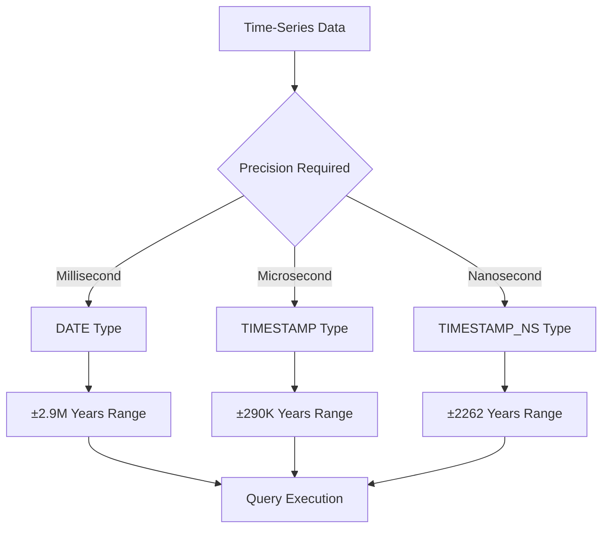
```mermaid
flowchart TD
    A[Time-Series Data] --> B{Precision Required}
    B -->|Millisecond| C[DATE Type]
    B -->|Microsecond| D[TIMESTAMP Type]
    B -->|Nanosecond| E[TIMESTAMP_NS Type]
    C --> F[±2.9M Years Range]
    D --> G[±290K Years Range]
    E --> H[±2262 Years Range]
    F --> I[Query Execution]
    G --> I
    H --> I
```

Continuous profiling integrates async-profiler for low-overhead performance diagnostics. Capture CPU and memory flame graphs continuously or on demand:

```bash
questdb.sh profile -- -e cpu -d 30 -f /tmp/cpu.html
```

This helps identify bottlenecks in production without impacting query performance. The profiler runs with minimal overhead, suitable for always-on monitoring.

Symbol map auto-scaling eliminates ingestion bottlenecks from fixed symbol capacity. Previously, if you exceeded the configured symbol capacity, ingestion would slow dramatically or fail. Now, symbol tables grow automatically as you ingest more distinct values. Millions of distinct values ingest in seconds instead of hours.

ASOF JOIN improvements support nanosecond precision and indexed lookups, making tick-stream matching faster and more accurate:

```sql
SELECT t.timestamp, t.price, q.bid, q.ask
FROM trades t
ASOF JOIN quotes q ON (t.symbol = q.symbol)
WHERE t.timestamp BETWEEN '2025-10-01' AND '2025-10-02';
```

The indexed ASOF JOIN on symbol columns dramatically speeds up temporal joins in high-frequency data.

New window functions first_value, last_value, max, and min now support timestamp and long data types:

```sql
SELECT 
    timestamp,
    price,
    FIRST_VALUE(price) OVER (ORDER BY timestamp ROWS BETWEEN 10 PRECEDING AND CURRENT ROW) AS first_price_10
FROM trades;
```

SHOW COLUMNS now displays symbol table sizes, offering instant visibility into symbol memory usage:

```sql
SHOW COLUMNS FROM trades;
```

This helps monitor memory consumption and optimize symbol column configurations.

Faster IN list evaluation for large lists uses hash-based lookups instead of binary search. Queries with thousands of constants, common in filtering or ACL checks, see significant speedups. The JIT compilation threshold is configurable (default: 10,000 values).

SELECT LATEST BY uses symbol maps for faster lookups:

```sql
SELECT * FROM sensors LATEST BY sensor_id;
```

This retrieves the most recent row for each unique sensor, leveraging the symbol map structure for O(1) lookups rather than scanning the entire table.

### TimescaleDB: Azure Performance Achievements

TimescaleDB on Azure demonstrated 225x faster queries than standard PostgreSQL for time-series workloads. This comes from Timescale's hypertable architecture, which automatically partitions data by time, and its continuous aggregates, which pre-compute common aggregations.

The TimescaleDB Summit in 2025 focused on open-source community innovations and the future of time-series data management. Key discussions centered on real-time analytics, compression techniques, and integration with machine learning pipelines.

## Open Table Formats: Apache Iceberg and Hudi

### Apache Iceberg: The Standard for Data Lakehouses

Apache Iceberg cemented its position as the leading open table format in 2025. The format enables ACID transactions, schema evolution, and time travel on data lakes, bridging the gap between data lakes and warehouses.

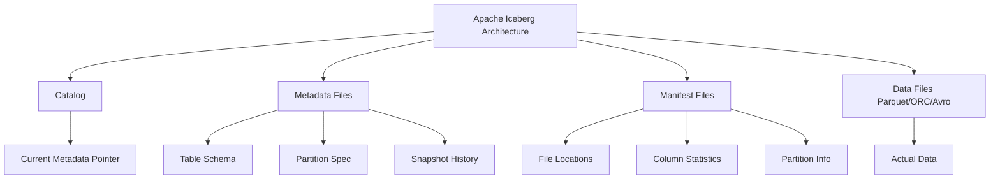
```mermaid
graph TB
    A[Apache Iceberg Architecture] --> B[Catalog]
    A --> C[Metadata Files]
    A --> D[Manifest Files]
    A --> E[Data Files Parquet/ORC/Avro]
    B --> F[Current Metadata Pointer]
    C --> G[Table Schema]
    C --> H[Partition Spec]
    C --> I[Snapshot History]
    D --> J[File Locations]
    D --> K[Column Statistics]
    D --> L[Partition Info]
    E --> M[Actual Data]
```

The metadata layer is what makes Iceberg powerful. A catalog (Hive Metastore, AWS Glue, REST catalog) stores a pointer to the current metadata file. That metadata file contains the table schema, partition specification, and snapshot history. Manifest files list the actual data files and their statistics, enabling aggressive file pruning.

Schema evolution in Iceberg is a metadata-only operation. Adding a column doesn't require rewriting data:

```sql
ALTER TABLE events ADD COLUMN version INT DEFAULT 1;
```

This operation is instantaneous. When a query engine encounters an older data file without the version column, it consults the table schema, finds the default value, and seamlessly populates it in query results on the fly.

Partition evolution works similarly. You can change partitioning strategies without rewriting data:

```sql
ALTER TABLE logs 
ADD PARTITION FIELD day(event_time);
```

Old data remains partitioned by month, new data is partitioned by day. Queries automatically prune files based on whichever partition scheme applies.

Hidden partitioning means you don't write partition values in your queries. Iceberg derives them automatically:

```sql
SELECT * FROM logs
WHERE event_time BETWEEN '2025-10-01' AND '2025-10-31';
```

Iceberg knows logs is partitioned by day(event_time) and automatically prunes files outside the date range. You don't need to specify the partition value.

Time travel allows querying historical table snapshots:

```sql
SELECT * FROM events
FOR SYSTEM_TIME AS OF '2025-10-01 12:00:00';
```

This recreates the table exactly as it existed at that point in time. Useful for debugging, auditing, and reproducing machine learning training data.

Deletion vectors, introduced in Iceberg v3 spec discussions, provide a way to mark deleted rows without rewriting files. Instead of copying all surviving rows to a new file, Iceberg maintains a bitmap of deleted row positions. Reads skip these rows, and compaction merges deletion vectors eventually.

Row-level upserts and deletes use position delete files. When you delete specific rows, Iceberg writes a small file listing (file_path, row_position) tuples. Readers merge these deletes on the fly. This avoids rewriting large data files for small changes.

Iceberg integrates with every major query engine: Spark, Flink, Trino, Presto, Hive, Dremio, Snowflake, Databricks, BigQuery. This portability is a key advantage. You write to Iceberg with Spark, read with Trino, and analyze with Snowflake, all using the same underlying files.

### Apache Hudi: Copy-on-Write and Merge-on-Read

Apache Hudi supports both Copy-on-Write (CoW) and Merge-on-Read (MoR) modes. CoW rewrites entire files on updates, providing fast reads but slower writes. MoR writes updates to delta logs and merges on read, providing fast writes but potentially slower reads.

Hudi now supports reading and writing Iceberg format, enabling interoperability between the two formats. This lets teams migrate from Hudi to Iceberg or use both formats in the same lakehouse.

Row-level upserts and deletes are core to Hudi. The database maintains an index mapping record keys to file groups. On update, Hudi knows exactly which file to modify:

```sql
UPDATE customers
SET status = 'inactive'
WHERE last_purchase_date < '2024-01-01';
```

Hudi locates affected records using the index, writes updates to the appropriate files (or delta logs in MoR), and maintains consistency.

Emerging formats include Apache Paimon, designed for streaming with Flink, and DuckLake, combining DuckDB with lakehouse formats. These represent alternative approaches to the lakehouse problem, with Paimon focusing on real-time streaming workloads and DuckLake providing analytical performance with embedded query processing.

## In-Memory and Spatial Databases

### SAP HANA: Column Lineage and AI Integration

SAP HANA updates in Q3 and December 2025 focused on data lineage capabilities and AI integration within S/4HANA deployments.

Column lineage for calculation views became accessible via SQL functions, enabling programmatic tracing of data flow at the kernel level. This is critical for compliance, data governance, and understanding how derived metrics are computed:

```sql
SELECT * FROM COLUMN_LINEAGE('sales_view');
```

The function returns a graph showing which base tables and columns contribute to each column in the view. This operates at the database kernel level, not application metadata, ensuring accuracy even for complex multi-level views.

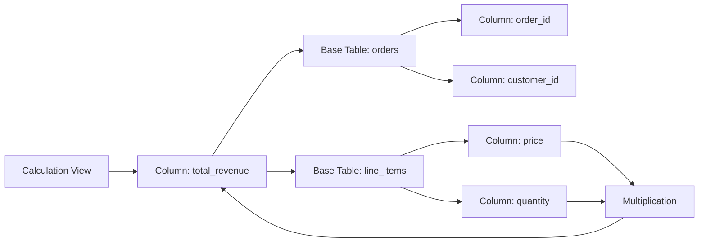
```mermaid
graph LR
    A[Calculation View] --> B[Column: total_revenue]
    B --> C[Base Table: orders]
    B --> D[Base Table: line_items]
    C --> E[Column: order_id]
    C --> F[Column: customer_id]
    D --> G[Column: price]
    D --> H[Column: quantity]
    G --> I[Multiplication]
    H --> I
    I --> B
```

The diagram shows how lineage tracking reveals that total_revenue depends on price and quantity from line_items, joined with order metadata. This transparency is essential for regulatory compliance and troubleshooting data quality issues.

Data access enhancements in HANA improved query performance on large analytical models. The optimizer now leverages columnar storage more aggressively, using SIMD instructions for parallel computation within CPU registers.

AI integration in S/4HANA 2025 combined with SAP Fiori 4.0 brings machine learning predictions directly into business workflows. The integration leverages HANA's Predictive Analysis Library (PAL), which runs ML algorithms in-database without moving data out.

HANA Cloud updates in 2025 included multi-model capabilities for graph, spatial, and time-series data within a single database. This eliminates the need for separate specialized databases, with HANA providing native support and optimized query execution for each model.

### PostGIS 3.5.4 and 3.6: Spatial Optimization

PostGIS 3.5.4, released in October 2025, and version 3.6 in September brought significant performance improvements for spatial queries through enhanced indexing and GPU acceleration.

GiST (Generalized Search Tree) indexes received optimizations for larger geometries. SP-GiST (Space-Partitioned GiST) indexes improved for points and small polygons. Create a spatial index:

```sql
CREATE INDEX sp_idx ON parcels 
USING GIST(geom);
```

This enables spatial joins like:

```sql
SELECT p.parcel_id, p.address
FROM parcels p
JOIN zones z ON ST_Intersects(p.geom, z.geom)
WHERE z.zone_type = 'residential';
```

The GIST index allows the database to quickly eliminate geometries that don't intersect, avoiding expensive geometry intersection calculations on the entire dataset.

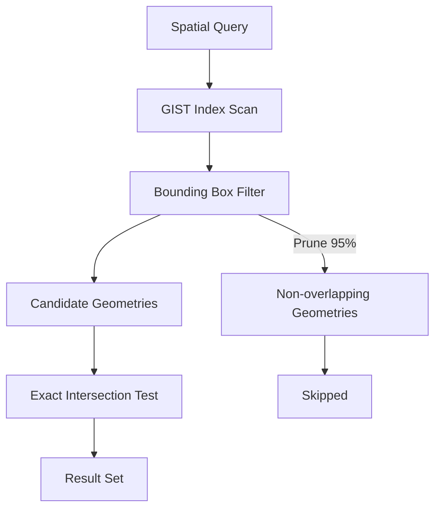
```mermaid
flowchart TD
    A[Spatial Query] --> B[GIST Index Scan]
    B --> C[Bounding Box Filter]
    C --> D[Candidate Geometries]
    D --> E[Exact Intersection Test]
    E --> F[Result Set]
    C -->|Prune 95%| G[Non-overlapping Geometries]
    G --> H[Skipped]
```

GPU-accelerated queries entered preview, enabling 10x faster spatial operations on large datasets. PostGIS offloads computations like buffer generation, intersection tests, and distance calculations to GPU shaders. This parallelism dramatically speeds up GIS workloads:

```sql
SET postgis.backend = 'cuda';

SELECT 
    parcel_id,
    ST_Buffer(geom, 100) AS buffer_geom
FROM parcels
WHERE county = 'Santa Clara';
```

The GPU acceleration is particularly effective for operations on millions of geometries, where traditional CPU processing becomes a bottleneck.

PostGIS 3.6 added improved support for 3D geometries and temporal spatial data. The ST_3DDistance and ST_3DIntersects functions handle three-dimensional geometries efficiently, useful for building information modeling and drone flight paths.

## Blockchain and Decentralized Databases

### BigchainDB: Immutable Distributed Storage

BigchainDB evolved in 2025 to support enterprise blockchain applications requiring immutable, decentralized storage. The architecture combines blockchain properties (decentralization, immutability, digital signatures) with database capabilities (queryability, low latency, high throughput).

The system stores assets and transactions in a distributed database (MongoDB or RethinkDB backend), with blockchain consensus ensuring immutability. Each transaction is cryptographically signed, and the network validates transactions through a federation of voting nodes.

Use cases in 2025 centered on supply chain provenance, intellectual property registries, and compliance audit trails. The immutability guarantee means once data is written, it cannot be altered or deleted, providing a permanent record.

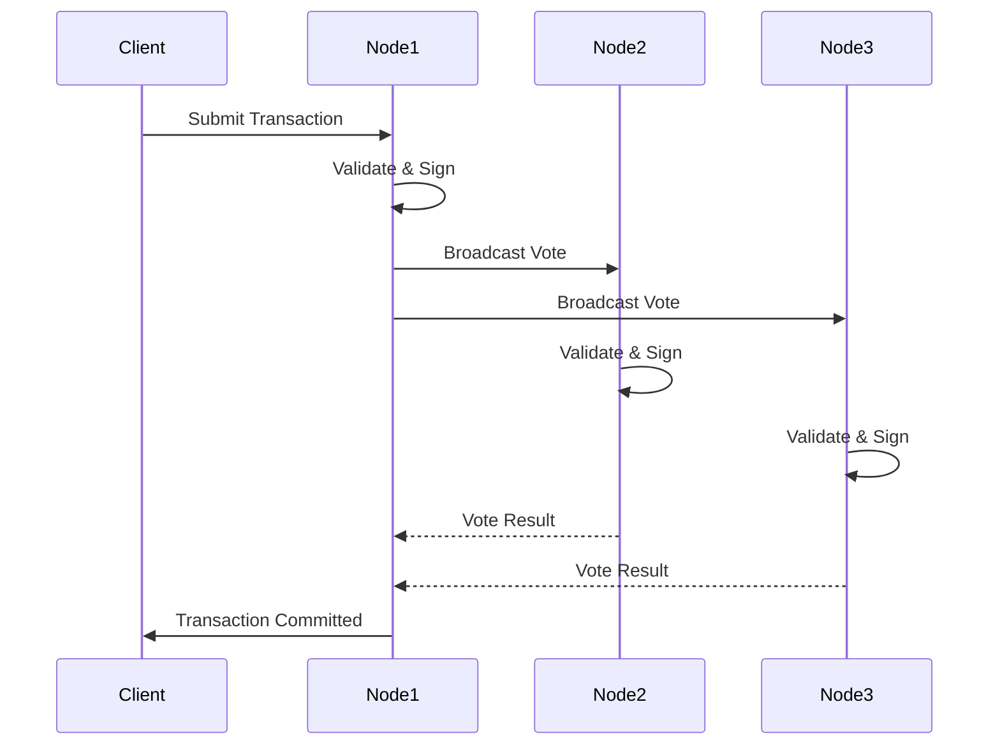
```mermaid
sequenceDiagram
    participant Client
    participant Node1
    participant Node2
    participant Node3
    Client->>Node1: Submit Transaction
    Node1->>Node1: Validate & Sign
    Node1->>Node2: Broadcast Vote
    Node1->>Node3: Broadcast Vote
    Node2->>Node2: Validate & Sign
    Node3->>Node3: Validate & Sign
    Node2-->>Node1: Vote Result
    Node3-->>Node1: Vote Result
    Node1->>Client: Transaction Committed
```

The federation consensus requires a supermajority of nodes to approve each transaction. This provides Byzantine fault tolerance while maintaining database-like performance (thousands of transactions per second).

### Chainbase: Onchain Data Infrastructure

Chainbase grew to support over 10,000 projects in 2025, providing infrastructure for blockchain data querying and analytics. The platform integrates with Trusta AI for onchain identity verification and the Hyperdata Network for distributed blockchain data indexing.

Zero-knowledge proofs for private queries allow users to query blockchain data without revealing their query patterns or accessed data. This addresses privacy concerns in public blockchain analysis:

```sql
-- Query appears as encrypted ZK proof to the network
SELECT balance, transaction_count
FROM ethereum_accounts
WHERE address = '0x...'
PROVE WITHOUT REVEALING address;
```

The result proves the query was executed correctly without revealing which address was queried. This is particularly valuable for institutional users who need blockchain data for compliance or risk analysis but cannot expose their positions.

Chainbase's Hyperdata Network distributes indexing across thousands of nodes, eliminating single points of failure. Each node indexes a subset of blockchain data, and queries fan out across the network, aggregating results in real time.

The integration with AI systems enables natural language queries over blockchain data:

```text
"Show me all wallets that interacted with Uniswap V3 in the last 24 hours with transaction volume over $100K"
```

The system translates this to structured queries across multiple blockchain indexers, returns results, and provides explanations of onchain activity patterns.

## Data Orchestration Tools

### dbt: AI-Assisted Modeling

dbt (data build tool) continued evolving in 2025 with enhanced integrations for data pipelines and AI-assisted development capabilities showcased at Coalesce 2025.

The dbt Cloud IDE received AI-powered features for automatic model generation. Describe your business logic in natural language, and the system generates SQL transformations:

```yaml
# models/staging/stg_orders.yml
version: 2
models:
  - name: stg_orders
    description: "Clean and standardized order data"
    ai_prompt: |
      Create a staging model that:
      - Deduplicates orders by order_id
      - Filters cancelled orders
      - Standardizes currency to USD
      - Adds a revenue_category column based on amount
```

The AI assistant generates the corresponding SQL model, applies dbt best practices, and suggests appropriate tests.

Fusion, announced in 2025, unifies dbt workflows with broader data engineering pipelines. Instead of maintaining separate Airflow DAGs and dbt projects, Fusion allows defining the entire data pipeline in dbt, including dependencies on external systems, API calls, and non-SQL transformations.

```yaml
# models/fusion/customer_enrichment.yml
sources:
  - name: salesforce_api
    type: rest_api
    endpoint: "https://api.salesforce.com/customers"

models:
  - name: enriched_customers
    depends_on:
      - ref('stg_customers')
      - source('salesforce_api')
    fusion_transform:
      type: python
      script: enrich_with_crm_data.py
```

This eliminates context switching between orchestration tools and transformation logic.

The dbt test command runs data quality expectations:

```bash
dbt test --select staging.*
```

Tests validate schema contracts, data freshness, referential integrity, and custom business rules. Failures block downstream models from running, preventing cascading data quality issues.

Incremental model improvements in 2025 include better merge strategies and automatic detection of deleted rows. The merge_update_columns parameter provides fine-grained control:

```sql
{{ config(
    materialized='incremental',
    unique_key='order_id',
    merge_update_columns=['status', 'updated_at'],
    on_schema_change='append_new_columns'
) }}

SELECT 
    order_id,
    customer_id,
    order_date,
    status,
    total_amount,
    updated_at
FROM {{ source('raw', 'orders') }}

WHERE updated_at > (SELECT MAX(updated_at) FROM {{ this }})

```

This updates only status and updated_at on existing rows, preserving other columns. The on_schema_change setting automatically adapts to schema changes without manual intervention.

### Great Expectations: Open-Source Data Quality

Great Expectations received significant updates in 2025, focusing on integrations with dbt and Soda for comprehensive anomaly detection in data pipelines.

The Expectation Suite concept allows defining reusable data quality rules:

```python
suite = context.add_expectation_suite("orders_suite")

suite.add_expectation(
    ExpectationConfiguration(
        expectation_type="expect_column_values_to_not_be_null",
        kwargs={"column": "order_id"}
    )
)

suite.add_expectation(
    ExpectationConfiguration(
        expectation_type="expect_column_values_to_be_between",
        kwargs={
            "column": "total_amount",
            "min_value": 0,
            "max_value": 1000000
        }
    )
)
```

Integration with dbt allows running Great Expectations validations as dbt tests:

```yaml
# tests/expectations/orders_expectations.yml
version: 2
models:
  - name: orders
    tests:
      - great_expectations:
          expectation_suite: orders_suite
```

This unified workflow means data quality checks run automatically as part of the transformation pipeline.

Anomaly detection in 2025 uses statistical profiling to detect outliers. Great Expectations learns the normal distribution of values during training, then flags anomalies in production:

```python
validator.expect_column_values_to_be_in_distribution(
    column="daily_revenue",
    distribution="normal",
    std_dev_multiplier=3
)
```

If daily revenue exceeds three standard deviations from the mean, the validation fails and alerts trigger.

The Data Docs feature automatically generates HTML documentation showing data quality results, including pass/fail rates, distribution histograms, and time-series trends of validation metrics.

## Edge and IoT Databases

### SQLite Extensions: Sync and Vector Capabilities

SQLite, the most deployed database (billions of installations), received powerful extensions in 2025 for edge computing scenarios.

SQLite-Sync provides conflict-free replication using Conflict-Free Replicated Data Types (CRDTs). This enables offline-first applications where multiple devices modify the same database and sync changes when connectivity returns:

```sql
CREATE TABLE documents (
    id TEXT PRIMARY KEY,
    content TEXT,
    version CRDT_LWW  -- Last-Write-Wins CRDT
);

-- Device A (offline)
UPDATE documents SET content = 'Version A' WHERE id = 'doc1';

-- Device B (offline)
UPDATE documents SET content = 'Version B' WHERE id = 'doc1';

-- Both devices sync
-- Conflict resolution happens automatically based on LWW timestamps
```

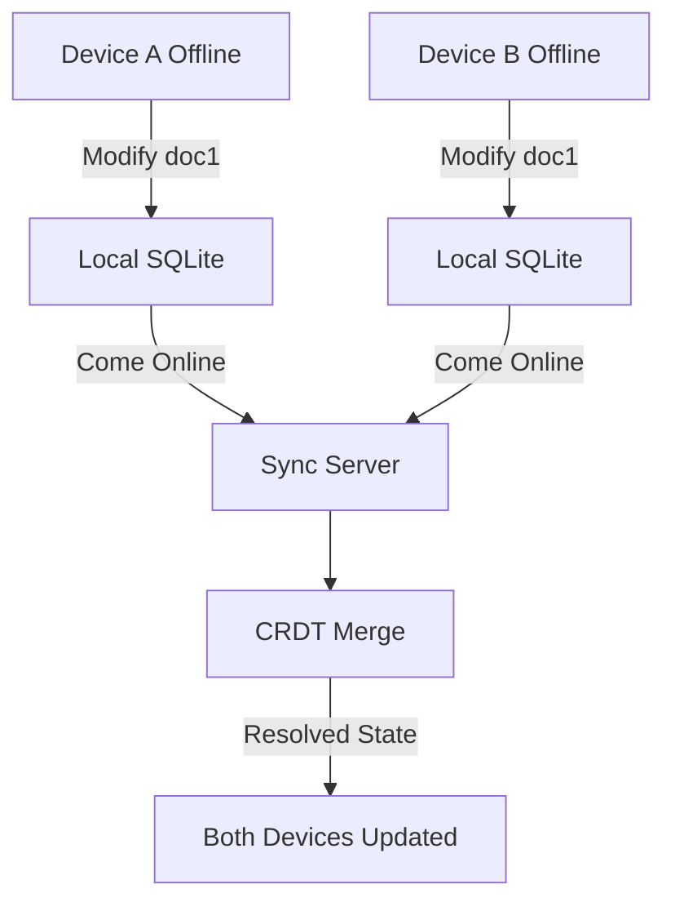
```mermaid
graph TD
    A[Device A Offline] -->|Modify doc1| B[Local SQLite]
    C[Device B Offline] -->|Modify doc1| D[Local SQLite]
    B -->|Come Online| E[Sync Server]
    D -->|Come Online| E
    E --> F[CRDT Merge]
    F -->|Resolved State| G[Both Devices Updated]
```

The CRDT ensures that regardless of sync order, all devices converge to the same final state. This is essential for mobile apps, IoT devices, and distributed systems that operate in intermittent connectivity environments.

SQLite-Vector brings vector embeddings to edge devices, enabling on-device semantic search without server round trips:

```sql
-- Install extension
.load ./vector

CREATE VIRTUAL TABLE docs_vec USING vec0(
    embedding FLOAT[768]
);

INSERT INTO docs_vec (rowid, embedding)
SELECT id, embedding FROM documents;

-- Semantic search on device
SELECT rowid, distance
FROM docs_vec
WHERE embedding MATCH vector_query
ORDER BY distance
LIMIT 10;
```

This runs entirely on the device, with zero server overhead. Mobile apps can perform semantic search over user data without uploading documents or embeddings to the cloud, addressing privacy concerns.

The combination of SQLite-Sync and SQLite-Vector enables powerful edge AI scenarios: devices generate embeddings locally, perform semantic search on device, and sync results to other devices or cloud storage when convenient.

Performance is surprisingly good. SQLite-Vector handles millions of vectors on modern smartphones, with sub-second query times using HNSW indexes optimized for mobile ARM processors.

## MLOps Integrations: Streaming and Real-Time ML

### Apache Kafka and Flink: Real-Time ML Pipelines

Apache Kafka and Flink integrations in 2025 focused on enabling real-time machine learning pipelines, where models consume streaming data, make predictions, and output results without batch processing delays.

Flink's stateful stream processing allows maintaining ML model state across events. You can implement online learning algorithms that update models incrementally as new data arrives:

```sql
CREATE TABLE user_events (
    user_id STRING,
    event_type STRING,
    timestamp TIMESTAMP(3),
    features ARRAY<DOUBLE>
) WITH (
    'connector' = 'kafka',
    'topic' = 'user-events',
    'properties.bootstrap.servers' = 'localhost:9092',
    'format' = 'json'
);

CREATE TABLE model_predictions (
    user_id STRING,
    predicted_churn DOUBLE,
    features ARRAY<DOUBLE>,
    prediction_time TIMESTAMP(3)
) WITH (
    'connector' = 'kafka',
    'topic' = 'predictions',
    'properties.bootstrap.servers' = 'localhost:9092',
    'format' = 'json'
);
```

The Flink SQL creates a streaming pipeline reading from Kafka, applying ML models, and writing predictions back to Kafka in real time.

```mermaid
flowchart LR
    A[Kafka: Raw Events] --> B[Flink Streaming]
    B --> C[Feature Engineering]
    C --> D[ML Model Inference]
    D --> E[Kafka: Predictions]
    D --> F[Model State Store]
    F -->|Update| D
    E --> G[Downstream Systems]
```

Flink maintains model state in RocksDB, a persistent key-value store. As the model makes predictions, it can update weights incrementally, implementing online learning:

```java
// Flink stateful function for online ML
public class OnlineLearningFunction 
    extends KeyedProcessFunction<String, Event, Prediction> {
    
    private ValueState<ModelState> modelState;
    
    public void processElement(Event event, Context ctx, 
        Collector<Prediction> out) {
        
        ModelState state = modelState.value();
        
        // Make prediction
        double prediction = state.predict(event.features);
        out.collect(new Prediction(event.userId, prediction));
        
        // Update model with new observation
        if (event.hasLabel()) {
            state.update(event.features, event.label);
            modelState.update(state);
        }
    }
}
```

This pattern enables real-time personalization, fraud detection, and anomaly detection where models adapt continuously as new patterns emerge.

Kafka Streams integration with TensorFlow and PyTorch models allows embedding inference directly in stream processing applications. Instead of calling external model servers, the model runs in-process, eliminating network latency:

```java
KStream<String, Event> events = builder.stream("events");

events
    .mapValues(event -> {
        // Load model (cached in memory)
        TensorFlowModel model = ModelCache.get("churn_predictor");
        
        // Run inference
        float[] features = event.extractFeatures();
        float prediction = model.predict(features);
        
        return new Prediction(event.userId, prediction);
    })
    .to("predictions");
```

The model loads once at startup and remains in memory. Each event runs inference in microseconds, achieving sub-millisecond end-to-end latency from event ingestion to prediction output.

Feature stores like Feast integrated with Flink in 2025, providing consistent feature engineering between training and serving. Features are defined once, computed in Flink streaming jobs, and stored in both offline stores (for training) and online stores (for real-time serving).

## Vector Databases: The AI Infrastructure Layer

### Pinecone: Dedicated Read Nodes

Pinecone introduced Dedicated Read Nodes (DRN) in December 2025 (public preview). DRN addresses workloads requiring consistent high throughput with predictable costs at scale. Examples include billion-vector semantic search, real-time recommendation systems, and user-facing AI assistants with strict service-level objectives.

```mermaid
graph TD
    A[Client Application] --> B{Workload Type}
    B -->|Bursty/Variable| C[On-Demand Mode]
    B -->|Sustained/High-QPS| D[Dedicated Read Nodes]
    C --> E[Shared Resources]
    C --> F[Pay Per Request]
    D --> G[Reserved Capacity]
    D --> H[Predictable Latency]
    G --> I[Data Stays Warm in Memory/SSD]
    H --> J[No Cold Starts]
    I --> J
    J --> K[Consistent P50/P99 Latency]
```

DRN allocates exclusive compute and memory resources for query operations. Data stays warm in memory and on local SSD storage, avoiding latency spikes from cold data fetches. There are no noisy neighbors or shared queues.

Performance benchmarks showed one customer sustaining 600 QPS with median latency of 45ms and P99 of 96ms across 135 million vectors. Under load testing, they reached 2,200 QPS with median latency of 60ms and P99 of 99ms. Another customer handling 1.4 billion vectors recorded 5,700 QPS with median latencies in the tens of milliseconds.

DRN scales along two dimensions: replicas for maximum throughput and availability, and shards for expanded storage capacity as datasets grow.

Pinecone updated its API to version 2025-01 in early 2025, adding support for sparse-only indexes for storing and retrieving sparse vectors (useful for keyword-based retrieval alongside semantic search).

The Pinecone CLI v0.1.0 (public preview) lets you manage infrastructure directly from your terminal: organizations, projects, indexes, and API keys. This streamlines CI/CD pipelines and infrastructure-as-code workflows.

Pinecone Assistant reached general availability, providing a managed service for building AI assistants with retrieval-augmented generation.

### Milvus, Chroma, Weaviate, Qdrant: Open-Source Vector Leaders

Open-source vector databases continued advancing in 2025. Milvus focuses on massive scalability, handling billions of vectors with diverse indexing structures like IVF, HNSW, and GPU acceleration. Independent benchmarks show Milvus sustaining thousands of queries per second when properly configured.

Chroma emphasizes developer experience and simplicity, targeting teams building AI applications who want vector search without operational complexity.

Weaviate combines vector search with structured metadata models and hybrid query capabilities. It's often chosen for applications needing more expressiveness than pure similarity search, like semantic + keyword retrieval or faceted navigation.

Qdrant focuses on performance and ease of deployment, with support for both in-memory and disk-based indexing. Its hybrid search improvements in 2025 included better tuning parameters for combining dense and sparse searches.

All these databases improved hybrid search capabilities in 2025, combining dense vector embeddings with sparse representations (like BM25) for better retrieval quality. They also enhanced multimodal data support (text, images, audio) and added more sophisticated filtering options.

### YugabyteDB: Top 5 for SQL Vector Search

YugabyteDB entered the top 5 vector databases for scalability and low-latency SQL vector search. Built on PostgreSQL compatibility, YugabyteDB provides distributed SQL with native vector support, combining transactional workloads with vector search in a single database.

The advantage is that you can join vector similarity results with relational data in standard SQL queries:

```sql
SELECT p.product_name, p.price, v.similarity_score
FROM products p
JOIN LATERAL (
  SELECT vector_similarity(p.embedding, @query_vector) AS similarity_score
) v ON true
WHERE p.category = 'electronics'
ORDER BY v.similarity_score DESC
LIMIT 10;
```

This eliminates the need to maintain separate vector and relational databases, simplifying architecture.

## Cloud Database Services: Multi-Cloud and AI Control Planes

### Google Cloud: Sixth Year as Gartner Leader

Google Cloud maintained its position as a Leader in the 2025 Gartner Magic Quadrant for Cloud Database Management Systems for the sixth consecutive year. For the third year running, Google was positioned furthest in vision.

```mermaid
quadrantChart
    title 2025 Gartner CDBMS Magic Quadrant
    x-axis Low Execution --> High Execution
    y-axis Limited Vision --> Complete Vision
    quadrant-1 Leaders
    quadrant-2 Visionaries
    quadrant-3 Niche Players
    quadrant-4 Challengers
    Google Cloud: [0.85, 0.95]
    AWS: [0.90, 0.75]
    Microsoft Azure: [0.88, 0.80]
    Oracle: [0.82, 0.85]
    IBM: [0.70, 0.72]
```

The recognition reflects Google's AI-native Data Cloud strategy, which eliminates complexity for agentic AI workloads. The architecture unifies transactional and analytical processing with AI capabilities built in.

BigQuery updates focused on AI integration, with Gemini models available for natural language querying and automatic schema design. AlloyDB added multimodal vector search, combining different data types in similarity searches. Spanner's columnar engine achieved 200x faster analytical queries on live operational data.

In the 2025 Gartner Critical Capabilities report, Google Cloud Spanner ranked #1 for Lightweight Transactions, and BigQuery ranked #1 for Event Analytics. These rankings demonstrate strengths in both operational and analytical workloads.

Google also led in the 2025 Gartner Magic Quadrant for AI Application Development Platforms, positioned highest for Ability to Execute. Vertex AI provides access to over 200 models from Google DeepMind, open-source communities, and third-party providers.

### Microsoft Azure: SQL Server 2025 and Ignite Announcements

Azure Ignite in November 2025 announced SQL Server 2025 availability in Azure, alongside MySQL enhancements and Managed Redis scalability improvements.

SQL Server 2025 on Azure includes all the features from the on-premises version: native vector search, Fabric Mirroring, regular expressions in T-SQL, and optimized locking. The advantage of running on Azure is integration with other Azure services: Azure AI for embeddings, Azure Cognitive Search for hybrid retrieval, and Fabric for analytics.

Azure MySQL received performance optimizations, with connection pooling improvements and read replica enhancements. The focus was on making managed MySQL competitive with self-hosted deployments while providing automatic backups, patching, and scaling.

Azure Managed Redis added vertical scaling generally available and improved hybrid search capabilities mirroring the Redis open-source Fall 2025 release.

Microsoft Fabric unified analytics became the centerpiece of Microsoft's data strategy. Fabric Mirroring in SQL Server 2025 allows near-real-time data flow from operational databases to Fabric OneLake, where Power BI, Synapse, and other tools can analyze it without ETL complexity.

### AWS: Oracle Database@AWS and re:Invent Highlights

AWS re:Invent 2025 highlighted Oracle Database@AWS integration for AI agents. This managed service provides Oracle databases running in AWS infrastructure, combining Oracle's database features with AWS's compute and networking.

The key use case is AI agents that need access to both transactional data in Oracle and AI services from AWS. With Oracle Database@AWS, you can query operational data and call Amazon Bedrock models in the same application without moving data between clouds.

Amazon Timestream added InfluxDB 3 support in October 2025, allowing customers to use InfluxDB's query language and tools while benefiting from Timestream's serverless architecture and automatic scaling.

Amazon RDS announced MySQL 9.5 support in the Database Preview Environment in December 2025, giving early access to test the latest MySQL features before general availability.

### Databricks: Fifth Year as Gartner Leader

Databricks maintained its position as a Leader in the Gartner Magic Quadrant for Cloud Data Warehouses for the fifth consecutive year. The Databricks Lakehouse platform combines data warehousing, data lakes, and machine learning in a unified architecture.

Delta Lake, the open-source storage layer, received significant updates in 2025. Deletion vectors improved delete performance, liquid clustering eliminated the need for manual table optimization, and predictive I/O reduced query latency.

Unity Catalog, Databricks' data governance layer, expanded with fine-grained access controls, data lineage across multiple clouds, and AI governance features for tracking model training data and lineage.

The market transition to data and AI control planes accelerated in 2025. Organizations increasingly adopt platforms that unify data management, AI/ML, and governance across multiple clouds. Multi-cloud adoption rose as companies avoid vendor lock-in and optimize costs by using the best services from each provider.

## AI-Integrated Databases: The Convergence

The theme of 2025 was AI moving from external services into database cores. Every major database vendor integrated AI capabilities directly into their products.

Oracle 26ai architects AI into the database core with ML models running at the kernel level for automatic query optimization. Vector search operates on all data types without moving data to specialized systems.

Microsoft Fabric unified analytics from data ingestion to AI model deployment. SQL Server 2025 brings AI capabilities to on-premises deployments with native vector search and REST endpoint calls from T-SQL.

Google Data Cloud with Gemini models provides natural language interfaces for querying, schema design, and data analysis. BigQuery and Spanner integrate AI directly into the query engine.

MongoDB AMP uses AI to modernize legacy applications, analyzing code patterns and suggesting refactoring strategies. Voyage AI embeddings improve retrieval accuracy for RAG applications.

Elastic Elasticsearch 9.0 (released earlier in 2025) added ESQL, a new query language with join support and improved vector search capabilities. The integration makes Elasticsearch competitive with purpose-built vector databases.

InfluxDB 3's Python Processing Engine brings real-time AI to time-series data, with embeddings for anomaly detection and automatic pattern recognition.

```mermaid
graph TB
    A[Traditional Database] --> B[AI Integration Layer]
    B --> C[Vector Search]
    B --> D[Embeddings Generation]
    B --> E[ML Query Optimization]
    B --> F[Natural Language Interface]
    C --> G[RAG Applications]
    D --> G
    E --> H[Automatic Performance Tuning]
    F --> I[Business User Access]
    G --> J[AI-Powered Applications]
    H --> J
    I --> J
```

Trends visible across all AI-integrated databases:

1. **Embedding Generation:** Databases generate embeddings internally rather than requiring external services
2. **Query Optimization:** Machine learning models optimize query plans based on historical patterns
3. **Anomaly Detection:** AI identifies unusual patterns in data access, schema changes, or performance metrics
4. **Schema Mapping:** AI assists with schema design and data migration
5. **Natural Language:** Query databases using natural language, with AI translating to SQL or native query languages

The convergence creates a new expectation: databases aren't just storage systems but active participants in AI workflows, providing preprocessing, feature engineering, and real-time inference alongside traditional query capabilities.

## Key Takeaways for Database Architects

Several architectural patterns emerged from 2025's database innovations:

**1. Separation of Storage and Compute**
InfluxDB 3's diskless architecture and Pinecone's dedicated read nodes exemplify this trend. Store data once (often on object storage), but provision compute resources independently based on workload requirements.

**2. Unified Data Platforms**
Oracle 26ai, Google Cloud, and Microsoft Fabric demonstrate the push toward platforms that handle transactional, analytical, and AI workloads without moving data. The "multiple specialized databases" approach gives way to unified platforms with specialized engines.

**3. AI at the Kernel Level**
PostgreSQL's skip scan, Oracle's ML query optimization, and SQL Server's intelligent query processing show AI moving from application layer to database internals. Future databases will use ML for almost every optimization decision.

**4. Vector Search as Standard**
Nearly every major database added native vector support in 2025. Vector search is becoming as fundamental as full-text search, not a specialized feature requiring separate systems.

**5. Async Everything**
PostgreSQL 18's AIO subsystem, Redis's query parallelization, and InfluxDB's async operations demonstrate the importance of asynchronous processing for modern performance requirements.

**6. Tablets and Dynamic Partitioning**
ScyllaDB's Tablets and Iceberg's partition evolution show the industry moving away from static partitioning toward dynamic data distribution that adapts to workload patterns.

**7. Edge Intelligence**
SQLite extensions bringing vector search and CRDT sync to edge devices represent the trend of pushing intelligence to where data is generated, reducing latency and addressing privacy concerns.

**8. Real-Time Everything**
The integration of Kafka, Flink, and databases enables true real-time ML pipelines where models are continuously updated and predictions happen in milliseconds.

When evaluating databases for new projects in 2026, consider these questions:

- Does the database support vector embeddings natively, or will you need a separate system?
- Can the database scale compute and storage independently?
- Does it integrate with your AI infrastructure (LLMs, embedding models)?
- What's the performance characteristic of async operations?
- How does it handle multi-cloud or hybrid deployments?
- What's the upgrade path, and does it support zero-downtime upgrades?
- Can it serve edge/IoT use cases with offline operation?
- Does it support real-time streaming workloads?

The database market in 2025 proved that mature, established databases can evolve significantly while maintaining backward compatibility. PostgreSQL, MySQL, Oracle, and SQL Server all delivered major architectural changes while preserving decades of existing applications and tools.

## Looking Forward to 2026

Based on 2025's trends, expect these developments in 2026:

**Real-Time AI Becomes Standard**
Every database will offer real-time inference capabilities. The distinction between "operational database" and "AI database" will disappear.

**Multi-Model Databases Dominate**
Pure document, pure relational, or pure graph databases will be niche choices. Most databases will handle multiple data models efficiently.

**Agentic Database Management**
AI agents will manage database operations: automatic scaling, query optimization, schema evolution, and backup strategies without human intervention.

**Enhanced Governance for AI**
As AI becomes embedded in databases, governance features will track model provenance, data lineage for training sets, and compliance for AI-generated results.

**Edge Database Deployments**
More databases will support edge deployment patterns, with intelligent data synchronization between edge and cloud instances.

**Serverless Becomes Default**
Pay-per-use pricing with automatic scaling will become the standard deployment model, even for on-premises installations.

**Lakehouse Convergence**
The distinction between data warehouses and data lakes will effectively disappear as open table formats mature and query engines optimize for both operational and analytical workloads.

The database landscape in 2025 set the stage for a fundamentally different approach to data management, where AI is inseparable from storage, retrieval, and processing. The innovations from this year will define how we build systems for the next decade.

---

## References

### PostgreSQL
1. PostgreSQL 18 Release Announcement: https://www.postgresql.org/about/news/postgresql-18-released-3142/
2. PostgreSQL 18 New Features Guide: https://neon.com/postgresql/postgresql-18-new-features
3. PostgreSQL 18 Release Notes: https://www.postgresql.org/docs/current/release-18.html
4. What's New in PostgreSQL 18 (Developer Perspective): https://www.bytebase.com/blog/what-is-new-in-postgres-18-for-developer/
5. PostgreSQL 18 DBA Perspective: https://www.bytebase.com/blog/what-is-new-in-postgres-18/

### MySQL
6. MySQL 9.5 Release Notes: https://dev.mysql.com/doc/relnotes/mysql/9.5/en/news-9-5-0.html
7. MySQL AI Add-on Release Notes: https://dev.mysql.com/doc/relnotes/mysql-ai/en/news-9-5-0.html
8. MySQL HeatWave 9.5 Release: https://dev.mysql.com/doc/relnotes/heatwave/en/news-9-5-0.html
9. Amazon RDS MySQL 9.5 Announcement: https://aws.amazon.com/about-aws/whats-new/2025/12/amazon-rds-mysql-innovation-release/

### Oracle
10. Oracle AI Database 26ai Announcement: https://www.oracle.com/news/announcement/ai-world-database-26ai-powers-the-ai-for-data-revolution-2025-10-14/
11. Introducing Oracle AI Database 26ai: https://blogs.oracle.com/database/oracle-announces-oracle-ai-database-26ai
12. Oracle 26ai Released (ORACLE-BASE): https://oracle-base.com/blog/2025/10/15/oracle-ai-database-26ai-released/
13. Oracle AI Database 26ai Features: https://www.oracle.com/database/26ai/
14. Oracle AI Database 26ai On-Premises: https://blogs.oracle.com/database/oracle-ai-database-26ai-coming-soon-for-linux-x86-64-on-premises-platforms

### SQL Server
15. What's New in SQL Server 2025: https://learn.microsoft.com/en-us/sql/sql-server/what-s-new-in-sql-server-2025
16. SQL Server 2025 New Features: https://www.mssqltips.com/sqlservertip/8290/sql-server-2025-new-features/
17. SQL Server 2025 on AWS: https://aws.amazon.com/blogs/modernizing-with-aws/whats-new-in-microsoft-sql-server-2025-on-aws/
18. What's New in SQL Server 2025 (Devart): https://blog.devart.com/whats-new-in-sql-server-2025.html
19. SQL Server 2025 Has Arrived: https://www.sqlservercentral.com/articles/sql-server-2025-has-arrived

### Snowflake
20. Snowflake Summit 2025 Recap: https://www.snowflake.com/blog/snowflake-summit-2025-recap/
21. Snowflake AI Data Cloud: https://www.snowflake.com/en/data-cloud/workloads/ai/
22. Cortex Analyst Documentation: https://docs.snowflake.com/en/user-guide/snowflake-cortex/cortex-analyst
23. Snowflake Product Updates: https://docs.snowflake.com/en/release-notes/

### CockroachDB
24. CockroachDB 25.2 Release: https://www.cockroachlabs.com/blog/cockroachdb-25-2-release/
25. CockroachDB 10 Years: https://www.cockroachlabs.com/blog/cockroachdb-10-years/
26. CockroachDB 25.3 Release Notes: https://www.cockroachlabs.com/docs/releases/v25.3
27. CockroachDB Vector Indexing: https://www.cockroachlabs.com/docs/stable/vector-search

### Couchbase  
28. Couchbase 8.0 Release: https://www.couchbase.com/blog/couchbase-server-8-0-released/
29. Couchbase Vector Search: https://docs.couchbase.com/server/current/vector-search/vector-search.html
30. Couchbase 8.0 What's New: https://docs.couchbase.com/server/current/release-notes/relnotes.html

### ScyllaDB
31. ScyllaDB 2025.1 Release: https://www.scylladb.com/2025/04/09/scylladb-2025-1-0/
32. ScyllaDB Tablets: https://docs.scylladb.com/stable/architecture/tablets.html
33. ScyllaDB X Cloud Launch: https://www.scylladb.com/product/scylladb-x/

### MongoDB
34. MongoDB 2025 in Review: https://www.mongodb.com/company/blog/mongodb-2025-in-review-2026-predictions
35. MongoDB Announces Voyage AI Acquisition: https://investors.mongodb.com/news-releases/news-release-details/mongodb-announces-acquisition-voyage-ai-enable-organizations
36. Redefining Database for AI: https://www.mongodb.com/blog/post/redefining-database-ai-why-mongodb-acquired-voyage-ai
37. MongoDB New Features: https://www.mongodb.com/products/updates/
38. MongoDB SQL Interface GA: https://www.mongodb.com/company/blog/product-release-announcements/mongodb-sql-interface-now-available-enterprise-advanced

### Redis
39. Redis What's New September 2025: https://redis.io/blog/whats-new-in-two-september-2025-edition/
40. Redis Fall Release 2025: https://redis.io/blog/fall-release-2025/
41. Redis 8 GA Release: https://redis.io/blog/redis-8-ga/
42. Benchmarking Vector Databases: https://redis.io/blog/benchmarking-results-for-vector-databases/
43. Redis Spring Release 2025: https://redis.io/blog/spring-release-2025/
44. Searching 1 Billion Vectors: https://redis.io/blog/searching-1-billion-vectors-with-redis-8/
45. Faster Redis Query Engine: https://redis.io/blog/announcing-faster-redis-query-engine-and-our-vector-database-leads-benchmarks/

### Neo4j
46. Neo4j 2025 Changelog: https://github.com/neo4j/neo4j/wiki/Neo4j-2025-changelog
47. Neo4j Operations Manual Changes: https://neo4j.com/docs/operations-manual/current/changes-deprecations-removals/
48. Neo4j Upgrade Guide 2025: https://neo4j.com/docs/upgrade-migration-guide/current/version-2025/upgrade/
49. Neo4j Cypher Manual: https://neo4j.com/docs/cypher-manual/current/queries/select-version/

### InfluxDB
50. InfluxDB 3 Core & Enterprise GA: https://www.influxdata.com/blog/influxdb-3-oss-ga/
51. InfluxDB 3 Core Documentation: https://docs.influxdata.com/influxdb3/core/
52. InfluxDB 3 Enterprise Release Notes: https://docs.influxdata.com/influxdb3/enterprise/release-notes/
53. InfluxDB 3 GA Announcement: https://www.businesswire.com/news/home/20250415573560/en/

### QuestDB
54. QuestDB 9.1 Release: https://questdb.io/blog/questdb-9-1-0-release/
55. QuestDB 9.0 Release: https://questdb.io/blog/questdb-9-0-0-release/
56. QuestDB Documentation: https://questdb.io/docs/

### Apache Iceberg & Hudi
57. Apache Iceberg Documentation: https://iceberg.apache.org/docs/latest/
58. Apache Hudi Documentation: https://hudi.apache.org/docs/overview
59. Iceberg 2025 Updates: https://iceberg.apache.org/releases/

### Pinecone
60. Pinecone 2025 Release Notes: https://docs.pinecone.io/release-notes/2025
61. Pinecone Dedicated Read Nodes: https://www.infoq.com/news/2025/12/pinecone-drn-vector-workloads/
62. Pinecone Scales Vector Database: https://siliconangle.com/2025/12/01/pinecone-scales-vector-database-support-demanding-workloads/
63. Pinecone Overview: https://docs.pinecone.io/docs/overview

### PostGIS & SAP HANA
64. PostGIS 3.6 Release Notes: https://postgis.net/docs/release_notes.html
65. PostGIS Documentation: https://postgis.net/documentation/
66. SAP HANA Updates: https://help.sap.com/docs/SAP_HANA_PLATFORM

### dbt & Great Expectations
67. dbt Documentation: https://docs.getdbt.com/
68. dbt Coalesce 2025: https://www.getdbt.com/coalesce/
69. Great Expectations Documentation: https://docs.greatexpectations.io/

### SQLite Extensions
70. SQLite Official Site: https://www.sqlite.org/
71. cr-sqlite (CRDT for SQLite): https://github.com/vlcn-io/cr-sqlite
72. sqlite-vec Documentation: https://github.com/asg017/sqlite-vec

### Kafka & Flink
73. Apache Kafka Documentation: https://kafka.apache.org/documentation/
74. Apache Flink Documentation: https://flink.apache.org/
75. Flink ML Documentation: https://nightlies.apache.org/flink/flink-ml-docs-stable/

### Cloud Providers
76. Google Cloud 2025 Gartner CDBMS Leader: https://cloud.google.com/blog/products/data-analytics/a-leader-in-2025-gartner-magic-quadrant-for-cdbms
77. Google Cloud Magic Quadrant SCPS: https://cloud.google.com/blog/products/compute/google-is-a-leader-in-gartner-magic-quadrant-for-scps
78. Google Cloud Analyst Reports: https://cloud.google.com/analyst-reports
79. Google Cloud AI Application Development: https://cloud.google.com/blog/products/ai-machine-learning/google-named-a-leader-in-the-gartner-magic-quadrant
80. IBM 2025 Gartner CDBMS Leader: https://www.ibm.com/new/announcements/ibm-named-a-leader-in-the-2025-gartner-magic-quadrant-for-cloud-database-management-systems
81. AWS re:Invent 2025 Announcements: https://aws.amazon.com/new/reinvent/
82. Microsoft Azure Ignite 2025: https://azure.microsoft.com/en-us/blog/ignite-2025/
83. Databricks Gartner Recognition: https://www.databricks.com/company/awards-and-recognition