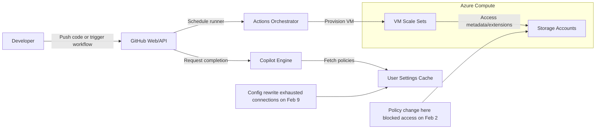
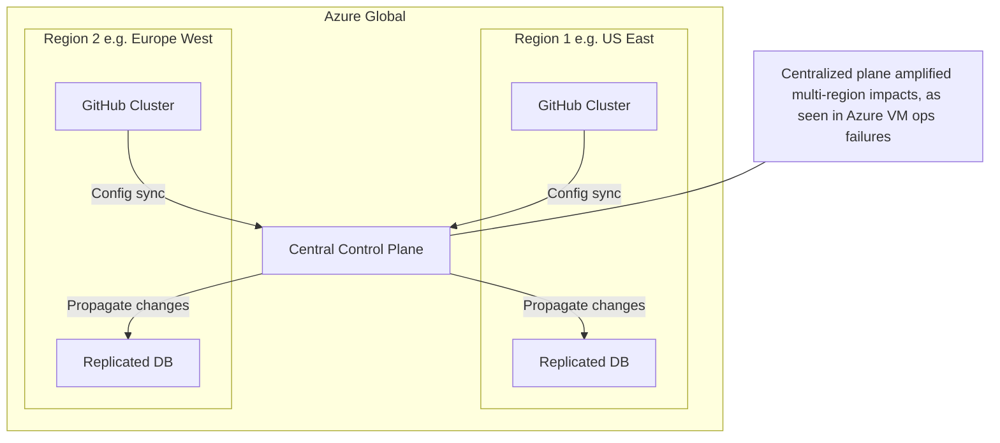

## Overview

We're looking at a month marked by frequent partial outages and degradations, not just a single event. This RCA pulls together insights from GitHub's status page, Azure updates, web articles, and social media chatter to explain the causes, impacts, and lessons. Think of this as a debrief among engineers, where we focus on the tech without the fluff.

## Timeline of Events

February kicked off with a notable disruption on February 2, around 18:35 UTC, when GitHub Actions hosted runners went offline. This stemmed from a backend storage access policy change in Azure, GitHub's underlying compute provider, which blocked virtual machine metadata access. Self-hosted runners failed to scale because they couldn't provision VMs, leading to cascading effects on services like Copilot Coding Agent, CodeQL, Dependabot, and Pages. Mitigation came via a policy rollback, with full recovery by February 3 at 00:30 UTC. Community speculation on Hacker News pointed to an AI-hallucinated config change or a simple ACL misconfiguration on storage accounts used for VM extensions. Azure's centralized control plane amplified the issue, affecting multiple regions unlike more isolated setups in competitors like AWS.

Things didn't stabilize after that. On February 3, we saw delays in UI updates for Actions runs due to connection churn in an eventing service causing CPU saturation. Copilot hit capacity imbalances leading to resource exhaustion. By February 6, pull request reviews on GitHub Mobile failed because of a defect in a new comment-positioning workflow, and Copilot's Claude Opus 4.6 model struggled with low rate limits amid traffic surges. February 9 stood out as particularly rough, with five separate incidents: degraded Copilot performance from traffic surges exceeding rate limits, webhook and pull request slowdowns, Actions run start delays from bottlenecks in event publishing, notifications delays from database degradation under load, and a major outage affecting Issues, Actions, Git operations, API, Webhooks, and more. The core problem there was a configuration change to user settings caching that triggered massive cache rewrites, exhausting connections in the Git HTTPS proxy.

Continuing into the double digits, February 10 brought degraded web experiences like slow pull requests and authentication due to memory pressure on a critical database. Copilot policy updates for enterprise users lagged in propagation. On February 11, GraphQL API latency spiked from a degraded dependency, and Copilot's Claude Haiku 4.5 model faltered due to upstream provider issues. February 12 piled on with Codespaces creation failures from a bad networking config rollout, repository archive download problems tied to corrupt configuration bundles, intermittent Copilot completions, regional Copilot degradations in places like Australia and Brazil, and Actions capacity constraints for larger runners. By February 13, file uploads disrupted some services, and community reports noted outages persisting into February 14 and 15.

From X posts and Reddit threads, developers expressed frustration over the frequency, with one tally showing 18 unscheduled incidents in the first 11 days alone. Impacts ranged from stalled CI/CD pipelines to delayed notifications and failed code pushes, hitting productivity hard for teams relying on GitHub for daily workflows. Articles highlighted GitHub's availability dipping below three nines, a stark contrast to its pre-acquisition reliability. One X user noted GitHub hiding uptime metrics on their status page, which fueled transparency concerns.

## Root Causes

Many incidents traced back to configuration changes, like the Azure policy shift on February 2 or the caching tweak on February 9. These often cascaded because GitHub's services are tightly coupled to Azure's infrastructure, especially for compute and storage. Load-related issues, such as database memory pressure or event publishing bottlenecks, suggest scaling challenges amid growing traffic, possibly from AI features like Copilot drawing more users. Dependency degradations, including upstream model providers for Copilot, point to external risks in the ecosystem. Overall, the pattern reveals systemic brittleness: centralized control planes in Azure lead to multi-region failures, inadequate safeguards during rollouts allow bad configs to propagate, and monitoring gaps fail to catch issues early.

## Service Interaction Overview

To visualize how these dependencies play out, consider the following Service Interaction Overview in Mermaid syntax. This shows user interactions flowing through GitHub's front-end services to backend components, highlighting points where Azure integrations can fail.

This overview underscores how a single Azure storage tweak rippled to Actions, and similar caching issues hit broader services.

## Deployment Topology

Shifting to deployment, GitHub's topology relies heavily on Azure's global footprint, but with centralized elements that create single points of failure. Here's a Deployment Topology representation.

This setup explains why Azure's VM management issues affected GitHub broadly, unlike regional isolation in other clouds.

## Mitigations and Lessons Learned

Mitigations GitHub applied included config rollbacks, traffic rebalancing, rate limit increases, and added monitoring. For instance, after February 9's caching fiasco, they optimized the mechanism and added safeguards. Post-mortems promised deeper fixes, like auto-rollback for corrupt configs and better alerting thresholds. But the recurrence suggests deeper architectural tweaks are needed, such as decoupling from Azure's control plane quirks or enhancing chaos engineering to simulate these failures.

In lessons learned, this month highlights the perils of deep integration with a single provider. Teams should consider hybrid setups or self-hosting critical components to avoid vendor lock-in risks. For GitHub, investing in more granular regional independence could prevent cascading outages. We've seen similar patterns in other platforms, but the frequency here, especially post-Microsoft acquisition, raises questions about resource allocation toward reliability versus new AI features. As architects, we need to balance innovation with robustness, ensuring configs are vetted through staged rollouts and dependencies are monitored end-to-end.

## Conclusion

February 2026 exposed GitHub's growing pains under heavy load and complex dependencies. While individual fixes addressed symptoms, systemic improvements in config management, scaling, and provider resilience will be key to restoring trust. If we're building similar systems, let's prioritize fault isolation from the start. Drop questions in the comments or on X @chessMan786.

(Word count: 912)
